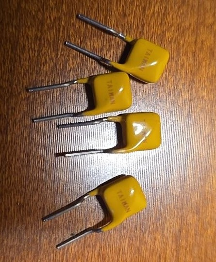
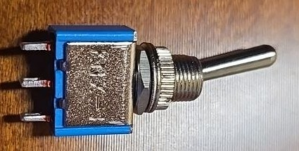
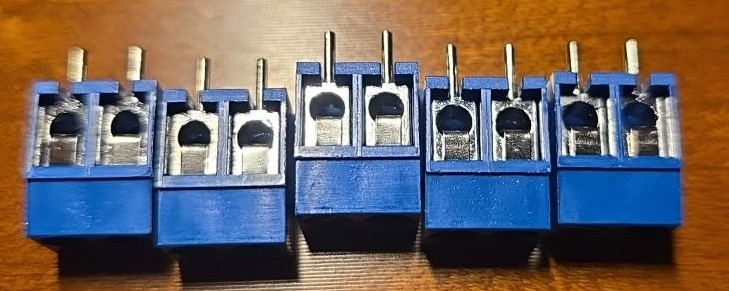
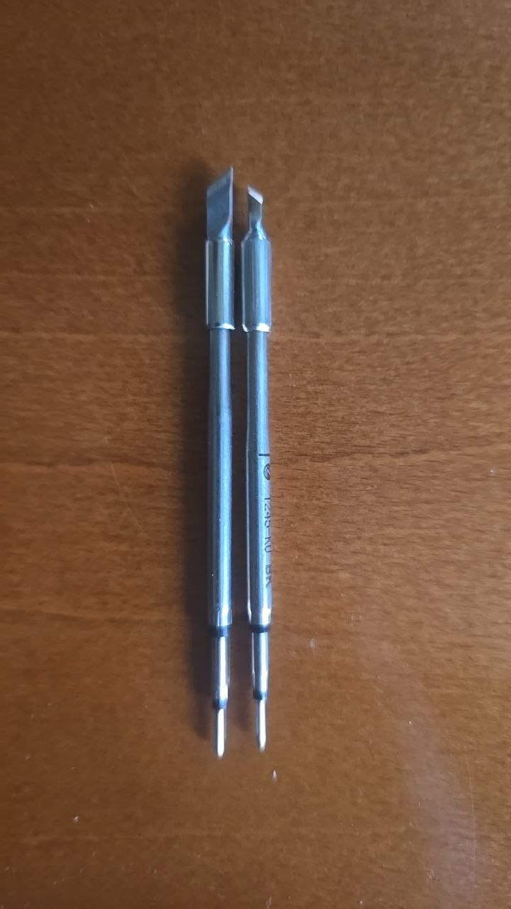
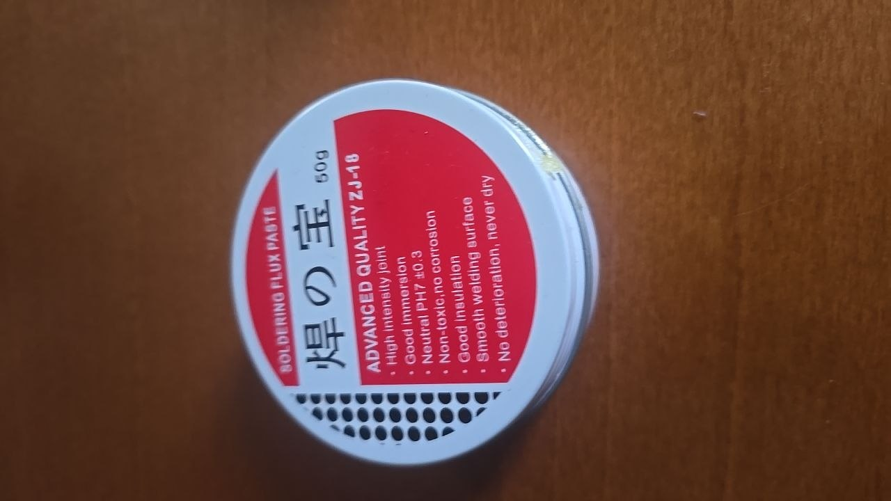
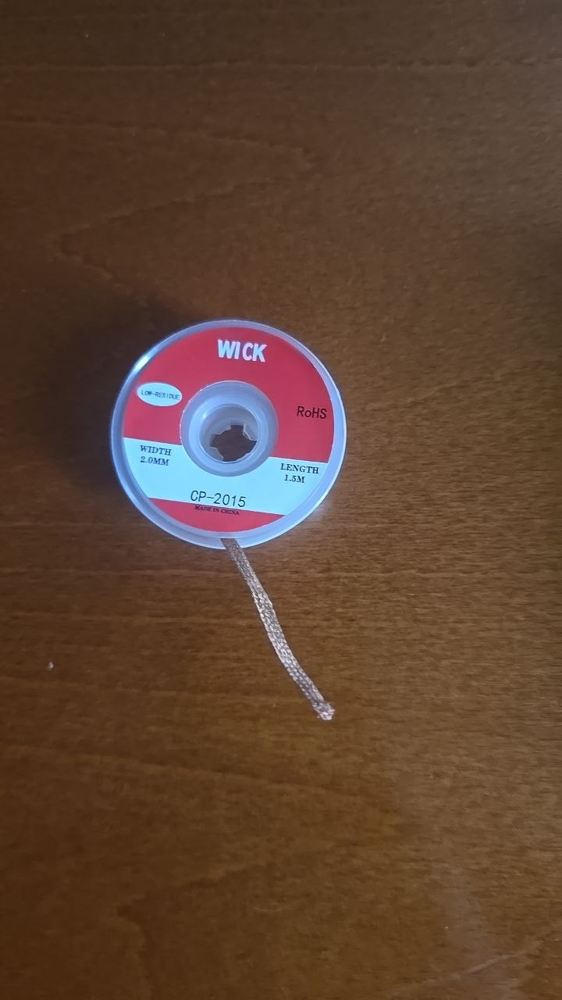
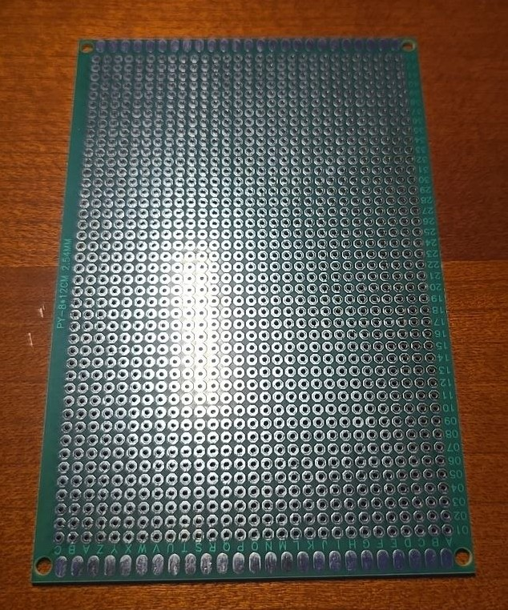
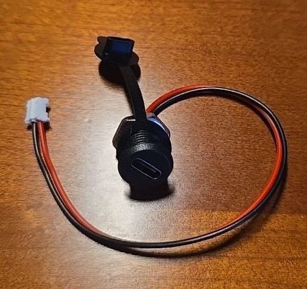
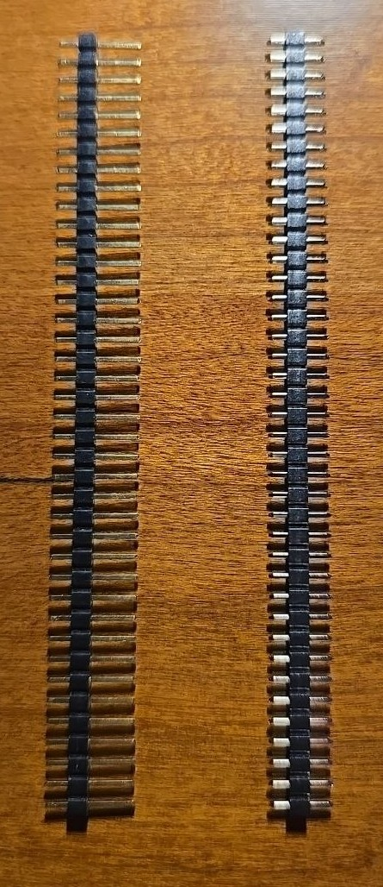

# Комплектующие — Wind Station

> Статус на 2026-05-29: все детали получены. Датчик ветра пришёл 2026-05-26 (фото пока нет). Мачта готова, находится у сына дома.
>
> Сверка фото ↔ BOM выполнена 2026-05-29. Найденные расхождения отмечены ⚠️ в строках ниже.

---

## Микроконтроллер

| # | Компонент | Кол-во | Спека (1 предложение) | Фото |
|---|-----------|--------|------------------------|------|
| 1 | ESP32 DevKit V1 (30 pin, Type-C) | 1 | Плата на модуле ESP32-WROOM-32 (240 МГц, WiFi b/g/n + BT) с бортовым LDO AMS1117 и USB-Serial мостом CP2102; питается 5V на пине VIN, ADC — только ADC1 (GPIO32/34/35). |  |

---

## Модули

| # | Компонент | Кол-во | Спека (1 предложение) | Фото |
|---|-----------|--------|------------------------|------|
| 2 | TP4056 Type-C с защитой | 1 | Линейный зарядник одной Li-ion ячейки (CC/CV 4.2V, ток до 1A) с микросхемой защиты DW01A + сдвоенный MOSFET от переразряда/перезаряда/КЗ; вход Type-C, выводы B±/OUT±. |  |
| 3 | Boost-модуль MT3608 / HW-085-TMF002 (2 рабочих + 1 запас) | 3 | Повышающий DC-DC на чипе MT3608 с **фиксированными пресетами 5/8/9/12V** (выбор каплей припоя на падах A/B, не подстроечник), вход 2–5V, ток до ~0.5A, дроссель 3R3. |  |

---

## Питание

| # | Компонент | Кол-во | Спека (1 предложение) | Фото |
|---|-----------|--------|------------------------|------|
| 4 | Аккумулятор 18650 LG HG2 (INR18650HG2) | 2 | Высокотоковая Li-ion ячейка 3000 мАч, длительный разряд до 20A, номинал 3.6V / заряд 4.2V (на корпусе лазерная маркировка «ABHG21865»). |  |
| 5 | Холдер 18650 одинарный (спаять параллельно) | 2 | Пластиковый держатель под одну ячейку 18650 с пружинными контактами и паяемыми выводами; два соединяются параллельно (+ к +, − к −). |  |
| 6 | Электролит JCCON 1000µF 16V | 4 | Радиальный алюминиевый электролит Low-ESR, 1000 мкФ / 16V, рабочий диапазон −40…+105°C (буфер на шине питания). |  |
| 7 | ⚠️ SMD-предохранитель **одноразовый** 2A 1206 (маркировка «N»=2A, глянцево-зелёный, R≈0.03Ω) — куплен ошибочно вместо PTC, годен как временная защита на макетке | 10 | Быстродействующий **плавкий** SMD-предохранитель 1206 на 2A — НЕ самовосстанавливающийся (после срабатывания меняется), на ленте по 10 шт. |  |
| 7b | PPTC 2A radial самовосстанавливающийся (жёлтый дисковый, TAIWAN) — для финальной сборки на батарейной линии. ⚠️ Проверить номинал мультиметром | 5 | Самовосстанавливающийся полимерный предохранитель (полисвитч) с током удержания ~2A, после устранения КЗ восстанавливается сам; холодное R≈0.1–0.3 Ω. |  |

---

## Пассивные компоненты

| # | Компонент | Кол-во | Спека (1 предложение) | Фото |
|---|-----------|--------|------------------------|------|
| 8 | Резисторы 1/4W набор (220Ω, 10kΩ, 5kΩ, 100kΩ и др.) | ~600 | Осевые металлоплёночные резисторы 0.25W, допуск ±1% (5-полосная маркировка, голубой корпус), на бумажных лентах по номиналам. |  |
| 9 | Конденсаторы керамические набор (вкл. 104 / 100nF) | ~300 | Дисковые керамические конденсаторы, 50V, набор номиналов (104 = 100 нФ — фильтры ADC и питания), в пакетиках по значениям. |  |
| 10 | Диоды набор 8 типов (вкл. 1N5819) | ~100 | Осевые выпрямительные диоды и Шоттки 8 типов на лентах; для проекта нужен **1N5819** (Шоттки 40V/1A, падение ~0.35V) для diode-OR. |  |

---

## Индикация и управление

| # | Компонент | Кол-во | Спека (1 предложение) | Фото |
|---|-----------|--------|------------------------|------|
| 11–13 | LED 5мм зелёный / жёлтый / красный | 5+5+5 | Рассеянные индикаторные светодиоды Ø5мм, рабочий ток ~20 мА (Vf ≈ 2.0V красный/жёлтый, ≈ 3.0V зелёный), длинная ножка — анод. |  |
| 14 | Тумблер мини SPDT (металл, синее основание) — главный выключатель станции, разрывает шину питания перед нагрузкой | 1 | Металлический рычажный переключатель на 3 контакта (SPDT, ON-ON), синее основание, ~6A/125VAC. |  |
| 14b | ⚠️ Тумблер-качалка I/O (KCD1, красная клавиша «O/I», чёрный корпус) — **есть на фото, в основном списке отсутствовал**; альтернатива п.14 как главный выключатель | 2 | Клавишный выключатель KCD1 (ON-OFF, 2 контакта, ~6A/250VAC) с маркировкой O/I — проще монтируется в прямоугольное окно корпуса, чем рычажный SPDT. |  |

---

## Коммутация

| # | Компонент | Кол-во | Спека (1 предложение) | Фото |
|---|-----------|--------|------------------------|------|
| 15 | Breadboard 830 точек | 1 | Беспаечная макетная плата MB-102 на 830 контактов (шаг 2.54 мм) с двумя шинами питания «+/−» по краям. |  |
| 16 | Dupont провода M-M (штырёк–штырёк) | 40 | Гибкие соединительные перемычки штырёк-штырёк, ~20 см, разъём 2.54 мм — для разводки на breadboard. |  |
| 17 | Dupont провода M-F (штырёк–гнездо) | 40 | Перемычки штырёк-гнездо, ~20 см — для подключения модулей и выноса LED. |  |
| 18 | Клеммная колодка KF301-2P (2-пин, под винт) — используется по 2 шт рядом как замена 4P | 5 | Винтовая клеммная колодка на 2 контакта, шаг 5.08 мм, монтаж на плату, до ~10A/300V (синий корпус). |  |

---

## Инструменты — пайка

| # | Компонент | Кол-во | Спека (1 предложение) | Фото |
|---|-----------|--------|------------------------|------|
| 19 | Паяльник Alientek T90B | 1 | Портативный паяльник под картриджи T245, 140W, питание USB-C PD3.1/QC, диапазон 80–450°C, IPS-дисплей. |  |
| 20+20b | ⚠️ Жала C245-KU (нож-ультра «BK», для SMD/drag-пайки) + C245-K (нож, для крупных площадок/демонтажа) — **оба на одном фото** | 1+1 | Картриджи-наконечники T245-формата: KU (тонкий нож-ультра, маркировка «C245-KU-BK») и K (широкий нож); фото общее для обеих позиций. |  |
| 21 | Припой ПОС 63 с флюсом | 1 | Трубчатый припой Sn63/Pb37 с канифольным флюсом внутри, температура плавления ~183°C (эвтектика). |  |
| 22 | Флюс-паста ZJ-18 | 1 | Паяльная флюс-паста, нейтральная (pH 7±0.3), не корродирующая, нетоксичная, 50 г. |  |
| 22b | ⚠️ Оплётка для удаления припоя WICK CP-2015 — **есть на фото, в основном списке отсутствовала** | 1 | Медная оплётка-выпайка (desoldering braid) шириной 2.0 мм, длина 1.5 м, с флюсом, low-residue / RoHS. |  |
| 23 | Губка для очистки жала | 1 | Целлюлозная губка, смачивается водой для съёма окислов с жала между пайками. | — нет фото — |

---

## Инструменты — измерение

| # | Компонент | Кол-во | Спека (1 предложение) | Фото |
|---|-----------|--------|------------------------|------|
| 24 | Мультиметр UNI-T UT33A+ | 1 | Компактный авто-диапазонный мультиметр (DCV до 600V, ток до 10A с предохранителем, ёмкость, сопротивление, прозвонка), категория CAT II 600V. |  |
| 25 | Индикаторная отвёртка | 1 | Отвёртка-пробник с неоновой лампой для определения фазы 220V. | — |
| 26 | Крокодилы / щупы | 1 | Провода с зажимами-«крокодилами» для временных подключений при измерениях. | — нет фото — |

---

## Корпус и герметизация

| # | Компонент | Кол-во | Спека (1 предложение) | Фото |
|---|-----------|--------|------------------------|------|
| 27 | Корпус IP65 ~190×150×75 | 1 | ⚠️ **Чёрная непрозрачная** ABS-распаячная коробка с резиновыми вводами-«мембранами» — крышка глухая, поэтому 5 статусных LED через неё не видно (план в `wind-station-assembly.md` рассчитан на прозрачную крышку — нужно вынести LED наружу или сменить корпус). |  |
| 28 | Гермоввод PG7 (IP68) | 2 | Нейлоновый кабельный ввод PG7 с гайкой и цанговым уплотнителем под кабель Ø ~3–6.5 мм, защита IP68 (маркировка «IP68/CE»). |  |
| 29 | Мачта / штанга | 1 | Опорная труба-штанга для крепления датчика ветра на высоте. | — готова, находится у сына дома — |
| 30 | Герметик силиконовый Lacrysil 50мл | 1 | Прозрачный санитарный силиконовый герметик 50 мл; ⚠️ **ацетатного отверждения** (выделяет уксусную кислоту, корродирует контакты — наносить на корпус снаружи, не на плату). |  |

---

## Монтаж и крепёж

| # | Компонент | Кол-во | Спека (1 предложение) | Фото |
|---|-----------|--------|------------------------|------|
| 31 | Монтажная лента PROзапас | 1 | Двусторонняя вспененная клейкая лента, толщина 0.8 мм, серая, держит до 1 кг на 4 см², ⚠️ рабочий диапазон по упаковке **−30…+80°C** (не +60), UV-стойкая. |  |
| 32 | Стяжки пластиковые | 1 уп. | Нейлоновые кабельные стяжки (хомуты), белые, ~100 мм — фиксация жгутов внутри корпуса. |  |
| 34 | Изолента HPX | 1 | ПВХ изоляционная лента (белая, бренд HPX) для изоляции скруток и маркировки. |  |

---

## Кабель

| # | Компонент | Кол-во | Спека (1 предложение) | Фото |
|---|-----------|--------|------------------------|------|
| 35 | FTP Cu Expert Power 2×2×0.5 Cat5e | ~3 м | Экранированная (FTP) витая пара Cat5e, медь, 2×2×0.5 мм — кабель от датчика на мачте (экран глушит наводки на длинной линии). |  |

---

## Датчик

| # | Компонент | Кол-во | Спека (1 предложение) | Фото |
|---|-----------|--------|------------------------|------|
| 36 | Датчик ветра Polycarbonate 0–5V | 1 | Анемометр + флюгер в поликарбонатном корпусе: питание 10–30V (используем 12V), аналоговый выход 0–5V, скорость 0–60 м/с, направление 0–360°. | получен 2026-05-26, фото пока нет |

---

## Монтажная плата и разъёмы

| # | Компонент | Кол-во | Спека (1 предложение) | Фото |
|---|-----------|--------|------------------------|------|
| 37 | Перфоплата двусторонняя 90×60 мм | 1 | Двусторонняя стеклотекстолитовая (FR4) макетная плата с лужёными металлизированными отверстиями, шаг 2.54 мм, координатная разметка — для финальной пайки вместо breadboard. |  |
| 38 | Панельный USB-C разъём с кабелем JST | 1 | Панельный USB-C (panel-mount) с пылезащитной крышкой и 2-проводным пигтейлом JST — **только зарядка** (без data-линий), подключается к IN+/IN− TP4056 через стенку корпуса. |  |
| 39 | Pin header 2.54 мм (золочёные + луженые) | 2 шт (полоски) | Однорядные штыревые гребёнки 40-pin, шаг 2.54 мм (одна полоса золочёная, одна лужёная) — ломаются на нужную длину для межмодульных соединений на перфоплате. |  |
