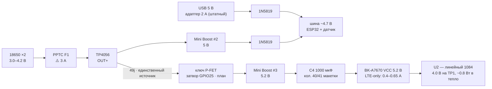
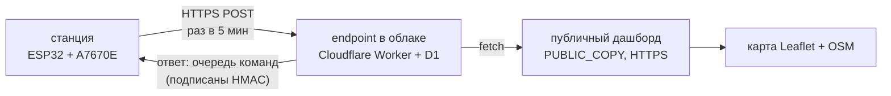

# Задача 10: 4G/GPS-модуль A7670E — встроить и вывести координаты на карту

## Промпт для новой сессии
```
Читай tasks/10-a7670e-4g-gps.md и выполни задачу шаг за шагом.
Источники истины: CLAUDE.md, bom-photos.md, wind-station-assembly.md.
Шаг 0a (AT-тест GNSS по USB) обязателен: без его результата шаги 1+ выполнять нельзя.
Перед шагом 1 прочитать §Питание целиком — там пересчитанная арифметика,
а не прикидки: старая версия документа предлагала схему, которая не работает.
```

## Статус
- Ресерч v1 — ✅ 2026-08-15.
- Ресерч v2 (пересчёт питания, замена стека на PPP, безопасность, дашборд) — ✅ 2026-08-16.
- Ресерч v3 (разбор фотографий — своих и вендорских: U2 линейный → питание пересчитано
  ещё раз) — ✅ 2026-08-16.
- Шаг 0a (GNSS по USB) — ⏳ **не выполнен**. Пока не сделан, блокирует всё: есть ли в этом SKU GNSS.
- Шаг 0b (сеть по USB) — ⏳ **не выполнен**. Нужен APN и подтверждение, что тариф не привязан.
- Железо: модуль и обе антенны на руках. **SIM-карта уже вставлена** (2026-08-16).
- Схема разводки под шаги 1–2 — ✅ 2026-08-16, **действующая версия `wiring-v6.html`**
  («Компакт-1», в корне, SVG инлайном; генераторы — `images/gen_wiring_v6_svg.py` →
  `images/wiring_v6.svg` → `images/build_wiring_v6.py`).
  - **v6 «Компакт-1»** — модуль садится **прямо на макетку**, в гнездовую планку PLS-7
    (ряд `a`, колонки **36–42**), свес платы 37×37 уходит вверх за верхние рельсы и за край
    макетки; ряды `b`–`e` под ним остаются рабочими. C4 1000 мкФ переехал на плату (кол. 40/41),
    C1 — с 39/41 на **43/44**. Диодное ИЛИ модема **снято**, буст №3 кормится только с `OUT+`
    TP4056. С макетки уходят четыре провода: `49j` → ключ → B3 IN+, `45i` → земля блока
    и два обратно в кол. 40/41. Проводов к самому модему нет вовсе.
  - **v5** (`wiring-v5.html`, генераторы `*_v5_*`) — предыдущий вариант, оставлен для сравнения:
    модем на весу, своё диодное ИЛИ на двух Шоттки 3 А, пять проводов к CN101, три точки
    на макетке (`37j`, `49j`, `45i`). К исполнению **не берётся**.

## Цель
Добавить к станции 4G-аплинк и GPS, вывести координаты на дашборд с картой.
Побочная цель, ради которой всё и затевается: **станция на мачте/даче, без домашней сети,
остаётся видимой** — сейчас `HAS_HOME_NETWORK 0` означает полную изоляцию.

> ⚠️ **Честная оговорка к этой цели, которой не было в v1.** Сценарий «станция на мачте»
> упирается не в связь, а в питание. По расчёту в `wind-station-assembly.md` станция ест
> ~190 мА при 4.7 В (0.89 Вт) и живёт от двух LG HG2 **19–21 час**. Модем добавляет
> ~0.24 Вт (см. §Энергобюджет) — автономка падает до ~16 часов, то есть на 21%, а не «в разы».
> Но и 21 час, и 16 — одинаково бесполезны для мачты без розетки. **4G не решает задачу
> автономности и не ухудшает её принципиально.** Если станция реально уедет на мачту,
> раньше 4G нужна отдельная задача про питание: солнечная панель либо deep sleep.
> Пока станция стоит у розетки, 4G — это резервный канал и GPS, а не автономность.

---

## Железо: что именно куплено

**Плата BK-A7670 V1**, производитель `www.and-global.com`.
Модуль **SIMCom A7670E**, P/N `S2-10F8H-Z333L`, SN `<SN>`, IMEI `<IMEI>`,
сертификат `CCAH23Y00011T5`. Всё сверено с наклейкой по снимкам 2026-08-16 — сходится
полностью, включая маркировку патч-антенны `1594P-C`.

> На шелкографии самой платы написано **`BK-7670 V1`, без буквы `A`** — так же и на снимках
> вендора. Мануал и каталоги при этом называют её `BK-A7670`. Искать документацию нужно
> по варианту с `A`, иначе поиск по надписи на плате ничего не находит.

Антенны в комплекте — две:
- плёночная LTE (в разъём **J1**)
- керамический патч «1594P-C» на 1575 МГц — это **GPS**, а не диверситивная LTE (в разъём **J2**)

Мануал платы: <https://manuals.plus/and/bk-a7670-4g-pcie-module-manual>
(оригинал PDF на `img.yfisher.com` отдаёт 403 при автозагрузке — открывать браузером;
текстового слоя в PDF нет, там картинки, автоматически он не парсится).

### Разъём CN101 — 7 контактов, шаг 2.54 мм

Гребёнка на плате одна и ровно на 7 контактов (сверено с железом 2026-08-15) — то есть это
и есть CN101 из мануала, других разъёмов искать не нужно. В мануале контакты пронумерованы
с нуля, здесь — с единицы; порядок тот же.

| # | Имя | Шелкография | Назначение |
|---|-----|-------------|------------|
| 1 | SLEEP | `S` | режим сна, заведён на DTR модуля через Q4. Не подключаем — см. §Энергобюджет |
| 2 | GND | `G` | земля |
| 3 | **VCC** | `V` | питание, **5.0–10 В (рекомендовано 5.0), обеспечить 2 А** |
| 4 | PWRKEY | `K` | вкл/выкл, **уже прижат к GND через R104**. Не подключаем |
| 5 | **TXD** | `T` | выход модуля, **3.3 В TTL** → на RX ESP32 |
| 6 | **RXD** | `R` | вход модуля, **3.3 В TTL** ← с TX ESP32 |
| 7 | GND | `G` | земля |

> **Как не перепутать сторону.** Считать от контакта с буквой `S` (SLEEP) — он крайний
> со стороны SIM-держателя. Противоположный край — второй `GND`. Ошибка на 180° подаёт
> VCC на TXD: до подключения питания **прозвонить оба крайних контакта на GND**,
> настоящая земля звонится накоротко.

Используем четыре контакта из семи: VCC, TXD, RXD и один GND. SLEEP и PWRKEY остаются
не подключены — модуль стартует сам, а спать мы его не укладываем.

### Что ещё есть на плате (уточнено по мануалу 2026-08-16)

- **CN2 — держатель nano-SIM.** В v1 документа было написано «слот под micro, скорее всего
  нужен переходник» — **это была ошибка**, слот штатно nano. Переходник не нужен, карта
  уже стоит. Держатель — откидной, с надписями `OPEN` / `LOCK` на крышке: крышка сдвигается
  в сторону `OPEN`, поднимается, карта ложится в рамку, крышка закрывается и сдвигается
  к `LOCK`. Рядом шелкография `SIM1`; посадочное место `SIM2` на плате есть, но **не распаяно**
  (плата разведена как двухсимочная, распаян один слот).
- **D5 — зелёный NET LIGHT.** Бесплатная диагностика, которой в v1 не было:
  **часто мигает = сеть не найдена, медленно мигает = регистрация прошла.** По нему видно
  состояние аплинка, не открывая ни Serial, ни AT-порт. При интеграции в корпус — вывести
  в поле зрения или хотя бы запомнить, где он.
- **CN1 — micro-USB**, USB 2.0 самого модуля. Питает ли VBUS плату — мануал молчит,
  схему `device.report` отдаёт по 403. **Проверяется опытом на шаге 0a**, см. там.
- **U2 — преобразователь питания** 5–10 В → VBAT модуля (~4.0 В). Именно из-за него
  плата просит 5 В и выше, хотя сам модуль A7670E питается от 3.4–4.2 В.
  **По фотографиям это линейный стабилизатор, а не понижающий преобразователь** — разбор
  и последствия ниже, в §Что видно на фотографиях платы. Последствия серьёзные, они
  переписывают арифметику §Питание.
- **TP1 — тестовая точка 4.0 В**, по мануалу платы. Это и есть выход U2, то есть VBAT модуля.
  **Единственный способ померить вольтметром, не проседает ли питание модуля под передачей** —
  на VCC этого не видно, там ещё стоит стабилизатор.
- Антенные разъёмы: **J1** = LTE, **J2** = GPS (в мануале помечен *Optional*),
  **J3** = BT (*Optional*). По снимкам нашей платы распаяны **J1 и J2, на месте J3 —
  голые пятаки**, и обе антенны из комплекта уже воткнуты. Прежняя запись «распаяны
  все три» была неверной; на задачу это не влияет — BT не используем.

### Что видно на фотографиях платы (разобрано 2026-08-16)

Два набора снимков, и различать их важно.

**Карточка товара (чужой экземпляр):** `images/skins/S1ee45f7…`, `S73257e41…` — плата крупно
с обеих сторон, `S15e41d54…` — BOARD OVERVIEW с таблицей обозначений, `S2bed1829…` —
DONGLE DIMENSION с размерами, `S3c510f06…` — состав комплекта. На наклейке модуля там IMEI
`<чужой IMEI>`, то есть сфотографирован **не наш** модуль.

**Наша плата:** `images/skins/photo_2026-08-15_20-44-21*.jpg` (весь комплект с подключёнными
антеннами) и `photo_2026-08-15_20-44-44*.jpg` (обе стороны крупно). Наклейка читается целиком
и сходится с записями: `P/N S2-10F8H-Z333L`, `SN <SN>`, `IMEI <IMEI>`,
сертификат `CCAH23Y00011T5`.

> Разводка на обоих наборах одинаковая, поэтому выводы про схему платы (U2, TP1, пятаки)
> подтверждены **на своём железе**, а не только по чужим снимкам. Что фотографии по-прежнему
> **не** решают — какой кристалл внутри экранированного модуля. Вопрос GNSS закрывает
> только `AT+SIMCOMATI`.

**1. U2 — линейный стабилизатор. Это главная находка, и она меняет расчёт питания.**

И на снимке вендора, и на нашем `photo_…_20-44-44.jpg` U2 — корпус TO-252/DPAK с маркировкой
**`1084`** (полностью: `AII 1084 1703EG`). `1084` — это семейство `AMS1084/LD1084`,
регулируемый LDO на 5 А. Четыре независимых подтверждения, что это именно линейник,
а не понижающий DC-DC:

- **на плате нигде нет дросселя.** Ни одного, ни на одной из сторон — проверено по нашим
  же снимкам. Без дросселя импульсный понижающий преобразователь физически не работает;
- корпус DPAK с тремя выводами и теплоотводящей площадкой — типовой корпус этого LDO;
- `TP1 = 4.0 В` из мануала сходится с регулируемым 1084, задранным делителем на 4.0 В;
- **VCC минимум 5.0 В при выходе 4.0 В — это ровно окно паразитного падения LDO.**
  Понижающий DC-DC спокойно работал бы и от 4.5 В, и минимум в мануале стоял бы ниже.

Что из этого следует (арифметика — в §Питание, там цифры уже пересчитаны):

- **ток на входе платы равен току модуля, а не меньше него.** LDO не преобразует ток:
  сколько модуль взял по VBAT, столько же пришло по VCC. Расчёт v2, где пик делился
  на отношение напряжений, был оптимистичен;
- **разница напряжений уходит в тепло:** `(VCC − 4.0) × I`. При 5.2 В и 0.65 А это ~0.8 Вт
  на маленьком DPAK без радиатора — плата будет ощутимо горячей. **Тем более нельзя
  подавать разрешённые мануалом 10 В**: там же выйдет 3.9 Вт и микросхема уйдёт в тепловую
  защиту. Держаться нижнего края диапазона;
- **окно по напряжению узкое с обеих сторон.** Ниже ~5.1 В — LDO вываливается из режима
  и VBAT просядет; выше — лишний нагрев. 5.2 В остаётся правильным выбором, но проверять
  его надо **по TP1 под нагрузкой**, а не по входу.

**2. Гребёнка CN101 уже распаяна — паять ничего не надо.** На снимке нашей платы со стороны
модуля видна семиконтактная гребёнка 2.54 мм с торчащими штырями. Значит на CN101 садятся
обычные dupont-мамы, и отдельного шага «припаять гребёнку» в задаче не появляется.
Пятаки `G`/`T`/`R` (см. ниже) — наоборот, голые.

**3. Тантал `J477` подтверждён.** Жёлтый конденсатор рядом с U2 читается как `J477` = **470 мкФ**.
Это тот самый штатный запас на VBAT, о котором говорит §Питание. Он висит **после** линейного
U2 и входную просадку не компенсирует — потому и нужен свой 1000 мкФ на VCC.

**4. J3 (BT) не распаян ни на нашей плате, ни на вендорской.** u.FL стоят только на **J1 (LTE)**
и **J2 (GPS)**, на месте `BT` — голые пятаки. В прошлой записи по проекту значилось
«распаяны все три» — **это была ошибка, поправлено**. На задачу не влияет: BT не используем.

**5. Обе антенны уже подключены.** На снимке комплекта плёночная LTE сидит на J1 (серый коаксиал),
патч 1575 МГц — на J2 (чёрный). Требование «антенны подключить до подачи питания» из шага 0a
на нашем экземпляре уже выполнено — но перед включением всё равно взглядом проверить,
что оба u.FL защёлкнуты (они отходят от натяжения провода).

**6. Второй ряд контактов `G` `T` `R` у нижнего края.** Виден и на фото вендора, и на нашем,
и на чертеже размеров — три круглых пятака отдельно от CN101, **без гребёнки**. По буквам это
земля и ещё одна пара UART (скорее всего отладочный порт модуля). Назначение мануалом
не описано, **проверять прозвонкой**, но потенциально полезно: можно повесить USB-TTL
и смотреть AT-обмен, пока основной UART занят ESP32.

**7. Габариты для корпуса:** плата **37 × 37 мм**, крепёжное отверстие ⌀3 мм в одном углу,
шаг CN101 — 2.54 мм, длина гребёнки ~18.5 мм вдоль края. Это уже можно класть в раскладку
корпуса в `wind-station-assembly.md`; плюс место под два коаксиала u.FL и разнос антенн
(см. §RF).

**8. Комплект подтверждён снимком `S3c510f06…`:** плата + плёночная 4G/NB-антенна +
патч-антенна GPS. Подпись продавца — «**CAT1 A7670E LTE+GPS version support WiFi scan**».

### Три вывода, которые определяют интеграцию

- **Преобразователь уровней НЕ нужен.** Мануал прямо: «TXD/RXD are 3.3V TTL level which can be
  directly connected with 3.3V MCU». Не спутать с голым модулем A7670E — у того UART 1.8 В,
  и половина интернета пишет про уровни именно о нём.
- **Питание от шины станции невозможно.** VCC требует 5.0–10 В, а шина даёт ~4.7 В — ниже
  минимума. Буст №1 (12 В для датчика) — выше максимума. Нужен свой источник, см. §Питание.
- **Модуль стартует сам** при подаче VCC, потому что PWRKEY уже на земле через R104.
  Отдельный GPIO под PWRKEY не нужен. Обратная сторона: **программно выключить или
  перезагрузить модуль нельзя** без резки R104 — только снятием VCC. См. §Аварийный ресет.

---

## Открытый вопрос: есть ли GNSS в этом SKU

Мануал платы пишет «GNSS **optional**», и это не отписка. В v2 нашлось объяснение точнее,
чем «по линейке GNSS числится за G и SA»:

- **У самого A7670E есть две ревизии, и различаются они буквами в суффиксе:
  `A7670E-FASE` — с GNSS, `A7670E-LASE` — без GNSS.** Плата и корпус одинаковые,
  распаянный J2 ничего не доказывает.
- Наш P/N `S2-10F8H-Z333L` — внутренний заказной код SIMCom, по нему суффикс не читается
  ни в одном публичном каталоге. Разрешается только командой `AT+SIMCOMATI`.
- На GitHub issue ровно с этим симптомом: у людей на A7670E **все** GNSS-команды
  (`AT+CGNSSPWR`, `AT+CGNSSMODE`, `AT+CGPSHOT`, `AT+CGNSSPORTSWITCH`) отвечают `ERROR` —
  <https://github.com/Xinyuan-LilyGO/LilyGo-Modem-Series/issues/327>. Мейнтейнеры в треде
  не ответили; вердикт сообщества — куплен вариант без GNSS-кристалла.

**Команды в v1 были названы неточно.** Правильная последовательность для A76XX:

```
AT+CGNSSPWR=1        ← включить GNSS. Ждать URC «+CGNSSPWR: READY!», не просто OK
AT+CGNSSINFO         ← мульти-созвездие (GPS+GLONASS+BDS+Galileo) — брать эту
AT+CGPSINFO          ← только GPS; в A76XX тоже есть, но смысла брать её нет
AT+CGNSSPORTSWITCH=<parsed>,<nmea>   ← куда уходит вывод: USB AT-порт или UART
```

Последняя — **отдельная ловушка именно для нас**: шаг 0 делается по USB, а работать
модуль будет по UART. По умолчанию разобранные координаты могут уходить в USB AT-порт,
и на UART мы не увидим ничего, решив, что GNSS сломался. Если на шаге 3 `AT+CGNSSINFO`
по UART молчит, а по USB отвечал — первым делом `AT+CGNSSPORTSWITCH`.

### Что добавили фотографии карточки товара

Аргумент в пользу того, что GNSS всё-таки есть, — но косвенный, и вопроса он не закрывает.

Подпись продавца к снимку комплекта: «**CAT1 A7670E LTE+GPS version support WiFi scan**».
То есть вендор продаёт эту позицию **именно как версию с GPS**, и кладёт в коробку патч-антенну
1575 МГц — что сходится с нашим комплектом один в один. Это заметно поднимает шансы против
исходной оценки «скорее всего LBS-версия».

Почему это всё же не доказательство: (а) IMEI на снимке не наш, то есть сфотографирован
другой экземпляр; (б) описания в карточках копируются между позициями линейки, и продавец
может не различать `-FASE` и `-LASE`; (в) распаянный J2 и антенна в комплекте — намерение
вендора, а не наличие кристалла. **Вердикт по-прежнему за `AT+SIMCOMATI` + `AT+CGNSSPWR=1`.**

Побочная находка — «**support WiFi scan**». У A76XX есть позиционирование по видимым
WiFi-точкам: модуль сканирует эфир и отдаёт список BSSID, координаты считает облачный сервис.
Это **третий** запасной путь к координатам, о котором v2 не знал, и в городе он точнее LBS
по сотам. Команду сверить по мануалу A76XX V1.09 — в разных прошивках она называется
по-разному. На мачте в поле смысла не имеет (чужих точек нет), но для отладки на столе
годится.

### Итого путей к координатам — четыре

1. **GNSS** (`AT+CGNSSPWR=1` → `AT+CGNSSINFO`) — точность метры. Проверяется на шаге 0a.
2. **WiFi scan** — десятки метров, только там, где есть чужие точки.
3. **LBS по сотам** (`AT+CLBS`) — ±300–1000 м.
4. **Константа в исходнике** — точность идеальная, обновляется руками раз в переезд.

Станция стационарная, так что даже вариант 4 задачу закрывает. Ветка «4G» от вердикта
по GNSS не зависит вообще.

> ⚠️ **Фикс на подоконнике ≠ фикс в корпусе.** Керамическому патчу 1575 МГц нужен вид
> на небо и опорная земля под ним, а корпус станции — **непрозрачный IP65, и стоит он внизу,
> в тени** (это решение уже записано в проекте). Даже если GNSS на шаге 0a заведётся,
> из закрытого чёрного бокса внизу фикса может не быть вовсе. Варианты: вынести патч
> под крышку/наружу вместе с антенным кабелем — либо честно взять вариант 4 (константа),
> который для стационарной станции ничем не хуже. **Решать после шага 0a, но помнить
> заранее: успех на столе ничего не обещает про корпус.**

---

## SIM: карта стоит, тариф планшетный

Карта — **вторая, для планшета, только 4G-интернет, без звонков и SMS**. Для наших задач это
ровно то, что нужно: голос и SMS не используются. Формат nano совпал со слотом CN2,
переходник не понадобился, **карта уже вставлена**.

Два следствия, оба важные.

### CGNAT — входящих соединений не будет

Операторы держат абонентов за **Carrier-Grade NAT**, публичного IPv4 у станции не появится.

- ❌ **Нельзя** открыть дашборд станции снаружи, набрав адрес. Ни по IP, ни через проброс портов.
- ✅ **Можно** всё, что станция инициирует сама.

Уточнение к v1, которое меняет архитектуру в лучшую сторону: **«только исходящее» не равно
«только односторонне»**. Соединение открывает станция, но данные по нему ходят в обе стороны.
Значит команды «сбросить порыв», «откалибровать ноль», «обновись» можно доставлять
в ответе на исходящий запрос — без единого открытого порта. См. §Безопасность.

### Привязка к устройству — риск, который проверяется опытом

У части тарифов SIM привязывается к IMEI при активации, у части — нет. IMEI нашего модуля
опознаётся как модем, не как планшет, поэтому урезание скорости или блокировка возможны.

**Обходить это в проекте не будем**: смена IMEI во многих юрисдикциях прямо незаконна,
а подмена TTL всё равно ловится DPI. Если тариф окажется привязанным — вопрос решается
сменой тарифа у оператора, а не прошивкой.

### Мелочи, которые выясняются до пайки

- **PIN.** Если запрос PIN включён, модуль будет требовать `AT+CPIN=****` при каждом старте.
  Проще один раз вставить карту в телефон и **отключить запрос PIN**, чем тащить пин в прошивку.
  (У `PPP.setPin()` такая возможность есть, но лишний секрет в исходнике не нужен.)
- **APN.** Нужен APN оператора — вписывается константой в `.ino`. Смотреть `AT+CGDCONT?`
  после регистрации: часто сеть подставляет APN сама, и тогда в константу идёт то же значение.
- **Диапазоны — вопросов нет.** A7670E держит LTE-FDD B1/B3/B5/B7/B8/B20 + GSM 900/1800,
  это полный европейский набор.

---

## Питание — самый серьёзный риск задачи

**Раздел переписан 2026-08-16. Схема из v1 (MT3608 на 2 А + 2200 мкФ от банки) не работает
по трём независимым причинам. Ниже — арифметика, а не прикидки.**

### Откуда вообще берётся требование «2 А»

Голый модуль A7670E питается от **VBAT 3.4–4.2 В** и в пике тянет **2 А**; SIMCom требует,
чтобы под этим пиком VBAT не проседал ниже 3.4 В, и рекомендует на VBAT **не менее 300 мкФ**,
если источник действительно способен на 2 А (иначе — от 600 мкФ). На плате BK-A7670
эта часть уже сделана: там свой U2 и танталовый 470 мкФ («J477»).

> ⚠️ **Поправка от 2026-08-16 по фотографиям платы.** Здесь раньше стоял пересчёт пика
> «на вход платы» через отношение напряжений: `2 А × 3.8 / 5 / 0.9 ≈ 1.7 А`. Он был бы верен,
> будь U2 импульсным преобразователем. **U2 — линейный стабилизатор** (см. §Что видно
> на фотографиях платы), а линейник ток не преобразует: сколько модуль взял по VBAT,
> ровно столько же прошло через VCC. **Правильная цифра пика на входе платы — те же 2 А**,
> без всякого деления. Именно поэтому мануал и просит «ensure 2A» — это не запас, это факт.

**Но 2 А — это GSM.** У 2G передатчик работает пачками 577 мкс с периодом 4.6 мс, и вся
жёсткость требования оттуда. У LTE Cat-1 профиль другой: передача почти непрерывная,
типичный ток **0.4–0.65 А**, и через LDO он приходит на VCC таким же — **0.4–0.65 А**.

> ### 🔑 Главное решение раздела: запретить 2G командой `AT+CNMP=38`
>
> `AT+CNMP=38` = LTE only (2 — авто, 13 — GSM only). Одна строка в прошивке превращает
> импульсную задачу на 2 А в ровную на 0.65 А. 2G в Европе всё равно выключают,
> SIM у нас дата-онли, голос и SMS не используются — **терять нечего вообще**.
> Всё остальное в этом разделе считается уже для LTE-only.

### Почему MT3608 не отдаст 2 А, но спокойно отдаст 0.65 А

```
Режим GSM (то, что предлагал v1):
  Vin 3.7 В → Vout 5.2 В, Iout 2.0 А, η ≈ 0.9
  Iin = 2.0 × 5.2 / 3.7 / 0.9 = 3.12 А           ← и это ещё средний ток входа,
                                                    пиковый ток ключа выше. ❌

Режим LTE-only (то, что предлагается сейчас):
  Vin 3.7 В → Vout 5.2 В, Iout 0.65 А, η ≈ 0.9
  Iin = 0.65 × 5.2 / 3.7 / 0.9 = 1.01 А          ← комфортно. ✅
```

Почему 3.12 А — это отказ. По даташиту у MT3608 **«Internal 4A Switch Current Limit»**,
и в таблице характеристик рядом стоит условие: `SW Current Limit: VIN=5V, duty cycle=50% → 4 A`.
У нас ни одно из условий не выполняется — вход 3.4–3.7 В, скважность ~0.30, а сопротивление
ключа 80 мΩ (тип) / 150 мΩ (макс). В даташите на это есть отдельный график «Current limit
vs Vout», и при наших режимах предел ниже паспортных 4 А. Пиковый ток дросселя выше среднего
входного на половину пульсации, то есть 3.12 А среднего — это уже за пределом, а не под ним.
Практический потолок модулей MT3608 при 3.7→5 В — 1.2–1.5 А выхода, дальше греется дроссель
22 мкГн. **0.65 А выхода — запас примерно вдвое.** (В v2 здесь стояло «почти втрое»: цифра
ужалась, когда выяснилось, что U2 линейный и ток модуля приходит на вход платы без деления.
Вывод не изменился, но запас теперь не такой роскошный — и тем важнее не давать модулю
свалиться в 2G.)

### Почему 2200 мкФ не был решением

Конденсатор считается по просадке за длительность пачки:

```
GSM-пачка 577 мкс при 2.0 А, C = 2200 мкФ:
  ΔV = I·t/C = 2.0 × 577e-6 / 2200e-6 = 0.525 В
  5.2 В − 0.53 = 4.67 В  ← ниже минимума 5.0 В. Конденсатор НЕ спасал. ❌
  Чтобы просадка осталась в 0.2 В, нужно было бы C = 2.0 × 577e-6 / 0.2 ≈ 5800 мкФ.

LTE-only: пачек нет, ток ровный, конденсатор гасит только транзиенты включения передатчика.
```

**Вывод: ставим 1000 мкФ 16 В** (тот же номинал, что уже стоит на шине станции — см. BOM,
строка про электролит). 2200 мкФ не повредит, если он есть под рукой, но необходимости нет.
Конденсатор **не заменяет** `AT+CNMP=38`, а дополняет его.

> **Куда именно ставить — на VCC, а не «куда-нибудь поближе».** Раз U2 линейный, он пропускает
> бросок тока насквозь: собственный тантал 470 мкФ на плате висит на выходе U2 и входную
> просадку не компенсирует. Держать напряжение в момент включения передатчика должен
> конденсатор **на входе VCC**, у самой платы модуля.

### Топология: откуда брать вход для буста №3

Схема v1 (`BAT → F1 → B3`) ломает зарядку. Модем ел бы из банки **всегда**, в том числе пока
TP4056 её заряжает: ток разряда 0.5 А не даёт зарядному току упасть до порога окончания,
**STDBY никогда не сработает**, и `chargeState` навсегда залипнет в `charging`. Это ровно та
проблема, из-за которой в проекте уже записано, что TP4056 не умеет заряд и разряд разом.

Рассмотренные варианты:

| Вариант | Вход B3 | Плюс | Минус |
|---|---|---|---|
| v1 | банка напрямую | одно преобразование | ломает окончание заряда, внешнее питание не разгружает модем |
| «с шины» | шина ~4.7 В | заряд не ломается | на батарее двойное преобразование (B2 → диод → B3), КПД ~81%, и B2 берёт на себя ещё ~0.8 А |
| v5 | своё диодное ИЛИ (D3 от USB-5 В + D4 с `OUT+`) | одно преобразование в обоих режимах, банка не трогается при внешнем питании, модем поднимается без банки | +2 диода Шоттки 3 А, +адаптер 3 А, отдельный блок на весу |
| **v6 «Компакт-1»** (выбранный) | **только `OUT+` TP4056** | минус два диода, минус адаптер 3 А, минус целый узел схемы; хватает штатного адаптера 2 А | **без банки модем не заводится**; нагрузка сеанса откладывает окончание заряда |

> **Решение 2026-08-16: диодное ИЛИ для модема снято.** Разбор ниже (D3/D4, падения, токи)
> оставлен целиком — он описывает вариант v5 и объясняет, что именно потеряно. Аргументы за
> «Компакт-1»: средний ток модема **65 мА** против 1 А заряда, а сеанс в 10 секунд стоит банке
> **4.2 мА·ч — 0.07 % от 6000 мА·ч**. Это микроцикл, на ресурс элементов он не влияет.
> Взамен исчезают две позиции закупки, отдельная карточка схемы и один провод с макетки.
>
> **Цена №1: без установленной банки модем не работает.** Пик 1.5 А берётся с `OUT+`, то есть
> фактически с элементов; TP4056 столько не отдаст. В v5 ветка D3 шла от узла USB-5 В, и модем
> можно было поднять на столе без аккумулятора — здесь нельзя. Отладка по USB — только с банкой.
>
> **Цена №2: нагрузка модема видна зарядному.** Ток сеанса течёт через тот же узел, по которому
> TP4056 ловит окончание заряда (порог ~1/10 от `Iprog`), поэтому во время сеанса терминация
> не сработает. Постоянная нагрузка убила бы её совсем — но сеанс длится ~10 с и между сеансами
> нагрузки нет, так что окончание заряда просто откладывается, а `chargeState` может дёрнуться
> обратно в `charging`. **Ключ питания на GPIO25 снимает и это** — между сеансами VCC снят
> полностью. Проверку «TP4056 доходит до STDBY» делать **между сеансами связи**.
>
> ✓ **Защита DW01/FS8205 полтора ампера держит.** Два ключа по ~25 мОм: при 1.5 А это 75 мВ
> падения и 0.11 Вт рассеяния, а порог токовой отсечки — около 3 А, вдвое выше пика.
> Заходить строго через `OUT+` (не через банку и не через `B+`) остаётся **обязательным**.

**Как это было устроено в v5** (для понимания цифр ниже). Ставилось отдельное диодное ИЛИ:
диод **D3** от узла USB-5 В (до штатного диода шины) и диод **D4** — **с `OUT+` платы TP4056**,
того же узла, откуда питается буст №2. В v6 остаётся только вторая ветка, и уже без диода.

> ⚠️ **`OUT+`, а не плюс банки напрямую.** Формулировка «от плюса банки» из прошлой редакции
> опасна: нагрузка 1.2–1.5 А в обход `OUT+` минует защиту TP4056, и у элементов не остаётся
> **никакой отсечки по глубокому разряду**. Батарейный тракт в `wind-station-assembly.md`
> идёт `Battery → PTC → TP4056 → OUT+ → Boost #2` — D4 садится на этот же `OUT+`.

Падение на Шоттки берём **0.45–0.5 В**, а не 0.3: `wind-station-assembly.md` при 190 мА уже
пишет 0.35 В, а тут через диод идёт больше ампера, и падение растёт вместе с током.

- **внешнее питание есть** → на входе B3 `5.0 − 0.45 = 4.55 В`, банка не участвует,
  TP4056 нормально досчитывает заряд до STDBY. `Iin = 0.65 × 5.2 / 4.55 / 0.9 = 0.83 А`;
- **внешнего нет** → на входе B3 `3.7 − 0.5 = 3.2 В` от `OUT+`, без второго преобразования.
  `Iin = 0.65 × 5.2 / 3.2 / 0.9 = 1.18 А`;
- **худшая точка всей схемы** — разряженная банка 3.0 В: вход `2.5 В`,
  `Iin = 0.65 × 5.2 / 2.5 / 0.9 = 1.50 А`. Это упирается в верхнюю границу практического
  потолка MT3608 (1.2–1.5 А). Ещё один довод за LTE-only и за то, чтобы не занижать пресет.

> ~~⚠️ **1N5819 сюда не годится — нужен 3-амперный Шоттки.**~~ **Снято в v6:** диодов
> у модема нет вообще. Довод сохранён на случай возврата к v5: у 1N5819 предельный средний
> прямой ток **1.0 А**, а D4 нёс бы 1.2–1.5 А сеансами по 10 секунд — для корпуса DO-41
> это уже тепловой стационар, а не импульс, и понадобились бы **SS34 / 1N5822 / SR340 (3 А)**.
> Штатные два 1N5819 на шине станции остаются как есть — там 0.2 А.

> ⚠️ **PPTC F1 — нужен на 3 А, 2 А уже впритык.** Считать надо в худшей точке, на разряженной
> банке 3.0 В: модем `1.50 А` плюс станция через буст №2
> (`0.19 А × 4.7 / 3.0 / 0.9 ≈ 0.33 А`) = **~1.83 А**. Предохранитель на 2 А держал бы это
> на самой границе срабатывания, а именно его в июле и вышибало (см. память
> `project_battery_brownout`). Решение принять **до первого включения от батареи**.

> ✅ **Вопрос адаптера закрыт в v6: хватает штатных 2 А (строка 23 BOM).** Это была цена
> ветки D3: она садилась на тот же узел USB-5 В, что и заряд, и шина станции, и худший
> случай «модем передаёт, пока батарея заряжается» давал `0.83 + 0.18 + 1.00 = 2.01 А`.
> В «Компакт-1» пик модема берётся с банки, а адаптер продолжает отдавать свой ток заряда:
> `0.18 + 1.00 = 1.18 А`. Выбор «адаптер 3 А либо Rprog 2.4 кΩ» **снят с повестки**.

> ⚠️ **Силовой тракт модема — 22AWG точка-в-точку, а не по рельсам макетки.** 1.5 А через
> пружинный контакт — выше комфортного тока для макетной платы, и это та же болезнь, из-за
> которой в проекте уже записано «dupont 0.64 квадрат разносит пружины». В v6 таких проводов
> четыре: `49j` → ключ → B3 IN+, `45i` → земля блока и два обратно в колонки 40/41 планки.
>
> Единственное исключение — **сигнальная земля** `36b` → «−» рельс (CN101-7). Она параллелит
> силовой обратный путь, и по рельсу пойдёт ~20–30 % пика, то есть **0.3–0.45 А** — в пределах
> клипсы MB-102, но не ноль. Не хочется делить ток — перемычку можно просто не ставить:
> опору UART модем всё равно получит через силовую землю на колонке 41.

> ⚠️ **Пресет буста.** 5.2 В, а не ровно 5.0 — запас на просадку и на падение проводов.
> Настраивать **без нагрузки, до подключения модуля**, см. `tasks/02-boost-config.md`,
> там же предупреждение про перепутанные IN/OUT у HW-085/TMF002 (шаг контактов, не сторона
> платы: РЯДОМ = IN, К КРАЯМ = OUT).

### Окно 5.2 В зажато с двух сторон — это следствие линейного U2

Пока U2 считался импульсным, выбор напряжения был вопросом вкуса: «5.2, чтобы с запасом».
С линейным стабилизатором у этого числа появились обе границы, и они близко.

```
Снизу — паразитное падение LDO. Выход фиксирован 4.0 В (TP1).
  У 1084-семейства падение при 0.5–0.7 А — порядка 1.0–1.2 В.
  → VCC не ниже ≈5.0–5.2 В, иначе VBAT просядет ровно в момент передачи.

Сверху — тепло. P = (VCC − 4.0) × I, всё в корпусе DPAK без радиатора.
  при 5.2 В и 0.65 А → 0.78 Вт
  при 5.5 В и 0.65 А → 0.98 Вт
  при 10 В  и 0.65 А → 3.90 Вт  ← мануал это разрешает, но так делать нельзя
```

**5.2 В — правильная середина, но проверять её надо по TP1, а не по входу.** Если под
передачей TP1 уходит ниже ~3.9 В — поднять пресет до 5.4 В и смириться с нагревом.
Если U2 обжигает палец — опустить до 5.1 В и следить за TP1. Настройка вслепую, по одному
только вольтметру на VCC, в этой схеме бессмысленна.

> **Про закрытый корпус.** ~0.8 Вт постоянного тепла от U2 добавляются к нагреву IP65-бокса
> на солнце. Это не авария (LDO уйдёт в тепловую защиту раньше, чем что-то испортится),
> но при раскладке в корпусе модуль стоит ставить не вплотную к банкам 18650.



### Энергобюджет — честные цифры

Отправная точка из `wind-station-assembly.md`: станция ест **190 мА при 4.7 В = 0.89 Вт**,
запас батарей 18.4 Вт·ч после КПД, автономка **19–21 час**.

Пересчитано 2026-08-16 с учётом того, что U2 линейный: **тот же ток модуль берёт и по VCC**,
то есть от буста уходит `I × 5.2 В`, а не `I × 3.8 В`. Разница между 5.2 и 4.0 сгорает
в стабилизаторе — за это платит батарея.

| Режим модема | Ток модуля (= ток по VCC) | На батарее (B3, η 0.9, 5.2 В) | Средний вклад |
|---|---|---|---|
| Зарегистрирован, не спит | ~25 мА | ~39 мА @3.7 В | постоянно |
| Передача (10 с раз в 5 мин) | ~500 мА | ~780 мА @3.7 В | +26 мА (скважность 3.3%) |
| GNSS включён | +30–50 мА | +47–78 мА | **не платим, см. ниже** |
| Сон (DTR + `AT+CSCLK=1`) | ~2 мА | — | недоступен, см. ниже |

```
Модем в сумме: ≈65 мА @3.7 В ≈ 0.24 Вт   (в v2 стояло 0.19 Вт — считалось через
                                           преобразование, которого у линейника нет)
Станция была 0.89 Вт → стало ≈1.13 Вт
Автономка: 18.4 Вт·ч / 1.13 Вт ≈ 16 часов  (было 20.7)  → −21%
```

**Два вывода, оба против того, что писал v1.**

1. «Постоянно включённые радио и GPS съедят банку в разы быстрее» — **неверно**. Съедают
   на пятую часть. Но и исходные 20 часов — это не автономность, а резерв на перебои.
2. **«Idle ~2 мА» недостижим в нашей схеме.** 2 мА — это sleep-режим, он требует контакта
   SLEEP (DTR) плюс `AT+CSCLK=1`, а мы SLEEP не подключаем. Реальный idle — 20–30 мА.
   Если когда-нибудь понадобится ужать: **GPIO33** свободен и не strapping, SLEEP заводится
   на него. GPIO25, тоже свободный, зарезервирован под ключ питания модема (см. ниже) —
   разводить эти два применения по разным пинам, а не спорить за один.

**GNSS не держим включённым.** Станция стационарна: снимаем фикс один раз при старте,
записываем `lat`/`lon` в RAM и гасим `AT+CGNSSPWR=0`. 30–50 мА экономии за счёт данных,
которые всё равно не меняются. Повторный опрос — раз в час или после переподключения,
на случай что станцию переставили.

### Аварийный ресет модема

R104 намертво держит PWRKEY на земле, значит зависший модем нечем перезагрузить, кроме
снятия VCC. **Для станции на мачте это не опция, а обязательное условие**, и вот почему:
задача сама же констатирует, что выход из CMUX у A7670 сломан, то есть штатного способа
вернуть повисший модем в COMMAND-режим нет. Без ключа питания единственное лекарство —
съездить и выдернуть провод.

**Решение:** P-канальный MOSFET (или готовый high-side ключ) на входе буста №3, затвор
с GPIO25 (свободен, не strapping; SLEEP при необходимости идёт на GPIO33 — не путать).
Тогда прошивка умеет полный power-cycle модема, а заодно получает настоящий
энергосберегающий режим — выключать модем между сеансами связи, а не усыплять.
Цена — один транзистор и резистор; учесть бросок тока при заряде 1000 мкФ.

> Пока станция стоит у розетки дома, без ключа можно жить. **Уезжать на мачту без него —
> нельзя.** Записано как условие переезда, а не как «хорошо бы когда-нибудь».

---

## Подключение к ESP32 — два провода

Занято сейчас: 34/32 (ADC), 4/16/17/5/18 (LED), 13/19 (TP4056). GPIO35 висит (`HAS_DIRECTION 0`).

| ESP32 | | Плата, контакт CN101 |
|---|---|---|
| **GPIO27** (TX) | → | **6** — RXD `R` |
| **GPIO26** (RX) | ← | **5** — TXD `T` |
| GND | — | **7** — GND `G` (или 2) |

Плюс отдельно **3** — VCC `V` с третьего буста (см. §Питание), не с шины станции.
Контакты **1** SLEEP и **4** PWRKEY не подключаются.

> Классическая ошибка — соединить TX с TX. Правило: **буквы не совпадают**,
> TXD платы идёт на RX-пин ESP32.

- GPIO26/27 — **не strapping**, это критерий выбора (та же логика, что для GPIO13/19 у TP4056).
  Сверено с `.ino` 2026-08-16: оба свободны.
- Оба относятся к ADC2, но используются **цифрово** — конфликт ADC2/WiFi касается только
  аналогового чтения. Прецедент GPIO4 уже в коде.
- Это ровно старые LED-пины схемы v3 (26/27/14/25/33), схема v4 их освободила — ряды на
  макетке под них уже были разведены.
- GPIO25 и GPIO33 физически остаются свободны — PWRKEY не нужен (R104), SLEEP пока не заводим.
  На бумаге они уже расписаны: **GPIO25 — ключ питания модема** (§Аварийный ресет),
  **GPIO33 — SLEEP**, если понадобится (§Энергобюджет). Не занимать их чем-то ещё.

> ⚠️ **Ловушка UART2 по умолчанию.** У ESP32 штатные пины `Serial2` — **GPIO16 и GPIO17,
> а это жёлтый и зелёный светодиоды станции.** Голый `Serial2.begin(115200)` начнёт дёргать
> лампы и не найдёт модем. Пины задавать всегда явно; при работе через `PPP` —
> `PPP.setPins(27, 26)`.

- Аппаратного управления потоком на CN101 нет (RTS/CTS не выведены). На 115200 и наших
  объёмах это несущественно, но в `PPP.setPins()` флаг остаётся `ESP_MODEM_FLOW_CONTROL_NONE`.
- **Порядок включения.** Модуль поднимается ~10–15 с после подачи VCC, ESP32 — за секунду.
  Значит достучаться до модема из `setup()` не выйдет **в принципе**, сколько его ни двигай
  в конец: к моменту, когда `setup()` дочитан, модуль ещё грузится. Поэтому в `setup()`
  остаются только `setApn()` и `setPins()`, а сам `begin()` уезжает в `loop()` и повторяется
  до успеха — см. §Софт, свойство 1. Это та же логика, по которой в `loop()` живёт
  `serviceUplink()` для WiFi, а не блокирующий `wifiMulti.run()` из старой версии.

---

## Софт: PPP из ядра ESP32, а не TinyGSM

**Ключевая находка ресерча v2.** В `esp32:esp32 3.3.10`, который уже установлен на этой
машине, есть библиотека **`PPP`** (проверено локально:
`packages/esp32/hardware/esp32/3.3.10/libraries/PPP/`). Она поднимает модем как полноценный
сетевой интерфейс поверх `esp_modem` — то есть **внешняя библиотека не нужна вообще**.

Что это даёт:

- `PPPClass : public NetworkInterface` — модем встаёт рядом с WiFi в общий сетевой стек ядра.
  После получения IP **работают штатные `NetworkClientSecure` (TLS через mbedtls),
  `HTTPClient`, `HTTPUpdate`, `Update`** — все уже лежат в `libraries/`, ничего доустанавливать
  не нужно и ничего не тянуть из интернета.
- `PPP.cmd("AT+CGNSSINFO", resp, 500)` — сырые AT-команды. GNSS не требует отдельного стека.
- `PPP.RSSI()`, `PPP.operatorName()`, `PPP.IMEI()`, `PPP.attached()`, `PPP.networkMode()` —
  готовые поля для `/api/data`, без парсинга руками.
- `PPP.mode(ESP_MODEM_MODE_CMUX)` — **смешанный режим: PPP-данные и AT-команды одновременно**.
  Именно так делает штатный пример `PPP_Basic`, а не через переключение туда-сюда.

Модель модема — `PPP_MODEM_SIM7600`: у A7670 набор AT-команд совместим, отдельного значения
в enum нет и не требуется.

Скелет (проверен по заголовку и примеру из ядра, не по памяти):

```cpp
#include <PPP.h>

// setup(): только настройка, ни одного ожидания
PPP.setApn(MODEM_APN);
PPP.setPins(27, 26);                       // TX=27, RX=26; RTS/CTS нет

// loop(): ретрай-машина, ничего не блокирует дольше своего таймаута
void serviceModem() {
  if (modemReady) return;
  if (millis() - lastModemTry < modemRetryMs) return;
  lastModemTry = millis();

  if (!PPP.begin(PPP_MODEM_SIM7600, 1, 115200)) {   // uart_num=1
    modemRetryMs = min(modemRetryMs * 2, MODEM_RETRY_MAX_MS);
    return;                                // модуль ещё поднимается — это норма
  }
  PPP.cmd("AT+CNMP=38", 2000);             // LTE only — дубль к настройке с USB, см. §Питание
  gnssProbeOnce();                         // пока ещё COMMAND mode
  PPP.mode(ESP_MODEM_MODE_CMUX);           // данные + AT вместе
  modemReady = true;                       // регистрацию ждём отдельно, по attached()
}
```

`begin()` возвращает `true` сразу после синхронизации с модулем — **это ещё не «интернет
есть»**. Готовность канала проверять `PPP.attached()` или ловить `ARDUINO_EVENT_PPP_GOT_IP`,
и только после этого слать первый POST (а до него — выставить время, см. §Безопасность).

### Три свойства библиотеки, которые определяют архитектуру

1. **`PPP.begin()` регистрации в сети НЕ ждёт.** ⚠️ В прошлой редакции здесь стояло
   «блокирует на 60 секунд» — **это была ошибка чтения примера**. Разобрано по
   `3.3.10/libraries/PPP/src/PPP.cpp:222–377`: `begin()` создаёт DCE → `esp_modem_sync()`
   (одна попытка плюс фолбэки COMMAND/CMUX) → флоу-контрол → проверка PIN →
   событие `ARDUINO_EVENT_PPP_START` → `return true`. Шестидесятисекундный цикл
   `while (!PPP.attached() …)` живёт **в скетче примера**, а не в библиотеке.

   Три следствия, и все в пользу упрощения:

   - **Цикл ожидания из примера копировать в `setup()` нельзя.** Иначе точка доступа
     поднимется, а `loop()` — вместе с `server.handleClient()` и опросом датчика — встанет
     на минуту при каждом старте, в том числе когда SIM не зарегистрируется вовсе.
     Ждать регистрацию в `loop()`, по `PPP.attached()` / событию `ARDUINO_EVENT_PPP_GOT_IP`.
   - **Провал `begin()` дешёвый** — единицы секунд, потому что `setResetPin()` мы не задаём
     (с ним ветка ожидания стала бы `100 × 500 мс` = 50 с). Значит запрет «только один раз,
     с большой паузой» снимается: повторные попытки из `loop()` допустимы.
   - **Первый `begin()` почти наверняка вернёт `false`:** модуль поднимается 10–15 с,
     а ESP32 готов через секунду. Нужна **ретрай-машина** (пауза с удвоением, как у
     `serviceUplink()` для WiFi), а не одна попытка «последним делом в `setup()`».
2. **А вот `PPP.cmd()` блокирует по-настоящему** — на весь свой таймаут, и это единственное
   место в связке, которое реально останавливает `loop()`. Поэтому GNSS опрашивается редко
   (раз в час) и с коротким таймаутом (200–500 мс), а не в каждом кадре. Контроль — `loopMax`
   в строке Serial: больше нескольких мс = что-то блокирует.
3. **Известная бага A7670: он некорректно выходит из CMUX.** Мы входим в CMUX один раз
   и не выходим, так что в штатной работе это безразлично. Но следствие серьёзнее, чем
   кажется: «переключить обратно в COMMAND» — не вариант, выход из CMUX = ресет модема,
   **а ресета у нас нет** (PWRKEY на земле через R104). Значит повисший модем поднимается
   только снятием питания — см. §Аварийный ресет, там это и переведено из «опции»
   в обязательное условие для мачты.
   AT-команды, к слову, запрещены только в `ESP_MODEM_MODE_DATA` (`PPP.cpp:16`);
   в CMUX они ходят штатно — на этом и держится вся схема.

### Маршрутизация: WiFi и 4G одновременно

`NetworkInterface::setDefault()` есть у обоих интерфейсов. Логика простая и вешается на те же
переходы, которые уже обрабатывает `serviceUplink()`:

- домашняя сеть поднялась → `WiFi.STA.setDefault()` (быстро и бесплатно);
- домашняя сеть упала, PPP жив → `PPP.setDefault()`;
- точка доступа при этом **не гаснет никогда** — это неизменное правило проекта.

### Оперативная память

esp_modem поднимает свои задачи и буферы, TLS-рукопожатие берёт ~45 КБ кучи на пике.
У ESP32 320 КБ DRAM, и часть уже съедена AP+STA, WebServer и SSE. **Обязательно завести
в строке Serial `ESP.getFreeHeap()` и `ESP.getMinFreeHeap()`** и посмотреть на них
после первого же TLS-запроса. Если минимума не хватает — резать не модем, а размер
SSE-буфера или число одновременных клиентов.

### Почему не TinyGSM

Форк `lewisxhe/TinyGSM-fork` рабочий и в сообществе популярный, но:
он даёт свой `Client`, свой TLS через `+CCH` и свой набор багов, тогда как `PPP` даёт
**настоящий сетевой интерфейс**, поверх которого работает всё, что в прошивке уже есть.
Главный практический аргумент — **OTA**: с PPP доступен штатный `HTTPUpdate`, то есть
обновление по 4G делается тем же кодом, что и локальное. С TinyGSM пришлось бы писать
загрузчик прошивки руками. TinyGSM остаётся запасным путём, если `PPP` не заведётся с A7670.

---

## Флеш: нужен другой раздел

```
Сейчас: 1 127 031 / 1 310 720 = 86.0 %.  Свободно 183 689 байт ≈ 180 КБ.
        (arduino-cli печатает «85%» — он усекает дробную часть, а не округляет.)
```

(Проверено 2026-08-16 живой сборкой. Устаревшие «92%» в `CLAUDE.md`, `FLASHING.md`
и `.claude/skills/build/SKILL.md` тогда же поправлены.)

`esp_modem` + PPP + mbedtls-TLS + HTTPUpdate — ориентировочно 120–200 КБ при свободных 180.
Формально нижняя граница оценки помещается — но **впритык и без места на рост**, а верхняя
не помещается вовсе. Разделы менять всё равно надо; честная формулировка не «не влезет»,
а «влезет в лучшем случае под завязку, и любая следующая правка упрётся в потолок».

Схемы разделов сверены с реальными CSV ядра 3.3.10
(`packages/esp32/hardware/esp32/3.3.10/tools/partitions/`):

| Схема | app0 / app1 | Файловая система | OTA | Прошивка станет |
|---|---|---|---|---|
| `default` (сейчас) | 0x140000 = 1 310 720 | SPIFFS 1.4 МБ | ✅ | 86 % |
| **`min_spiffs`** | **0x1E0000 = 1 966 080** | SPIFFS 128 КБ | ✅ | **57 %** |
| `no_fs` | 0x1F0000 = 2 031 616 | нет | ✅ | 55 % |
| `no_ota`, `huge_app`, `max_app_4MB` | больше | — | ❌ | **не годятся** |

**Берём `min_spiffs`.** Разница с `no_fs` всего 64 КБ приложения, зато остаются 128 КБ
файловой системы — ровно то место, где может лежать буфер телеметрии за время без связи
(см. §Архитектура). `nvs` в обеих схемах на месте (`0x9000`, `0x5000`) и не двигается.

```
FQBN: esp32:esp32:esp32:PartitionScheme=min_spiffs
```

> ⚠️ Смена таблицы разделов = **одна заливка по USB**. Таблица лежит на `0x8000`, OTA её не
> переписывает — CLAUDE.md предупреждает ровно об этом. Дальше опять по воздуху.

> ⚠️ **Хвосты FQBN, которых v1 не заметил.** После смены схемы `esp32:esp32:esp32` без суффикса
> начнёт врать про переполнение (компилятор сверяется с лимитом 1 310 720). Поправить надо
> в **пяти файлах, восемь строк**: `.claude/skills/build/SKILL.md:36`, `CLAUDE.md:221` и `:226`,
> `FLASHING.md:24`, `:54` и `:327`, `setup-usb-flash-prompt.md:90`,
> `esp32_wind_station/gen_web_header.py:14` (докстринг с командой) — **плюс скрипты внутри
> `WindStation-kit.zip`** (там свой набор `tools/*.ps1`, в рабочем дереве их нет).
> `FLASHING.md:64` трогать **не** надо: там `PartitionScheme=min_spiffs` уже написан правильно.
> Копию в `archive/` не трогаем — она на то и архив.

---

## Архитектура: почему станция пушит, а не отдаёт

CGNAT (см. §SIM) исключает входящие соединения. Единственная работающая схема:



Половина схемы уже написана до покупки модуля: публичная копия описана в `PUBLISHING.md`,
а `PUBLIC_COPY` в `wind-dashboard.jsx` уже отличает хостинг (HTTPS) от платы (HTTP).
Достраивается только источник данных.

### Две поправки к v1, обе обязательные

**1. KV не подходит — нужен D1.** У бесплатного тарифа Cloudflare Workers **1 000 записей
в KV в сутки**. План v1 «POST раз в 30 с» = **2 880 записей в сутки**, то есть втрое сверх
лимита; на третьи сутки месяца всё встало бы. У D1 бесплатно **100 000 записей строк в сутки** —
запас 30-кратный, и заодно появляется история, а не только последнее значение.
Запросов у Worker 100 000/сутки — не ограничение ни при каком раскладе.

**2. Период не 30 с, а 5 минут — и с агрегатом.** 30 секунд в v1 не обоснованы ничем.
Кто рядом со станцией — смотрит локальный дашборд на 20 Гц. Кому нужен удалённый взгляд —
нужен ответ «что с ветром сейчас», а не мгновенный отсчёт. Поэтому:

- кадр раз в **5 минут**, а в кадре не мгновенное значение, а **min / avg / max за интервал**
  плюс текущий порыв. Это и информативнее мгновенного отсчёта, и дешевле.
- 288 записей в сутки — влезает даже в KV, не говоря о D1;
- радио держится горячим 10 секунд из 300, а не постоянно (см. §Энергобюджет);
- трафик: **≈45 МБ/мес**, и вот откуда. Полезная нагрузка — сущие копейки: кадр ~300 байт
  × 288 ≈ 2.6 МБ/мес. Но каждый POST раз в 5 минут — это **новое TLS-рукопожатие с цепочкой
  сертификатов на 4–5 КБ**, и вот оно даёт ещё ~43 МБ. Вывод «планшетный тариф не заметит»
  остаётся верным, а число из прошлой редакции было занижено примерно в 15 раз.
  Если когда-нибудь станет тесно — лечится возобновлением TLS-сессии или тем, чтобы
  не рвать соединение между кадрами.

Если понадобится реакция быстрее — период уменьшается константой, но платится батареей.

### Что кладём в кадр

Всё, что уже есть в `/api/data`, плюс: `lat`, `lon`, `gpsFix`, `sats`, `gpsAge`,
`netOperator`, `netRssi`, `netMode`, `simReady`, `speedMin`/`speedAvg`/`speedMax` за интервал,
`seq` (монотонный счётчик), `fwVersion` и **`sessionId`**.

`sessionId` — случайные 8 байт от `esp_random()`, выданные один раз при старте и живущие
до перезагрузки. Выглядит как мелочь, но именно на нём держится защита команд от повтора
(см. §Безопасность, пункт 2): счётчик `id` перезагрузку не переживает, а нонс делает
команду из прошлой сессии невалидной по подписи — **без единой записи в NVS**.

### Буфер на время без связи

При обрыве кадры копятся и уходят пачкой при восстановлении. Где копить:

- **RAM, кольцевой буфер на ~200 кадров** (≈17 часов при 5 мин) — просто, ничего не изнашивает,
  теряется при ребуте. **Рекомендуется как первый вариант.**
- SPIFFS 128 КБ из `min_spiffs` — переживает ребут, но **нарушает принцип проекта
  «прошивка никогда не пишет флеш»** (см. CLAUDE.md про `/api/zero`). Если решим писать —
  решать сознательно и записать это решение в CLAUDE.md, а не протащить молча.

---

## Безопасность и удалённый доступ

Отдельный раздел, потому что вопрос «как подключиться к плате по интернету, если нет WiFi»
имеет неочевидный правильный ответ: **никак — и это нормально.**

### Что нельзя делать ни при каких условиях

- ❌ **Выставлять веб-сервер станции в интернет.** У `/api/led`, `/api/zero`, `/api/gust`
  **нет никакой аутентификации** — это осознанно, потому что они живут за WPA2 точки доступа.
  Любой, кто дотянется до `/api/zero?set`, разрушит калибровку; `/api/led` погасит индикацию.
  Плюс `WebServer` отвечает голым HTTP, без TLS. Наружу это выставлять нельзя даже
  «на минутку».
- ❌ **Проброс портов / статический IP от оператора.** Под CGNAT первое невозможно,
  второе стоит денег и всё равно оставляет пункт выше.
- ❌ **Класть в прошивку что-то, что даёт полный доступ,** — исходник лежит в git,
  а пароли WiFi там уже открытым текстом.

### Что делаем: исходящий канал с подписанными командами

Соединение всегда открывает станция. Ответ сервера на телеметрию несёт очередь команд.

```
Станция → Worker:  POST /ingest
                   Authorization: Bearer <DEVICE_TOKEN>     (32 случайных байта в .ino)
                   тело: кадр телеметрии + seq + sessionId

Worker → станция:  {"cmds":[{"id":17,"op":"gust-reset","exp":1786...,"sig":"<HMAC>"}]}

                   sig = HMAC-SHA256(ключ, id ‖ op ‖ args ‖ exp ‖ sessionId)
                   ↑ sessionId входит в подписываемые данные, но по проводу в команде
                     не едет: станция знает свой и подставляет сама
```

Правила, которые делают это безопасным:

1. **Каждая команда подписана HMAC-SHA256** общим секретом (mbedtls в ESP32 уже есть,
   отдельной библиотеки не надо). Станция проверяет подпись **до** выполнения.
2. **`id` строго возрастает** — команда с `id` не больше уже выполненного отбрасывается.

   > ⚠️ **Но `id` не переживает перезагрузку, и это дыра.** Прошивка принципиально не пишет
   > NVS, RTC у станции нет — после ребута `lastId` снова 0, и перехваченный ответ можно
   > проиграть заново. Одного `id` мало.
   >
   > **Правильное лекарство — сессионный nonce.** Станция при старте генерирует случайный
   > `sessionId` (`esp_random()`), шлёт его в каждом POST, и сервер **включает его
   > в подписываемые данные**. Команда, подписанная для прошлой сессии, после ребута
   > не проходит проверку HMAC — без единой записи в NVS. `id` при этом остаётся, но честно
   > считается защитой **внутри сессии**, а не поверх ребутов.

3. **Срок годности `exp`** — команда старше нескольких минут не выполняется.
   Время берётся у сети: `AT+CCLK?` (RTC у станции нет, и это, кстати, бесплатный
   побочный выигрыш от 4G — метки времени для накопленных кадров).

   > ⚠️ **Время нужно раньше, чем кажется — не для `exp`, а для самого TLS.** ESP32 стартует
   > с 1970 года, а `setCACert()` заставляет mbedtls проверять `notBefore`/`notAfter`
   > сертификата. С часами в 1970-м **первое же рукопожатие упадёт** с «certificate is not
   > yet valid», ещё до всякого POST. Обязательный порядок в прошивке:
   > `GOT_IP` → `AT+CCLK?` (или SNTP поверх PPP) → `settimeofday()` → **и только потом** TLS.
4. **Белый список операций.** `gust-reset`, `zero-set`, `led`, `reboot`, `ota` — и всё.
   Никакого «выполни произвольный запрос».
5. **TLS с проверкой сертификата**: `NetworkClientSecure::setCACert()` с корневым
   ISRG Root X1. HMAC при этом не убирается — он страхует от смены корня и от
   `setInsecure()`, если до него когда-нибудь дойдёт.
6. **Два разных секрета.** `DEVICE_TOKEN` (в прошивке, только на запись телеметрии) и
   админ-ключ, которым команды кладутся в очередь, — **админ-ключ в прошивке не лежит
   никогда**, он живёт у пользователя в браузере/curl.

### OTA по 4G — только pull, никогда push

`espota` шлёт прошивку на плату, то есть требует входящего соединения — под CGNAT мертво.
Правильный способ обновить станцию на мачте:

1. кладём `.bin` на статический хостинг (тот же, где публичная копия дашборда);
2. в очередь команд добавляем `{"op":"ota","url":"https://…/fw-2026-09-01.bin","sha256":"…"}`;
3. станция скачивает штатным `HTTPUpdate`, **сверяет SHA-256 с тем, что было в подписанной
   команде**, и только тогда применяет.

Подпись команды + хеш файла закрывают подмену прошивки даже при скомпрометированном хостинге.

> **Локальный путь обновления остаётся главным.** `espota` по адресу точки доступа
> (`192.168.4.1`) или по `staIp` в домашней сети работает как работал. Pull-OTA — это способ
> дотянуться до станции, когда до неё физически не дойти, а не замена обычной заливке.
> И он обязан существовать до того, как станция уедет: сменится корневой сертификат —
> лечится только новой прошивкой.

### Полный доступ к станции — если он всё-таки нужен

Единственный честный способ открыть **сам дашборд станции** через интернет — VPN-туннель,
который станция инициирует сама: `WireGuard-ESP32-Arduino` + дешёвый VPS. Станция получает
постоянный адрес в приватной сети (`10.x`), телефон и ноутбук — тоже, и `http://10.x.x.x/`
открывается как дома. Через CGNAT проходит, потому что WireGuard — UDP с исходящим
`PersistentKeepalive`.

**Не делаем в v1.** Цена: ещё ~50 КБ флеша, VPS, управление ключами, и главное — это
возвращает в интернет тот самый неаутентифицированный `/api/zero`, просто за туннелем.
Записано как осознанно отложенный вариант, а не как забытый.

### Итоговая матрица доступа

| Что нужно | Дома / у станции | С мачты через 4G |
|---|---|---|
| Смотреть показания | локальный дашборд, 20 Гц по SSE | публичная копия, кадр раз в 5 мин |
| Сбросить порыв, калибровать ноль | `/api/*` на точке доступа | очередь команд, задержка до 5 мин |
| Обновить прошивку | `espota` по IP | подписанная команда `ota` + pull |
| Залезть в Serial | USB | нет — только то, что кладём в кадр |

---

## Дашборд: как настраивать

Три отдельные вещи, которые легко перепутать.

### 1. Публичная копия наконец-то перестаёт быть демо

Сейчас в `wind-dashboard.jsx` публичная копия **физически не может** показать реальные
данные, и это в коде прямым текстом: `PUBLIC_COPY` = страница отдана по HTTPS, станция
отвечает по HTTP, браузер блокирует смешанный запрос (строки 989–993 и 1019–1024
объясняют это пользователю, строка 778 включает демо-режим по умолчанию).

Облачный endpoint убирает причину: данные приходят по HTTPS с того же происхождения.

- добавить константу `CLOUD_ENDPOINT` и, при `PUBLIC_COPY`, тянуть `GET /latest?station=<id>`
  вместо демо-генератора;
- демо-режим остаётся **фолбэком** (endpoint не ответил), а не режимом по умолчанию;
- в записи станции в localStorage появляется поле `cloudId` рядом с `host`;
- **тексты на строках 991 и 1021 придётся переписать** — они утверждают, что показания
  отсюда не подтянуть. После этой задачи утверждение станет неверным для станций с 4G
  и останется верным для станций без него. Разводить по наличию `cloudId`.

### 2. Карта — только в публичной копии

v1 предлагал «рисовать карту, когда интернет есть, и падать на ссылку, когда нет».
Решение построже: **Leaflet не должен попадать во встроенный в прошивку бандл вообще.**
Он весит ~42 КБ в gzip, а на точке доступа плитки всё равно не придут — это чистая трата
флеша, которого и так занято 86%. Значит карта есть ровно там, где страница отдана
с хостинга, и нигде больше:

| Откуда открыт дашборд | Leaflet в бандле | Интернет у браузера | Что видно |
|---|---|---|---|
| Публичная копия на хостинге | ✅ есть | есть | ✅ карта |
| С платы по `staIp` (дома) | ❌ нет | есть | координаты + ссылка |
| С платы, клиентом AP (мачта) | ❌ нет | **нет** | координаты + ссылка |

Механика: динамический `import()` карты под условием `PUBLIC_COPY`, чтобы Vite вынес её
в отдельный чанк, а `gen_web_header.py` этот чанк во встроенную версию не клал.
Встроенная копия показывает координаты текстом и ссылку `https://maps.google.com/?q=LAT,LON` —
она откроется на телефоне, когда тот вернётся в интернет.

> Проверка после сборки: `wind-ui/dist/assets/` должен содержать **отдельный чанк карты**,
> а `web_content.h` — не содержать его. Сейчас бандл один файл на 216 КБ; если после правки
> он останется одним файлом, значит код-сплит не сработал и Leaflet уехал в прошивку.

**Библиотека — Leaflet + OpenStreetMap**, не Google Maps JS API. Причина не идеологическая:
Google с 2026 требует ключ и активированный биллинг, а ключ во **встроенном в прошивку**
дашборде утечёт каждому, кто подключится к станции. Для задачи «точка на карте» OSM достаточно.

### 3. Новые поля и совместимость

Дашборд кладёт сырой ответ `/api/data` прямо в состояние `data` — значит переименования
и смена типов делаются **синхронно с прошивкой**, иначе поле молча станет `undefined`.
Добавляются: `lat`, `lon`, `gpsFix`, `sats`, `gpsAge`, `netOperator`, `netRssi`, `netMode`,
`simReady`, `cloudLastPost`, `cloudLastError`.

Правило совместимости то же, что было с `ledWifi`: дашборд должен корректно рисовать
и старую прошивку без этих полей (`gpsFix` отсутствует → карточка GPS не показывается),
и новую без фикса (`gpsFix: false` → «нет фикса», а не пустота).

> **Побочная выгода, которую даёт только GPS:** `navigator.geolocation` в дашборде сидит под
> `window.isSecureContext` (`wind-dashboard.jsx:122`), и по HTTP с платы браузер координаты
> не отдаёт. С GPS координаты приходят **от станции**. Инфраструктура под них уже есть —
> `lat`/`lon` у станций, haversine и «ближайшая станция» (строки 103–108, 986).
> Сейчас координаты вбиваются руками при добавлении станции — с GPS они подставляются сами.

---

## Шаги

### Шаг 0a — GNSS. Без SIM, без паяльника, 10 минут

Разделено надвое по сравнению с v1: **вердикт по GNSS не требует ни SIM, ни сети**,
а именно на нём висит половина смысла задачи. Делать первым.

1. Антенны **обязательно подключить до подачи питания** — работа передатчика без антенны
   портит выходной каскад. J1 = LTE (плёнка), J2 = GPS (патч). **На нашей плате обе уже
   воткнуты** (видно на снимках) — но перед подачей питания взглядом проверить, что оба
   u.FL защёлкнуты: они отходят от натяжения провода.
2. Воткнуть micro-USB (CN1) в компьютер, поставить драйвер SimTech.
   - **Плата не подала признаков жизни?** Значит VBUS не заведён на VCC. Тогда подать 5 В
     на контакт 3 (`V`) от лабораторного блока или уже настроенного буста, а USB оставить
     только как данные. Это не поломка — мануал нигде не обещает питание от USB.
   - Признак, что питание есть: **зелёный D5 мигает** (часто = сеть не найдена, что без SIM
     и ожидаемо).
3. Открыть COM-порт на 115200 (модуль показывает несколько портов — нужен AT).
4. Проверить GNSS:
   ```
   AT
   AT+SIMCOMATI      ← точный вариант модуля и версия прошивки. ГЛАВНАЯ строка вывода
   AT+CGNSSPWR=1     ← ждать URC «+CGNSSPWR: READY!». ERROR = GNSS нет, ветка закрыта
   AT+CGNSSINFO      ← фикс у окна или на улице, холодный старт 30–120 с
   ```
5. Если `AT+CGNSSPWR=1` дал `ERROR` — проверить запасной путь `AT+CLBS` (нужна SIM и сеть,
   то есть отложить до 0b).

**Записать в этот файл:** полный вывод `AT+SIMCOMATI` и вердикт по GNSS.

### Шаг 0b — сеть. SIM уже стоит

> ⚠️ **Питание на этом шаге важнее, чем кажется.** Регистрация в сети — первый момент,
> когда передатчик реально включается. Порт USB 2.0 на 500 мА этого может не потянуть,
> и плата уйдёт в ребут-луп ровно на той команде, которая должна дать ответ.
> **Симптом «перезагружается на `AT+CFUN=1` или при регистрации» — это питание, а не SIM.**
> Брать USB3 / порт с зарядным профилем и короткий толстый кабель, либо подать 5 В на VCC
> внешне.

6. Проверить сеть:
   ```
   AT+CPIN?          ← READY, или SIM PIN если запрошен пин (тогда отключить PIN в телефоне)
   AT+CNMP=38        ← LTE only. Дальше всё меряем в этом режиме — см. §Питание
   AT+CNMP?          ← перевести питание модуля и переспросить: настройка обязана пережить
                       выключение. Если не пережила — вся §Питание держится на честном слове
   AT+CREG?          ← регистрация: ждём 0,1 или 0,5
   AT+CGREG?         ← пакетная регистрация — вот это и есть «интернет есть»
   AT+CPSI?          ← какая технология и band реально подцепились
   AT+COPS?          ← оператор
   AT+CGDCONT?       ← APN, который подставила сеть
   AT+CSQ            ← уровень сигнала, заодно проверка антенны
   AT+CCLK?          ← сетевое время (пригодится как источник меток)
   ```
7. Если есть USB-ваттметр — записать ток при регистрации и в покое. Это единственная
   возможность проверить расчёт из §Питание на реальном железе.

> ⚠️ **`AT+CNMP=38` обязан быть зафиксирован здесь, с USB — а не только в прошивке.**
> Модуль стартует сам (PWRKEY на земле через R104) и уходит искать сеть за 10–15 секунд
> **до того**, как ESP32 успеет сказать ему хоть слово. Если настройка не сохранена в самом
> модуле, первая же регистрация после подачи питания может пройти по GSM — с пиками 2 А,
> ровно пока конденсатор 1000 мкФ ещё заряжается. Вся арифметика §Питание держится
> на «2G не будет», поэтому: **выставить с USB на этом шаге, проверить переживание
> выключения, и продублировать в прошивке** (пояс и подтяжки).

**Записать в этот файл:** вердикт по данным, APN, оператор, band из `AT+CPSI?`,
и **не оказался ли band = B7** (2500–2570 МГц — вплотную к WiFi, см. §RF ниже).

### Шаг 0в — RF-соседство (проверить, пока плата на столе)

LTE **B7 передаёт в 2500–2570 МГц**, а WiFi станции живёт в 2400–2483 МГц. У ESP32 потолок
передатчика уже упёрт в 18 дБм и запаса нет вообще. Плёночная LTE-антенна в паре сантиметров
от PCB-антенны ESP32 — это гарантированная просадка WiFi.

8. Разнести антенны **≥10–15 см**, ориентировать взаимно перпендикулярно, LTE-плёнку увести
   от бустов MT3608 (они сами шумят на 1.2 МГц и гармониках).

> ⚠️ **Проверить не только WiFi, но и АЦП — это бесплатно и уже встроено.** Источник
> на GPIO34 — делитель ~6 кΩ плюс длинный кабель с мачты, то есть отличная антенна.
> 100 нФ на выходе стоит (`wind-station-assembly.md:505`), но детектирование РЧ на входе
> АЦП даёт **сдвиг нуля, а не шум** — то есть поедет `SPEED_ZERO_MV`, который только что
> чинили. Диагностика уже есть в API: снять `speedMv` и `speedSpreadMv` **до** и **во время**
> передачи. Если ноль уехал — экранировать кабель датчика или разносить дальше.
> Сделать на шаге 1 (с лабораторным питанием) и повторить на шаге 3 (в сборе).
9. Если `AT+CPSI?` показал B7 — рассмотреть фиксацию на B3/B8/B20. Команда предпочтения
   диапазонов у A76XX — `AT+CNBP`; **синтаксис и битовую маску сверить по мануалу
   A76XX V1.09**, у разных прошивок формат аргументов отличается. Фиксировать только если
   качество связи позволяет: лучше слабый WiFi, чем отсутствующий 4G.

### Шаг 1 — питание

> Разводка шагов 1 и 2 нарисована: **`wiring-v6.html`** — «Компакт-1» (схема, таблица «куда
> какая площадка садится», порядок работ, список закупки). Плата v4 меняется в одном месте:
> **C1 переезжает с 39/41 на 43/44**, потому что колонки 36–42 забирает планка модема.

9a. Померить **длину штырей CN101 линейкой**. Планка PLS даёт ~6 мм посадки; если штырь
    короче, модуль будет держаться плохо — нужна планка с длинными контактами. Это
    единственная неизвестная всей компоновки.
10. Настроить третий MT3608 на **5.2 В** без нагрузки, до подключения модуля
    (`tasks/02-boost-config.md`, там же про перепутанные IN/OUT).
11. **Слепые перемычки — до посадки модема.** Свес платы накрывает верхний «−» рельс над
    колонками 33–46, потом туда не подлезть. Должны стоять: `35a` (уже стоит), `36b`
    (сигнальная земля, по желанию — см. §Питание), `44a` и `45a`.
11a. Перенести **C1** с 39/41 на **43/44**: «+» в `43e`, перемычка через траншею в `39f`
    (узел ШИНА); «−» в `44a` → «−» рельс. Банка ⌀10 мм задевает корпус TP4056 — наклонить влево.
11b. Поставить **планку PLS-7 в ряд `a`, колонки 36–42**. Контакты идут **справа налево**:
    36 = GND(7), 37 = RXD(6), 38 = TXD(5), 39 = PWRKEY(4), 40 = VCC(3), 41 = GND(2),
    42 = SLEEP(1). Левее нельзя: `35a` — низ делителя датчика, то есть земля.
12. Закрыть вопрос F1: заменить на PPTC с током удержания **3 А** (2 А — впритык, расчёт
    в §Питание). Обход — только как временная мера и с записью в этот файл, что защиты нет.
13. ~~Решить вопрос адаптера.~~ **Снято в v6:** хватает штатного адаптера 2 А, пик модема
    берётся с банки. См. §Топология.
14. Электролит **C4 1000 мкФ ≥10 В** в колонки `40e` / `41e` макетки, «+» в колонку 40.
    Две банки по ⌀10 мм стоят в 7.6 мм друг от друга — развести наклоном в стороны.
15. Проверить вольтметром 5.2 В **под нагрузкой**, до посадки модуля.
15a. Поставить **стойку M2** под дальнюю кромку платы: 27 мм её висят за краем макетки
    на семи штырях, вместе с SIM и двумя косичками u.FL. На дальней кромке два монтажных
    отверстия — одна стойка снимает весь момент с гребёнки.
16. **Померить TP1 при передаче** — это и есть VBAT модуля после линейного U2, единственная
    точка, где видно реальную просадку. Норма ~4.0 В; ниже 3.9 В — поднимать пресет B3
    до 5.4 В. Заодно потрогать U2: если обжигает — наоборот, опускать до 5.1 В.
    См. §Окно 5.2 В зажато с двух сторон.
17. Проверить, что при внешнем питании TP4056 доходит до STDBY (зелёный на TP4056 /
    `chargeState: full` в `/api/data`) — это проверка, что топология собрана правильно.
    **Проверять между сеансами связи:** во время сеанса ток модема идёт через тот же узел
    и терминацию откладывает — это ожидаемое поведение v6, а не ошибка монтажа (§Топология).
18. Снять `speedMv` / `speedSpreadMv` **до и во время передачи** — не поехал ли ноль АЦП
    от РЧ-наводки (см. §RF). Здесь, на столе, это ловится дешевле, чем в сборе.

### Шаг 2 — UART

19. GPIO27 → RXD (контакт 6), GPIO26 → TXD (контакт 5). В v6 оба провода идут **не к модулю,
    а в колонки планки**: **GPIO27 (кол.6 верхнего ряда ESP32) → `37c`**,
    **GPIO26 (кол.7) → `38c`** (`wiring-v6.html`). Земля общая через рельс; отдельная
    сигнальная перемычка `36b` → «−» рельс — по желанию (§Питание).
    **Гребёнка CN101 на плате уже распаяна** — она и садится в планку, dupont-провода
    к модему не нужны вовсе. Со стороны макетки — провод 22AWG в свежие отверстия
    (dupont 0.64 квадрат разносит пружины).
    **Силовые провода модема — отдельно, точка-в-точку, не по рельсам.**

### Шаг 3 — прошивка

20. Сменить схему разделов на `min_spiffs`, **залить один раз по USB** (см. §Заливка).
21. Поднять `PPP` по скелету из §Софт. В `setup()` — **только `setApn`/`setPins`**, никаких
    ожиданий; сам `begin()` живёт в `loop()` ретрай-машиной. Порядок остальной части
    `setup()` не меняется: точка доступа → веб-сервер → WiFi-аплинк.
22. `AT+CNMP=38` сразу после `begin()`, до перехода в CMUX — **дублем** к тому, что уже
    выставлено с USB на шаге 0b.
23. После `GOT_IP`: `AT+CCLK?` → `settimeofday()` → **и только потом** первый TLS-запрос.
    Без этого рукопожатие упадёт «certificate is not yet valid» (часы стартуют в 1970-м).
24. GNSS: фикс один раз при старте, затем `AT+CGNSSPWR=0`. Повторный опрос раз в час.
    Если по UART молчит, а по USB отвечал — `AT+CGNSSPORTSWITCH`.
25. Новые поля в `/api/data` и в кадре SSE (список — в §Дашборд).
26. Отправка кадра раз в 5 минут с агрегатом min/avg/max, кольцевой буфер в RAM
    при отсутствии связи. `sessionId` (`esp_random()` при старте) — в каждом кадре.
27. Разбор очереди команд: HMAC, `id`, `exp` **и `sessionId`** (см. §Безопасность).
28. Добавить в строку Serial `ESP.getFreeHeap()` / `ESP.getMinFreeHeap()` и следить
    за `loopMax` — он должен остаться в единицах миллисекунд.
29. Повторить замер `speedMv` / `speedSpreadMv` **в сборе** — наводка на макетке
    и наводка на лабораторном столе это разные вещи.

### Шаг 4 — облако и дашборд

30. Cloudflare Worker: `POST /ingest` (Bearer-токен, запись в **D1**, ответ — очередь команд),
    `GET /latest` (публично, координаты округлены), `POST /cmd` (админ-ключ).
    Подпись команды считается **с учётом `sessionId`** из последнего кадра станции.
31. Карточка GPS + сеть в дашборде; карта Leaflet **только в публичной сборке**,
    встроенная копия — координаты и ссылка.
32. Разделить тексты про смешанный контент по наличию `cloudId`.

### Шаг 5 — документация (три пласта движутся вместе)

33. `wind-station-assembly.md`: +2 строки в таблицу распиновки, диаграмма питания Mermaid,
    энергобюджет пересчитать, **габарит модуля 37 × 37 мм в раскладку корпуса**
    (не вплотную к банкам — U2 греется). BOM уже пополнен заранее — см. раздел
    «Планируется для задачи 10», сверить с ним по факту закупки.
34. `CLAUDE.md`: раздел про 4G/GPS, новые поля API, смена FQBN на `min_spiffs`.
35. `FLASHING.md`: FQBN с `PartitionScheme=min_spiffs`, раздел про pull-OTA по 4G.
36. Скрипты в `WindStation-kit.zip` — тот же FQBN.

---

## Заливка: как правильно

Три разных пути, и путать их нельзя.

**1. Смена таблицы разделов — один раз, по USB, по-адресно.**

```powershell
& "C:\Program Files\Arduino CLI\arduino-cli.exe" compile `
  --fqbn esp32:esp32:esp32:PartitionScheme=min_spiffs `
  --output-dir C:\Users\temaf\OneDrive\Documents\Projects\TymurWindStation\build `
  C:\Users\temaf\OneDrive\Documents\Projects\TymurWindStation\esp32_wind_station
```

Дальше — вручную в download mode и по-адресно, как описано в `FLASHING.md`:
`0x1000` bootloader, `0x8000` partitions, `0xe000` boot_app0, `0x10000` приложение.

- **Никогда `arduino-cli upload`** — электролит в цепи питания ломает автосброс, нужен
  ручной вход в download mode и `--before no-reset`.
- **Никогда не заливать `merged.bin` по 0x0** — затирает `nvs`. Параметры точки доступа
  при этом не пострадают (они в коде), но затирать раздел незачем.
- esptool 5.x: дефисы (`write-flash`, `--before no-reset`), старый синтаксис не запустится.
- После `--after no-reset` плата остаётся в загрузчике; **открытие COM-порта её не будит** —
  нужен импульс RTS (`RtsEnable=$true` 150 мс → `$false`).

**2. Обычные обновления — OTA, как сейчас.** `espota` по IP: `staIp` из `/api/data`
(домашняя сеть, ноутбук не переключается) либо `192.168.4.1` через точку доступа.
После смены схемы разделов **обязательно собирать с тем же FQBN** — иначе компилятор
будет сверяться со старым лимитом и врать про переполнение.

> ⛔ **Ноутбук к сети `WindStation` не подключать** — теряется интернет, сигнал слабый,
> HTTP отваливается. Только USB или OTA через домашнюю сеть.

**3. Обновление станции на мачте — pull по 4G.** Подписанная команда `ota` + `HTTPUpdate` +
сверка SHA-256. См. §Безопасность. `espota` туда не достанет никогда.

---

## Результат задачи
- [ ] Шаг 0a пройден, вывод `AT+SIMCOMATI` и вердикт по GNSS записаны сюда
- [ ] Шаг 0b пройден: данные ходят, APN и оператор записаны, band известен
- [ ] Известно, питает ли micro-USB плату (для будущих сеансов отладки)
- [ ] `AT+CNMP=38` зафиксирован **и в модуле (с USB), и в прошивке** — 2G исключён
- [ ] `PPP.begin()` вызывается из `loop()` ретрай-машиной, а не один раз в `setup()`
- [ ] Питание: буст №3 на 5.2 В с единственного входа — `OUT+` TP4056 (кол. `49j`),
      C4 1000 мкФ в колонках 40/41 макетки, F1 на 3 А
- [ ] Модуль сидит в планке PLS-7 (ряд `a`, кол. 36–42), стойка M2 под дальнюю кромку стоит
- [ ] C1 перенесён с 39/41 на 43/44, все четыре «слепых» провода (`35a`, `36b`, `44a`, `45a`)
      заведены **до** посадки модуля
- [ ] **TP1 под передачей не ниже 3.9 В**, U2 не перегревается — пресет B3 подтверждён замером
- [ ] Проверено, что заряд доходит до STDBY при подключённом модеме — **между сеансами связи**
- [ ] UART на GPIO26/27 (провода в `37c` и `38c`), `PPP.begin()` отдаёт IP
- [ ] Разделы `min_spiffs`, флеш ниже 70 %, OTA работает, FQBN поправлен во всех восьми строках + в архиве kit
- [ ] `loopMax` не вырос, `getMinFreeHeap()` под нагрузкой известен
- [ ] `lat`/`lon` в `/api/data` и SSE
- [ ] Телеметрия доходит до endpoint по 4G, период 5 мин, хранилище D1
- [ ] Очередь команд работает и проверяет HMAC + `id` + `exp` + **сессионный nonce**
      (иначе после ребута команда воспроизводима заново)
- [ ] Время выставлено до первого TLS — рукопожатие не падает «not yet valid»
- [ ] `AT+CNMP=38` пережил выключение модуля (проверено `AT+CNMP?` после power-cycle)
- [ ] Ноль АЦП не поехал под передачей (`speedMv` до/во время)
- [ ] Ключ питания модема на GPIO25 — **до переезда на мачту**, не «когда-нибудь»
- [ ] Pull-OTA по 4G проверен **до** того, как станция уедет
- [ ] Карта на публичном дашборде; во встроенной сборке Leaflet отсутствует
- [ ] Три пласта документации обновлены

## Если GNSS не окажется
Ветка не тупиковая — 4G-аплинк ценен сам по себе, а координаты берутся из `AT+CLBS`
(±300–1000 м) либо вписываются константой: станция стационарная, координаты меняются раз в год.
Отдельный NEO-6M на свободный UART — третий вариант, но он тянет ещё пару проводов и питание.

## Источники

**Железо платы и модуля**
- `images/skins/photo_2026-08-15_20-44-21*.jpg`, `photo_2026-08-15_20-44-44*.jpg` — **снимки
  нашей платы** (наклейка сходится с записями), разобраны 2026-08-16: U2 `1084` в DPAK,
  дросселя нет, тантал `J477` = 470 мкФ, гребёнка CN101 распаяна, J1/J2 с антеннами,
  J3 голый, пятаки `G/T/R` без гребёнки
- `images/skins/S1ee45f7…`, `S73257e41…`, `S15e41d54…`, `S2bed1829…`, `S3c510f06…` — снимки
  из карточки товара: та же разводка, плюс BOARD OVERVIEW с обозначениями, чертёж
  размеров 37 × 37 мм и подпись «LTE+GPS version support WiFi scan».
  **Снят другой экземпляр** (IMEI на наклейке не наш)
- [AND BK-A7670 4G Module User Manual](https://manuals.plus/and/bk-a7670-4g-pcie-module-manual) — CN101, VCC 5–10 В/2 А, уровни 3.3 В, R104, nano-SIM CN2, NET LED D5, J1/J2/J3, TP1 = 4.0 В
- [BK-A7670 Board user manual V1.0 (PDF)](https://img.yfisher.com/m0/1692268831380-a7670-series-model-bk-a7670-board-user-manual-v10.pdf)
- [Protel Schematic BK-A7670 V1.1](https://device.report/m/e9092e07a07bc33749193c1bf00450bd0994decd60e796988f25ce1354ca95a2) — отдаёт 403 автозагрузчикам
- [A7670 Series Hardware Design V1.03 (PDF)](https://www.ktron.in/wp-content/uploads/2022/10/A7670-Series_Hardware-Design-V1.03-1.pdf) — VBAT 3.4–4.2 В, пик 2 А, ≥300 мкФ на VBAT
- [A7672X/A7670X Series Hardware Design V1.03 (PDF)](https://files.waveshare.com/wiki/A7670E-Cat-1-GNSS-HAT/A7672X_A7670X_Series_Hardware_Design_V1.03.pdf)
- [A7670E-FASE на LCSC](https://www.lcsc.com/product-detail/C7435296.html) и [A7670E-LASE на LCSC](https://www.lcsc.com/product-detail/C5362211.html) — FASE = с GNSS, LASE = без
- [MT3608 datasheet (Aerosemi, копия Olimex, PDF)](https://www.olimex.com/Products/Breadboarding/BB-PWR-3608/resources/MT3608.pdf) — «Internal 4A Switch Current Limit» при VIN=5 В и D=50%, Rds(on) 80/150 мΩ, график предела тока от Vout

**AT-команды и GNSS**
- [A76XX Series AT Command Manual V1.09 (PDF)](https://files.waveshare.com/wiki/A7670E-Cat-1-GNSS-HAT/A76XX_Series_AT_Command_Manual_V1.09.pdf)
- [A76XX Series GNSS Application Note V1.03 (PDF)](https://files.waveshare.com/wiki/A7670E-Cat-1-GNSS-HAT/A76XX_Series_GNSS_Application_Note_V1.03.pdf)
- [Maduino Zero 4G LTE CAT1 A7670 — Makerfabs Wiki](https://wiki.makerfabs.com/Maduino_Zero_4G_LTE_CAT1_A7670.html) — рабочая последовательность CGNSSPWR → READY! → CGNSSINFO
- [LilyGo issue #327 — GPS не работает на A7670E](https://github.com/Xinyuan-LilyGO/LilyGo-Modem-Series/issues/327)
- [SIMCom modules with Super SIM — KORE](https://docs.korewireless.com/en-us/supersim/cellular-module-knowledgebase/simcom-modules-with-super-sim) — значения `AT+CNMP`

**Софт**
- `packages/esp32/hardware/esp32/3.3.10/libraries/PPP/` — установлен локально, главный источник
- [arduino-esp32 PPP.h](https://github.com/espressif/arduino-esp32/blob/master/libraries/PPP/src/PPP.h)
- [arduino-esp32 PPP_Basic example](https://github.com/espressif/arduino-esp32/blob/master/libraries/PPP/examples/PPP_Basic/PPP_Basic.ino) — CMUX как штатный режим
- [ESP-MODEM docs](https://docs.espressif.com/projects/esp-protocols/esp_modem/docs/latest/README.html) — режимы, и заметка про выход A7670 из CMUX
- [TinyGSM fork с поддержкой A7670 — lewisxhe](https://github.com/lewisxhe/TinyGSM-fork) — запасной путь
- [WireGuard-ESP32-Arduino](https://github.com/ciniml/WireGuard-ESP32-Arduino) — отложенный вариант полного доступа

**Облако и сеть**
- [Cloudflare Workers pricing](https://developers.cloudflare.com/workers/platform/pricing/) и [KV pricing](https://developers.cloudflare.com/kv/platform/pricing) — 1 000 записей KV/сутки против 100 000 строк D1/сутки
- [CGNAT and remote access in cellular IoT networks](https://www.pondiot.com/blog/cgnat-iot-cellular-networks)
- [Is Google Maps API Still «Free» in 2026?](https://www.thefinalcode.com/blog/is-google-maps-api-still-free-in-2026-real-costs-limits-smarter-alternatives/)
