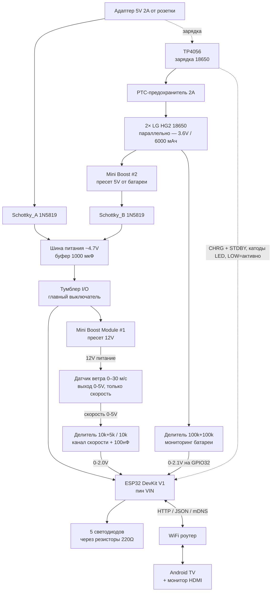
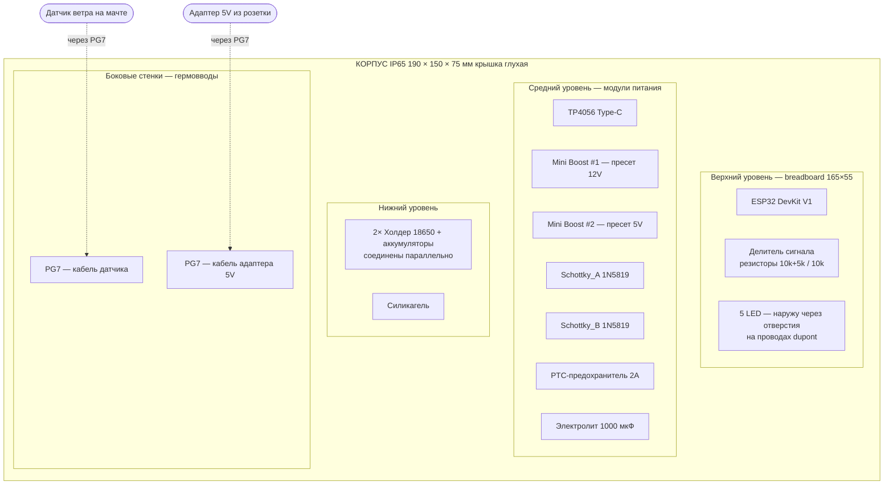

# Метеостанция ветра на ESP32 — Сборочный документ

## Описание проекта

DIY метеостанция для измерения ветра с резервным питанием от аккумулятора 18650 и выводом красивого дашборда на телефон, планшет или монитор через Android TV приставку. Станция **сама раздаёт WiFi** — подключаешься к её сети и открываешь дашборд, домашний роутер не нужен. Обновления прошивки — по OTA без вскрытия корпуса.

**Как открыть дашборд:** подключиться к сети `WindStation` (пароль — в `secrets.h`) и открыть `http://MyWindProbeBETA.org` — или `http://192.168.4.1`, если браузер капризничает. Обычно портал всплывает сам сразу после подключения.

**Датчик:** анемометр 0-5V, **только скорость** (с AliExpress)
**Диапазон:** скорость **0–30 м/с**. Канала направления нет
**Питание датчика:** 10–30V DC (используем 12V)
**Выходной сигнал:** аналоговый 0–5V (один канал)

> ⚠️ **Датчик сменился, и это важнее, чем выглядит.** Раньше стоял Polycarbonate
> «Wind Speed & Direction» на 0–60 м/с с каналом направления. Нынешний — **0–30 м/с
> и без направления**. В прошивке за это отвечают `SPEED_MAX = 30.0` и `HAS_DIRECTION 0`:
> оставленные от старого датчика 60 **удваивают каждое показание**. Канал направления
> (GPIO35) в коде выключен, провод к нему не идёт, второй делитель не собран.

---

## Список компонентов

| # | Компонент | Назначение |
|---|---|---|
| 1 | ESP32 DevKit V1 (30 pin, Type-C) | Контроллер, WiFi, веб-сервер, чтение ADC |
| 2 | Датчик ветра 0-5V, **0–30 м/с, только скорость** | Измерение скорости. Канала направления у него нет — прошивка собрана с `HAS_DIRECTION 0` |
| 3 | Mini Boost Module HW-085 / TMF002 (фиксированные пресеты 5/8/9/12V) ×**2** | #1 — повышает 5V→12V для питания датчика; #2 — повышает 3.7V→5V от батареи на шину (даёт стабильные 4.7V при отключении адаптера, без него ESP32 уходит в brownout на рывках WiFi) |
| 4 | TP4056 Type-C с защитой DW01A | Зарядка аккумулятора 18650 |
| 5 | Диод Шоттки 1N5819 ×**2** | Diode-OR load sharing: Schottky_A от адаптера, Schottky_B от boost#2 — на общую шину ~4.7V |
| 6 | Аккумулятор 18650 LG HG2 (INR18650HG2) 3000 мАч ×2 | Резервное питание (параллельно, суммарно 6000 мАч) |
| 7 | Холдер 18650 (1 слот) ×2 | Установка батарей (соединение параллельно) |
| 8 | Резисторы 10kΩ ×4 | Сигнальный делитель: **нижнее** плечо + **верхнее** плечо, 1-й резистор в серии. Собирается **один** делитель (скорость), на него нужно 2 шт; остальные 2 куплены под второй делитель для направления и лежат в запасе |
| 9 | Резисторы 5kΩ ×2 | **Верхнее** плечо сигнального делителя, 2-й резистор в серии (10k+5k = 15k; 5V → 2.0V, чистая линейная зона ADC). Отдельного 15kΩ в наборе нет. Нужен 1 шт, второй — запас |
| 10 | Резисторы 100kΩ ×2 | Делитель для мониторинга напряжения батареи на GPIO32 |
| 11 | Резисторы 220Ω ×5 | Токоограничение для LED |
| 12 | Керамический конденсатор 100 нФ ×4 | Фильтр ADC-входа скорости (×1), VIN (×1), батарейный делитель (×1). Четвёртый — запас, он предназначался второму ADC-входу (направление) |
| 13 | Электролитический конденсатор 1000 мкФ **16V** (или 10V как минимум) ×1 | Буфер на шине ~4.7V (гасит просадки при старте WiFi). **16V рекомендован** вместо 10V: защищает от случайной ошибки, если boost #2 настроен на 12V вместо 5V (10V версия в таком случае вздуется). Предпочтителен рейтинг 105°C. |
| 14 | Тумблер мини SPDT (~6A/125VAC) | Главный выключатель станции — разрывает шину питания перед нагрузкой (ESP32 + Boost#1) |
| 14b | PTC-предохранитель 2A radial самовосстанавливающийся (жёлтый дисковый TAIWAN) | Защита батарейной линии от КЗ (заменяет SMD «N») |
| 15 | LED зелёный 5мм ×2 | Заряд батареи >60% + WiFi (горит, пока станция кому-то доступна) |
| 16 | LED жёлтый 5мм ×1 | Средний ветер (>5 м/с) или заряд 30–60% |
| 17 | LED красный 5мм ×2 | Сильный ветер / низкий заряд (мигает при <10%) + ошибка |
| 18 | Breadboard 830 точек (165×55 мм) | Сборка без пайки |
| 19 | Провода dupont м-м 40 шт | Соединения на breadboard |
| 20 | Провода dupont м-ж 40 шт | Подключение модулей и LED |
| 21 | Корпус IP65 190×150×75 мм | Защита от влаги. ⚠️ Купленный экземпляр **глухой/чёрный, крышка непрозрачная** — исходный план «светодиоды видно через крышку» не сработал, светить придётся наружу или смотреть по дашборду |
| 22 | Гермовводы PG7 ×2 | Ввод кабелей в корпус |
| 23 | Адаптер 5V 2A (USB Type-C) | Основное питание от сети |
| 24 | Мультиметр | Опциональная проверка 12V на выходе boost-модуля |
| 25 | Силикагель (пакетик) | От конденсата в корпусе |

### Планируется для задачи 10 (4G/GPS) — ещё не в сборке

Ничего из этого блока в станции пока не стоит, но **докупать тоже нечего**: после перехода
на компоновку v6 «Компакт-1» весь список закрывается тем, что уже в хозяйстве. Расчёты, из
которых он получен, лежат в `tasks/10-a7670e-4g-gps.md`, §Питание. Позиция 30 не добавляется,
а **заменяет** уже стоящее (PPTC вместо позиции 14b).

| # | Компонент | Наличие | Назначение и почему именно такой |
|---|---|---|---|
| 26 | Плата BK-A7670 V1 (SIMCom A7670E) + плёночная LTE-антенна + патч GPS 1575 МГц | ✅ на руках | 4G-аплинк и координаты. Антенны подключены к J1/J2. Гребёнка CN101 распаяна — паять не нужно. ⚠️ **Штыри торчат со стороны наклейки**, поэтому на макетку модуль ложится наклейкой вниз, а micro-USB после посадки недоступен |
| 27 | Mini Boost MT3608 **№3** | ✅ есть | Отдельный источник 5.2 В для VCC модуля. Шина станции 4.7 В ниже минимума платы (5 В), буст №1 на 12 В — выше максимума |
| 29 | Электролит 1000 мкФ **≥10 В** ×1 | ✅ есть | C4 — в колонки 40/41 макетки, два ряда от контакта VCC модема. **Та же деталь, что позиция 13** (C1 на шине). Штатный тантал 470 мкФ на плате стоит **после** линейного стабилизатора и входную просадку не держит. Корпус ⌀8 мм удобнее ⌀10: рядом стоит C1 |
| 30 | PTC-предохранитель **3 А** radial (замена позиции 14b) | ✅ есть | Пик на разряженной банке ~1.83 А: модем 1.50 А + станция 0.33 А. Двухамперный работал бы на границе срабатывания — а его в июле уже вышибало |
| 32 | P-канальный MOSFET (high-side ключ) + обвязка затвора, на GPIO33 | ⏳ перед мачтой | Снятие питания с модема. PWRKEY прижат к земле через R104, а выход из CMUX у A7670 сломан — повисший модем поднять больше нечем. **Пока плата в руках, вместо ключа стоит перемычка `49j` → B3 IN+.** В v6 у него вторая работа: между сеансами он снимает нагрузку с зарядного узла |

> ⚠️ **Ключ обязан быть логического уровня.** `Rds(on)` в даташите должен нормироваться при
> `Vgs = −4.5 В` (годятся AO3401A, IRLML6402, NDP6020P); обычный IRF9540 нормируется при −10 В
> и на наших 4.2 В будет полуоткрыт и горяч. Кроме транзистора нужны **подтяжка 100 кΩ
> затвор→исток** (иначе при сбросе ESP32 состояние ключа неопределённое) и **NPN/N-FET снизу**,
> который тянет затвор к земле по GPIO33 — напрямую с 3.3 В логики верхний ключ не закрывается.
> Логика при этом инвертируется: **GPIO33 HIGH = модем включён**.

> **Как это подключается:** разводка блока нарисована в **`wiring-v6.html`** («Компакт-1»:
> модуль воткнут штырями прямо в ряд `a`, кол. 36–42, буст №3 кормится только с `OUT+` TP4056,
> UART на GPIO26/25 приходит в колонки 37/38). С макетки уходят **три** провода — `49j`, `45i`
> и один обратно в колонку 40 (5.2 В); земля модема — **перемычка `41b` → `44b`** на самой
> макетке (обоснование — в задаче 10, §Питание). Единственная правка существующей платы:
> **C1 переезжает с 39/41 на 43/44**. Предыдущий вариант (модем на весу, своё диодное ИЛИ на двух Шоттки 3 А)
> лежит в `wiring-v5.html` и к исполнению не берётся.
>
> ⚠️ **Контакты CN101 опознаются по буквам, а не по номерам** — цифр у пятаков на плате нет.
> Вдоль ребра идут `S`·`G`·`V`·`K`·`T`·`R`·`G`, и вторая `G` стоит вплотную к **micro-USB**.
> Модуль лежит наклейкой вниз, поэтому вдоль колонок это читается от разъёма: кол.36 = `G`
> (контакт 7), 37 = `R` (RXD), 38 = `T` (TXD), 39 = `K` (PWRKEY), 40 = `V` (VCC), 41 = `G`
> (контакт 2), 42 = `S` (SLEEP). Перепутанные концы = 5.2 В на TXD модуля.
>
> **Что выпало из этого списка при переходе на v6:** гнездовая планка PLS-7 (штыри идут прямо
> в отверстия макетки), два Шоттки 3 А (SS34 / 1N5822 / SR340), адаптер 5 В 3 А либо Rprog
> 2.4 кΩ и стойка M2. Диодного ИЛИ у модема больше нет, а заряд идёт своим током — штатного
> адаптера 2 А (позиция 23) хватает. Цена решения: **без установленной банки модем
> не заводится**, TP4056 в одиночку пик 1.5 А не отдаст. Разбор — в
> `tasks/10-a7670e-4g-gps.md`, §Топология.
>
> **Почему НЕ YX-850:** рассматривался как альтернатива связке TP4056 + диод Шоттки, но не нужен — diode-OR c двух Schottky дешевле и универсальнее. Вычеркнут из списка.
>
> **Почему два boost-модуля:** первый повышает шину 5V до 12V для сенсора (как раньше). Второй поднимает напряжение батареи 3.7V до 5V, чтобы при отключении адаптера шина оставалась в районе 4.7V — это обязательно, потому что у AMS1117 на ESP32 dropout 0.8–1.25V, и из 3.4V (батарея минус диод) регулятор не выдаёт стабильные 3.3V, ESP32 падает в brownout на пиках WiFi (500 мА).

---

## Блок-схема питания и сигналов



**Почему diode-OR с двумя Schottky, а не один диод:**

Один диод между TP4056 OUT+ и шиной (старая схема) оставлял шину на 3.4V при отключённом адаптере (батарея 3.7V − 0.35V на диоде). Для AMS1117 ESP32 это ниже dropout 0.8–1.25V ([datasheet](http://www.advanced-monolithic.com/pdf/ds1117.pdf)) — регулятор уже не держит 3.3V под нагрузкой, и любой пик WiFi TX (500 мА) роняет 3V3 ниже порога brownout ESP32 (2.43V).

Новая схема (diode-OR):
- **Адаптер → Schottky_A → шина** — адаптер в работе, шина 5V − 0.35V ≈ **4.7V**
- **Battery → PTC → TP4056 → OUT+ → Mini Boost #2 (пресет 5V) → Schottky_B → шина** — при отключении адаптера boost поднимает 3.7V до 5V, далее через диод: шина остаётся ≈ **4.7V**
- Оба Schottky смотрят катодами на одну и ту же шину; выигрывает источник с большим напряжением, другой закрыт
- AMS1117 на 4.7V VIN с dropout до 1.25V → 3.45V выхода с запасом 0.15V к минимуму 3.3V (под пики WiFi TX этого достаточно плюс буферный электролит 1000 мкФ)

Батарея изолирована от перезаряда: TP4056 работает штатно (IN+ получает 5V с адаптера, B+ подключён к ячейке через PTC, OUT+ замкнут на вход boost#2). Boost#2 не «утекает» в батарею — у него ноль обратной проводимости.

---

## Распиновка ESP32

| Пин ESP32 | Подключение | Назначение |
|---|---|---|
| VIN (5V) | Шина питания | Основное питание платы |
| GND | Общая земля | — |
| GPIO34 (ADC1) | Выход делителя (10k+5k)/10k — скорость | Чтение скорости ветра (0–2.0V) |
| GPIO35 (ADC1) | **Не подключён** — висит в воздухе | Был каналом направления у старого датчика. У нынешнего направления нет, в прошивке `HAS_DIRECTION 0`. Пин зарезервирован на случай возврата старого датчика |
| GPIO32 (ADC1) | Делитель 100k/100k от батареи | Мониторинг напряжения батареи |
| GPIO4  | 220Ω (на плате) → анод LED на крышке | Красный — ветер > 15 м/с или заряд 10–30%; мигает при заряде <10% |
| GPIO16 | 220Ω (на плате) → анод LED на крышке | Жёлтый — ветер > 5 м/с или заряд 30–60% |
| GPIO17 | 220Ω (на плате) → анод LED на крышке | Зелёный — заряд батареи > 60% |
| GPIO5  | 220Ω (на плате) → анод LED на крышке | Зелёный — WiFi: **горит, когда станция кому-то доступна** (клиент на точке ИЛИ домашняя сеть), мигает, когда ни того ни другого (strapping-пин, кратко мигает при загрузке) |
| GPIO18 | 220Ω (на плате) → анод LED на крышке | Красный — ошибка ADC или WiFi |
| GPIO13 | Катод индикаторного LED TP4056 (CHRG), напрямую | Идёт заряд батареи (активный LOW) |
| GPIO19 | Катод второго LED TP4056 (STDBY), напрямую | Заряд завершён (активный LOW); вместе с GPIO13 даёт «от сети / от батареи» |
| GPIO26 | Колонка **37** макетки (буква `R` на модуле A7670E) | UART2 TX → **RXD** модема. Буквы через линк намеренно не совпадают |
| GPIO25 | Колонка **38** макетки (буква `T` на модуле A7670E) | UART2 RX ← **TXD** модема. В прошивке включается флагом `HAS_MODEM` |

**Важно:** GPIO32, 34, 35 — это пины ADC1 (34/35 input-only). ADC2 (GPIO 0, 2, 4, 12–15, 25–27) **не работает одновременно с WiFi**, поэтому все аналоговые входы используем только на ADC1 (GPIO32–39).

GPIO13 формально относится к ADC2, но здесь он работает **цифровым входом** — запрет ADC2 касается только аналогового чтения при активном WiFi, цифровые вход/выход на этих пинах разрешены. По той же причине светодиод «ветер >15» стоит на **GPIO4** (тоже ADC2), а он работает **цифровым выходом** — это допустимо. **GPIO5 — strapping-пин** (должен быть HIGH при загрузке): светодиод на землю через 220 Ω не удерживает его в 0, поэтому лишь кратко мигает при включении. Назначен на WiFi-индикатор, который до подключения к сети и так погашен — безвредно.

**GPIO25/26 (UART модема) — тоже ADC2**, и по той же причине это допустимо: они работают как UART, а не как аналоговые входы. Отдельная ловушка не в ADC2, а в другом: **`Serial2` по умолчанию сидит на GPIO16/17, то есть на жёлтом и зелёном светодиодах**. В прошивке пины передаются в `Serial2.begin()` явно — с умолчаниями AT-команды пошли бы в светодиодную панель.

### Индикация заряда: CHRG / STDBY

**Отдельных пятачков `CHRG` и `STDBY` на модуле TP4056 нет** — наружу выведены только `IN+/IN−`, `B+/B−`, `OUT+/OUT−` (см. раздел про TP4056 в `tasks/04-power-rail.md`). Сигнал снимается **с катода индикаторного светодиода**; катодная площадка крупнее ножки микросхемы, паять к ней удобнее.

⚠️ **Какой светодиод есть какой — проверить на своей плате, не полагаться на цвет.** Распайка отличается между партиями. Проверка занимает секунду: вставь батарею и воткни зарядку — светодиод, который загорится и погаснет по окончании заряда, и есть `CHRG`; второй — `STDBY`.

**Делители не нужны, дополнительных деталей в BOM не добавляется.** Выводы `CHRG`/`STDBY` — открытый сток: при активном состоянии микросхема сажает узел на землю, в покое вывод в высокоимпедансном состоянии. Прошивка поднимает пин внутренней подтяжкой (`INPUT_PULLUP`), и уровни получаются полными: ~0.1 В активно, ~3.3 В в покое.

Делитель на землю здесь **применять нельзя**. В покое узел катода подтягивается через светодиод от 5 В и садится нагрузкой делителя примерно до 3.1 В; делитель 10k/15k даёт на пине 1.2–1.9 В — это между `Vil` (0.83 В) и `Vih` (2.48 В), то есть запрещённая зона, состояние будет плавать. Если нужна защита входа — ставится **последовательный** резистор 10 кΩ, но не делитель.

**Диагностика:** мультиметр между выбранным GPIO и землёй. Идёт заряд — около **0 В**; заряд закончен или зарядка не подключена — около **3.3 В**. Если при снятой батарее показания дёргаются примерно раз в секунду, это нормально: TP4056 без банки циклит индикацию.

#### Откуда берётся `powerSource` — почему отдельный съём с `IN+` не нужен

TP4056 способен посадить `CHRG` или `STDBY` к земле **только когда на его собственном входе есть питание** — активный вывод питается от той же шины `IN+`. Значит, обратное тоже верно: если обе линии в покое, на входе питания нет, и станция живёт от банок.

| `CHRG` | `STDBY` | `chargeState` | `powerSource` |
|---|---|---|---|
| активен (0 В) | покой | `charging` | `external` |
| покой | активен (0 В) | `full` | `external` |
| покой | покой | `discharging` | `battery` |

Поэтому **отдельный провод на `IN+` с делителем 100k/100k не ставится**: те же два состояния уже читаются с линий, которые всё равно заводятся ради индикации заряда. Экономия — один вывод ADC, два резистора и пайка к занятому пятачку.

**Оба провода обязательны.** По одному `CHRG` источник питания не определяется: линия уходит в покой и когда зарядка окончена, и когда шнур выдернут — состояния неразличимы. Прошивочный флаг `HAS_STDBY` переведён в `1`; пока `STDBY` физически не припаян, станция будет постоянно показывать `discharging` / «от батареи» — это не сбой, а отсутствие сигнала.

**Дребезг гасится в прошивке, RC-цепочки не нужны.** Без установленной банки TP4056 перекидывается между зарядом и standby примерно раз в секунду, и в момент переключения обе линии успевают побыть в покое. Прошивка опрашивает пины каждые 100 мс и **держит состояние ещё 3 с после пропадания сигнала** (`STATUS_HOLD_MS`) — надпись на дашборде не мигает, но выдернутый шнур замечается за пару секунд. Опрос вынесен отдельно от `readBattery()`: тот вызывается раз в 30 с и попадал бы в случайную фазу мигания.

**Про ADC 2.0V, а не 3.0V/3.3V:** делитель **(10k+5k)+10k** (верхнее плечо 15k собрано из 10k+5k последовательно) снижает 5V до 2.0V. Это сознательно ниже 3.3V, потому что ESP32 ADC при 11dB аттенюации **чисто линеен только в 150 мВ … 2.45V** ([ESP32 Forum](https://esp32.com/viewtopic.php?t=2881), [Arduino-ESP32 docs](https://docs.espressif.com/projects/arduino-esp32/en/latest/api/adc.html)); от 2.45V до 3.10V идёт нелинейная зона, которую factory two-point eFuse калибровка **не компенсирует полностью**, выше 3.10V — насыщение. Обратный вариант (большее плечо 10k+5k снизу, 10k сверху) давал бы 3.0V при 5V и заходил в нелинейную зону: на скоростях ветра >49 м/с показания занижались на 5–15%. Текущий (10k+5k)+10k даёт 0–2.0V — весь диапазон датчика 0–30 м/с в чистой линейной зоне, с запасом и на старый 0–60, если он когда-нибудь вернётся.

Прошивка использует `analogReadMilliVolts()` — функция применяет eFuse-калибровку и выдаёт мВ. Реальная точность в DIY-условиях (наводки на длинный кабель, температурный дрейф) — **±50–100 мВ**, а не ±30 мВ, как часто пишут в туториалах.

---

## Компоновка в корпусе 190×150×75 мм



**Размещение светодиодов:** все 5 LED выносятся длинными проводами dupont м-ж к крышке или стенке корпуса — чтобы статус станции был виден снаружи без открытия.

> ⚠️ **Крышка у купленного корпуса непрозрачная.** Исходный план «поставить LED под крышку и смотреть сквозь неё» не работает: нужны отверстия под 5-мм светодиоды с герметизацией (держатель с уплотнителем или капля прозрачного герметика), иначе IP65 теряется. Альтернатива, которая ничего не сверлит: смотреть состояние на дашборде — там те же четыре индикатора отдаются в `/api/data` полями `led*`.

---

## Делитель напряжения сигнала датчика

Сигнал датчика 0–5V нужно понизить до **0–2.0V** — это внутри чистой линейной зоны ADC ESP32 (150 мВ … 2.45V при 11dB).

```
  Сигнал датчика (0-5V)
         │
         ▼
      ┌──┴──┐
      │ 10k │  ← ВЕРХНЕЕ плечо, 1-й в серии
      └──┬──┘
      ┌──┴──┐
      │  5k │  ← ВЕРХНЕЕ плечо, 2-й в серии  (10k+5k = 15k)
      └──┬──┘
         ├─────► GPIO34 (макс 2.0V)
         ├──── 100 нФ ── GND   (фильтр шума от длинного кабеля)
      ┌──┴──┐
      │ 10k │  ← НИЖНИЙ резистор
      └──┬──┘
         │
        GND
```

**Формула:** `V_out = V_in × 10k / ((10k+5k) + 10k) = V_in × 0.4`
При V_in = 5V → V_out = **2.0V** ✓ (целиком внутри линейной зоны ADC 150 мВ – 2.45V, запас до 3.3V — большой буфер)

Инверсный коэффициент в прошивке: `((10+5)+10)/10 = 2.5` — умножаем на него напряжение с ADC, чтобы получить исходное напряжение датчика.

> **Почему именно так (большее плечо 10k+5k сверху), а не наоборот — 10k сверху + большее плечо снизу (то, что обычно советуют в туториалах):** обратный вариант давал бы 3.0V при 5V, что выходит за 2.45V — в нелинейную зону, где eFuse-калибровка не компенсирует ошибку. На скоростях >49 м/с (= 0.6 × 5V × 2.45/3 / делимое) показания занижались на 5–15%. Для метеостанции с потенциально ураганным ветром (>49 м/с это шторм 7 по Бофорту) это критично.

Делитель нужен **один** — канал скорости на GPIO34. У нынешнего датчика второго выхода нет, и в прошивке стоит `HAS_DIRECTION 0`, поэтому делитель направления не собирается, а GPIO35 остаётся не подключённым. Конденсатор 100 нФ на выходе делителя между GPIO34 и GND — фильтр высокочастотных наводок с длинного кабеля от мачты.

> Комплекты резисторов в BOM (10kΩ ×4, 5kΩ ×2) и конденсаторов посчитаны на **два** делителя — так покупалось под старый датчик с направлением. Уменьшать закупку смысла нет: лишние резисторы уже лежат, и второй делитель собирается за пять минут, если старый датчик вернётся.

---

## Делитель для мониторинга батареи

Напряжение батареи 3.0–4.2V нужно понизить, чтобы ADC ESP32 мог его читать (предел линейной зоны ~2.45V).

```
   Батарея (+) ─── PTC 2A ──── шина 3.7V
                                   │
                                ┌──┴──┐
                                │ 100k│
                                └──┬──┘
                                   ├──► GPIO32
                                   ├── 100 нФ ── GND
                                ┌──┴──┐
                                │ 100k│
                                └──┬──┘
                                  GND
```

**Формула:** `V_bat = V_adc × 2.0` (делитель 1:2)
При батарее 4.2V → на GPIO32 будет 2.1V (чистый линейный диапазон).

Прошивка пересчитывает в проценты: **3.5V = 0%**, 4.2V = 100%. 3.5V, а не 2.4V (предел защиты DW01A) — потому что при батарее ниже 3.5V Mini Boost #2 начинает терять регулировку (минимальное входное ≈ 2.0V по datasheet чипа MT3608, но при 3.5V запас для подъёма в 5V быстро тает), шина просаживается ниже 4.3V и AMS1117 на ESP32 выходит из регулировки. Индикатор коррелирует с реальным моментом, когда станция становится нестабильной, а не с теоретическим пределом ячейки (2.4V у DW01A).

**Почему 100k + 100k (большие резисторы):** через делитель постоянно течёт ток `V/(R1+R2) = 3.7V / 200k = 18.5 мкА` — на порядок меньше, чем через сигнальный делитель (10k+5k)+10k (при 5V это `5V/25k = 200 мкА`). За сутки расход `18.5 мкА × 24 ч = 0.44 мАч` — абсолютно ничтожно для батареи 5000 мАч.

---

## Фильтры по питанию

Помимо конденсаторов на делителях, добавь ещё два по питанию:

| Конденсатор | Где ставить | Зачем |
|---|---|---|
| **1000 мкФ 16V электролит** (или 10V как минимум) | на шину ~4.7V breadboard, «плюсом» к шине, «минусом» к GND | гасит просадки при рывке тока на старте WiFi (ESP32 может кратковременно потреблять 500–800 мА). 16V рекомендован: защита от ошибки пресета boost #2. Рейтинг 105°C предпочтителен (долгая жизнь в тёплом корпусе). |
| **100 нФ керамика** | как можно ближе к пинам VIN/GND ESP32 | фильтр высокочастотных помех, стабилизирует LDO на плате |

Обязательно соблюдай полярность электролита — длинная ножка `+`, полоска на корпусе указывает на минус.

---

## USB-Serial драйвер для Windows 11

На плате рядом с AMS1117 стоит USB-Serial мост — один из трёх вариантов: **CP2102**, **CH9102X** или **CH340**. Это определяет, какой драйвер нужен.

**Порядок проверки:**

1. Воткни ESP32 в USB (**до установки датчика и батарей** — просто посмотреть, определяется ли плата)
2. Открой `Диспетчер устройств` → раздел `Порты (COM и LPT)` или `Другие устройства`
3. Найди новое устройство, ПКМ → `Свойства` → вкладка `Сведения` → `ИД оборудования`
4. По VID/PID определи чип:

| VID & PID | Чип | Драйвер |
|---|---|---|
| `VID_10C4 & PID_EA60` | **CP2102** | Silicon Labs CP210x (обычно Windows 11 ставит сам) |
| `VID_1A86 & PID_55D4` | **CH9102X** | WCH CH343SER (скачать с wch-ic.com) |
| `VID_1A86 & PID_7523` | **CH340C** | WCH CH341SER |

**Если плата не появляется вообще** — попробуй другой USB-C кабель: у дешёвых бывает только заряд без data. Кабель должен быть **data-capable**.

**Если появляется как «неизвестное устройство» с жёлтым треугольником** — нужен драйвер, см. таблицу выше.

После установки драйвера в Arduino IDE появится новый COM-порт — его и выбирай для прошивки.

---

## PWR LED и автономность

На плате ESP32 DevKit стоит красный PWR LED, который горит всегда, пока есть питание. Он потребляет ~5 мА непрерывно.

**Реалистичная автономка от батареи (2× LG HG2 6000 мАч суммарно, прошивка always-on webserver, новая архитектура с двумя boost):**

Энергетический подсчёт (не по току, а по Wh — потому что цепь поднимает 3.6V батареи до 4.7V на шине через boost#2 с КПД ~85%):
- Запас батареи: `6000 мАч × 3.6V = 21.6 Вт·ч`
- После boost#2 (КПД ~85% для 3.6V→5V): `≈ 18.4 Вт·ч` на шине
- Минус потери на Schottky_B: `0.35V × 0.2A = 0.07 Вт` непрерывно — пренебрежимо
- Потребление на шине 4.7V:
  - ESP32 + WiFi (сервер + polling 2с): ~100 мА
  - Датчик 25 мА через boost#1 12V (η≈85%): ~75 мА на входе boost#1
  - PWR LED: ~5 мА
  - Статусные LEDы (в среднем 2 активных): ~10 мА
  - **Итого ≈ 190 мА × 4.7V ≈ 0.89 Вт**
- **Автономка: `18.4 Вт·ч / 0.89 Вт ≈ 20.7 часа`** (округлённо 19–21 час — зависит от температуры, старения батарей и реального поведения WiFi)

**Что даёт выпайка PWR LED:** `5 мА × 4.7V × 21 ч ≈ 494 мВт·ч` = ~2.7% расхода → продление с 20.7 до ~21.3 часа. Заметной разницы нет.

**Многодневная автономия** физически недостижима с текущей прошивкой (always-on WiFi, постоянный опрос). Для недель/месяцев автономной работы нужен Deep Sleep (опрос раз в N минут) + отключение датчика между замерами — это переделка архитектуры прошивки и питания, см. «Что можно улучшить потом».

**Рекомендация:** оставить PWR LED как есть. Станция питается от сети, батарея — резерв на часы перебоев, выигрыш в 1 час автономки не стоит вскрытия SMD. Если всё же хочется выпаять: паяльником 25–40 Вт разогреть одну сторону SMD-компонента, наклонить плату, переместить кончик на вторую сторону — компонент отскочит. Искать 1 кΩ резистор или сам LED рядом с надписью `PWR` возле AMS1117.

---

## Сеть станции, портал и OTA

**Своя сеть у станции есть всегда.** Она поднимается при включении, и никакая логика в прошивке
её не выключает — это главное отличие от прежней версии, где AP жила лишь пока не найдена
знакомая сеть, и через ~15 секунд после включения станция просто пропадала с телефона.

**Вдобавок к своей сети плата с 2026-08-15 входит в домашнюю** (режим AP+STA). Это не возврат
старого поведения: домашняя сеть — дополнение, а не замена, и если её нет рядом, не меняется
ровно ничего.

| Параметр | Значение |
|---|---|
| Имя сети (SSID) | `WindStation` |
| Пароль | из `secrets.h` |
| Адрес дашборда | `http://MyWindProbeBETA.org` |
| Он же по IP | `http://192.168.4.1` |
| Клиентов одновременно | до 4 |
| Домашние сети | список `SECRET_HOME_NETWORKS` в `esp32_wind_station/secrets.h` (файл вне git) |
| Адрес в домашней сети | выдаёт роутер; смотреть поле `staIp` в `/api/data` или строку в Serial |

**Про домашнюю сеть.** Вписывать её через дашборд нельзя и не задумано — это список констант
в скетче, меняется вместе с перепрошивкой. Что важно знать:

- **Сетей может быть сколько нужно.** `SECRET_HOME_NETWORKS` в `secrets.h` — список пар
  «имя, пароль», порядок задаёт приоритет: дом, дача, телефон-раздача. Плата пробует их по очереди, по 12 секунд
  на каждую, и останавливается на первой, которая отозвалась
- **Только 2.4 ГГц.** У ESP32 нет радио на 5 ГГц, поэтому сеть с суффиксом `-5G` он не увидит
  никогда. У двухдиапазонного роутера нужна вторая половина, без суффикса
- **Точка доступа один раз моргнёт.** Радио у чипа одно: своя сеть стартует на канале 1, а при
  входе в роутер переезжает на его канал. Подключённый к `WindStation` телефон в этот момент
  отвалится и подключится заново. Это происходит один раз, через несколько секунд после включения
- **Если ни одной из сетей рядом нет** (мачта, дача, поле) — плата пробует всё реже:
  30 секунд, минута, две… до десяти минут между полными проходами по списку. Так сделано потому,
  что каждая попытка уводит радио с канала своей сети, и дашборд на это время замирает.
  Совсем отключить попытки — поставить `SECRET_HAS_HOME_NETWORK 0` в `secrets.h`

**Про адрес.** Имя резолвится DNS-сервером самой платы, который отвечает этим адресом на любой
запрос. Поэтому оно работает даже там, где `.local` ненадёжен — например на Android. Плата ещё
анонсирует captive-portal через DHCP option 114, так что телефон обычно сам предлагает открыть
дашборд сразу после подключения. Bonjour и прочие пляски с mDNS больше не нужны.

Две мелочи, которые не сломают ничего, но заметны:
- домен на нас не зарегистрирован, поэтому пока устройство подключено к станции, настоящий сайт
  по этому адресу для него будет недоступен. У точки всё равно нет выхода в интернет
- браузер для настоящего домена сначала пробует HTTPS и только потом откатывается на HTTP —
  первое открытие занимает лишнюю секунду. Плата на 443 порту не слушает и слушать не будет

**mDNS** тоже работает, как запасной путь: `http://mywindprobebeta.local` — и из своей сети
станции, и из домашней (при подключении к домашней сети mDNS перезапускается на обоих
интерфейсах). На Windows `.local` капризничает, там надёжнее IP.

**OTA (обновление по воздуху):**
- Из домашней сети — по адресу из `staIp`. Компьютер никуда переключать не нужно, интернет
  не пропадает. Это основной путь
- Если аплинка нет (или прошивка на плате старее 2026-08-15) — подключить компьютер к сети
  `WindStation` и заливать по `192.168.4.1`
- Arduino IDE → `Инструменты → Порт → Network Port` → `mywindprobebeta`
- Пароль OTA: `SECRET_OTA_PASSWORD` в `esp32_wind_station/secrets.h` — этот файл вне git,
  на свежем клоне копируется из `secrets.example.h`
- Прошивай, не открывая корпус IP65. Подробности и разбор ошибок — в `FLASHING.md`

---

## Пошаговая сборка

### Этап 1: Проверка пресетов двух boost-модулей (ОБЯЗАТЕЛЬНО до подключения датчика и батареи!)

У тебя **два** модуля Mini Boost, оба с фиксированными пресетами (5V / 8V / 9V / 12V), которые выбираются джамперами — двумя падами `A` и `B` на лицевой стороне платы.

**Нужные пресеты:**
- **Boost #1** → **12V** (для датчика ветра) — пресет `1 1`
- **Boost #2** → **5V** (поднимает батарею на шину) — пресет `0 0`

**Таблица выбора напряжения (типовая для HW-085, см. врезку ниже):**

| A | B | VOUT | Применение в проекте |
|---|---|------|---|
| **0** | **0** | **5V** | ← **Boost #2** (от батареи на шину) |
| 0 | 1 | 8V | — |
| 1 | 0 | 9V | — |
| **1** | **1** | **12V** | ← **Boost #1** (для датчика) |

`0` = пад разомкнут, `1` = пад замкнут каплей припоя. С завода обычно оба пада замкнуты → **12V**. Для boost#2 **надо снять припой** с обоих падов.

⚠️ **Таблица для HW-085.** У клонов (TMF002 и безымянные) логика пресета может быть инвертирована или пары расположены иначе. Доверяй мультиметру, не таблице.

⚠️ **Не перепутай физически IN и OUT.** Различающий признак — расстояние между контактами, а не сторона платы: **два коннектора, расположенные РЯДОМ (близко друг к другу) — это IN**; **два коннектора, разнесённые К КРАЯМ платы — это OUT**. Оба модуля легко вставить в макетку развёрнутыми на 180° — визуально они почти симметричны. Ошибка не бьёт по защите (нет защиты от переполюсовки, см. ниже), но выход остаётся без питания или недобирает напряжение: датчик или шина молчат, а прошивка это не отличит от обрыва сигнального провода. Проверяй ориентацию мультиметром на шаге 3 ниже, а не на глаз.

**Пошагово для каждого модуля:**

1. Посмотри на лицевую сторону модуля — найди пады с буквами `A` и `B`
2. Настрой пресет:
   - **Boost #1** (для датчика, 12V): убедись, что оба пада замкнуты припоем (конфигурация `1 1`)
   - **Boost #2** (для батареи, 5V): оба пада должны быть **разомкнуты**. Если залиты припоем с завода — аккуратно выпаять/размыть паяльником
3. **Обязательная** проверка мультиметром (для обоих):
   - Подай на вход (IN+/IN−) 5V от USB-адаптера (соблюдай полярность! нет защиты от переполюсовки)
   - **Ничего не подключай к выходу**
   - Измерь OUT+/OUT−:
     - Boost #1 → ~12V (11.5–12.5)
     - Boost #2 → ~5V (4.8–5.2)
   - Если не сходится — перепаяй пады по результату, а не по таблице
4. Отключи питание, промаркируй модули «#1 12V» и «#2 5V» маркером

⚠️ **Важные отличия от классического MT3608:**
- Входное напряжение **должно быть меньше выходного** (Vin < Vout − 0.5V). При пресете 12V — вход 5V или 3.7V норм, но **нельзя подавать 12V на вход**.
- Максимальный ток на выходе: ~0.5A при входе 3.7V или 5V. Для датчика ветра (25 мА) это с огромным запасом.
- Нет защиты от переполюсовки — будь внимателен с плюсом/минусом на входе.

### Этап 2: Подготовка и сборка питания

#### 2.1 Выравнивание напряжений батарей (ОБЯЗАТЕЛЬНО перед соединением!)

⚠️ **Два Li-ion аккумулятора нельзя просто так соединять параллельно** — если их напряжения различаются, один начнёт заряжать другой большим током через себя. Это приводит к перегреву, вздутию и в худшем случае возгоранию.

1. Измерь мультиметром напряжение **каждой** батареи отдельно
2. Разница должна быть **не больше 0.05V**
3. Если разница больше — зарядить каждую батарею отдельно (в отдельном TP4056 или бытовом зарядном) до одинакового уровня (например, обе по ~3.7–3.8V)
4. Проверь ещё раз после "отдыха" 30 минут — напряжение должно устояться

#### 2.2 Параллельное соединение батарей

1. Установи обе 18650 в холдеры (соблюдай полярность — знаки на дне холдеров)
2. Соедини холдеры параллельно:
   - Плюс холдера 1 + Плюс холдера 2 → общий провод **+**
   - Минус холдера 1 + Минус холдера 2 → общий провод **−**
3. Получаешь одну виртуальную "батарею" 3.7V / 5000 мАч

```
  Холдер 1 (+) ──┬──► общий +  (к B+ TP4056)
  Холдер 2 (+) ──┘

  Холдер 1 (−) ──┬──► общий −  (к B− TP4056)
  Холдер 2 (−) ──┘
```

#### 2.3 Подключение к TP4056 и схеме питания (diode-OR load sharing с двумя Schottky)

1. Соедини общий **+** батарей → **PTC-предохранитель 2A** → B+ на TP4056
2. Соедини общий **−** батарей → B− на TP4056
3. **Адаптер → Schottky_A → шина:**
   - Плюс адаптера 5V → анод Schottky_A (1N5819, без полоски)
   - Катод Schottky_A (с полоской) → шина breadboard
   - Минус адаптера → общий GND
4. **Батарея → boost#2 → Schottky_B → шина:**
   - От OUT+ TP4056 → IN+ второго Mini Boost (#2, пресет 5V, проверь пады A/B — см. Этап 1)
   - От OUT− TP4056 → IN− boost#2 → общий GND
   - OUT+ boost#2 → анод Schottky_B (без полоски)
   - Катод Schottky_B (с полоской) → шина breadboard (та же шина, что и после Schottky_A — оба диода сходятся в одной точке)
   - OUT− boost#2 → GND
5. Поставь **электролит 1000 мкФ 16V** (или 10V) между шиной и GND (плюс к шине, минус/полоска к GND)
6. Установи **тумблер SPDT** между шиной и нагрузочным рельсом:
   - Один крайний пин тумблера → шина ~4.7V (после конденсатора)
   - Другой крайний или средний пин → нагрузочный рельс (к VIN ESP32 и IN+ Boost#1)
   - SPDT: используй средний пин как «общий» и один крайний как «нагрузка». Третий пин оставь висеть (или на GND через 10k).
   - В положении I (замкнуто): станция работает; в положении O: ESP32 и датчик обесточены (батарея продолжает заряжаться от адаптера через TP4056)
7. Соедини все GND в одну общую точку:
   - GND TP4056
   - Минус адаптера
   - GND breadboard
   - Общий минус батарей
   - GND boost#2
8. Подай 5V от адаптера → красный LED на TP4056 должен загореться (идёт зарядка), тумблер переведи в I → на нагрузочном рельсе мультиметр показывает **4.6–4.8V**

**Время зарядки:** ~7 часов до полной зарядки (ток 1A на 6000 мАч = 0.17C — щадящий режим, увеличивает срок службы батарей LG HG2).

**Автономность при отключении сети:** ~19–21 час непрерывной работы (считай из энергии: 6000 мАч × 3.6V × 0.85 КПД boost#2 ≈ 18.4 Вт·ч / 0.89 Вт потребления на шине). Без boost#2 (старая схема) было бы 0 часов автономки — шина падала до 3.4V, ESP32 уходил в brownout на первом пике WiFi. Для многодневной автономки всё равно нужен Deep Sleep — см. «Что можно улучшить потом».

### Этап 3: Сборка на breadboard

1. Установи ESP32 в центр breadboard (чтобы с обеих сторон были свободные ряды)
2. Подключи VIN ESP32 → шина ~4.7V, GND → общая земля
3. Поставь керамику **100 нФ** между VIN и GND ESP32 как можно ближе к пинам
4. Собери **один** сигнальный делитель (канал скорости): сверху **10k + 5k последовательно (= 15k)**, снизу **10k**. Второй делитель не нужен — у датчика нет канала направления
5. На выход делителя (перед GPIO34) поставь **100 нФ** на землю — фильтр шумов
6. Подключи выход делителя к GPIO34 (скорость). **GPIO35 не трогай** — он остаётся не подключённым, в прошивке `HAS_DIRECTION 0`
7. Собери делитель мониторинга батареи: **100k + 100k** между шиной 3.7V (после PTC) и GND, средняя точка → GPIO32 + **100 нФ** на GND
8. Поставь 5 резисторов 220Ω **на плату** (нижний банк), к пинам нижнего ряда ESP32; сами светодиоды — на крышке:
   - GPIO нижнего ряда (**4, 16, 17, 5, 18**) → резистор 220Ω на плате → провод к длинной ножке (аноду) LED на крышке
   - Короткие ножки (катоды) всех 5 LED соединены вместе → общий провод назад на GND
   - Всего к крышке идёт 6 проводов: 5 анодов + 1 общий катод
9. Подключи **Mini Boost #1** (IN+/IN-) к шине ~4.7V, выход (OUT+/OUT-) 12V выведи на клеммы для датчика
10. **Mini Boost #2** уже подключён в Этапе 2.3 (вход от OUT+ TP4056, выход через Schottky_B на шину). Проверь мультиметром: OUT+ boost#2 должен показывать **~5V** при подключённой батарее (даже если адаптер в розетке)

### Этап 4: Прошивка и проверка без датчика

1. Подключи ESP32 к компьютеру через USB
2. Если плата не определяется или COM-порт не появляется → см. раздел **«USB-Serial драйвер для Windows 11»** выше
3. Открой Arduino IDE, установи ESP32 Board Manager
4. Открой скетч `esp32_wind_station.ino`
5. **Скопируй `esp32_wind_station/secrets.example.h` в `secrets.h`** — без него скетч не
   соберётся, компилятор так и напишет. Ничего дописывать туда не обязательно: в шаблоне
   уже лежат пароли точки и OTA из этого документа, а домашние сети выключены.
   Пароль точки — строго 8–63 символа, короче ESP32 молча поднимет **открытую** сеть
6. Выбери плату: **ESP32 Dev Module**, правильный COM-порт
7. Нажми Upload
8. Открой Serial Monitor (115200 бод) — увидишь `AP 'WindStation' up  IP: 192.168.4.1`
   и строку про DNS catch-all
9. Подключи телефон или ПК к сети `WindStation` (пароль — в `secrets.h`) и открой
   `http://MyWindProbeBETA.org`. Обычно портал всплывает сам
10. При отсутствии датчика LED `ОШИБКА` (GPIO18) **не загорится** — это не поломка.
    Детектор срабатывает только на глухое замыкание сигнала на землю (<10 мВ), а
    неподключённый вход читается тем же полом АЦП ~145 мВ, что и датчик на нуле.
    Скорость на дашборде при этом будет `0.00` — гейт `SPEED_ZERO_MV = 150` режет всё,
    что ниже порога
11. Дальше обновления идут по OTA — но только с компьютера, подключённого к сети станции:
    Arduino IDE → `Инструменты → Порт → Network Port → mywindprobebeta`

### Этап 5: Подключение датчика

1. **Выключи питание полностью**
2. Подключи провода датчика по схеме (цвета уточни в инструкции датчика):
   - VCC (обычно красный) → выход Mini Boost **#1** +12V
   - GND (обычно чёрный) → общая земля
   - Сигнал скорости (0–5V) → вход делителя
   - Четвёртого провода (направление) у этого датчика нет
3. Подай питание
4. Проверь что датчик вращается свободно (подуй на чашки)
5. Открой веб-дашборд — должно появиться реальное значение скорости. Направление там не показывается: `dirPresent` в `/api/data` всегда `false`

### Этап 6: Монтаж в корпус

1. Выключи питание
2. Просверли 2 отверстия под гермовводы PG7 в боковой стенке корпуса
3. Установи гермовводы, протяни через них кабели датчика и адаптера
4. Закрепи breadboard на дно корпуса (двусторонний скотч 3M или термоклей)
5. Модули питания (TP4056, Mini Boost **#1** для 12V, Mini Boost **#2** для 5V) → на термоклей к дну
6. Холдер 18650 → в свободный угол
7. Выведи светодиоды проводами к крышке — крышка глухая, так что либо отверстия с герметизацией, либо смотреть статус на дашборде (см. «Размещение светодиодов»)
8. Брось внутрь пакетик силикагеля
9. Закрой крышку, проверь что уплотнитель плотно прилегает

### Этап 7: Дашборд на мониторе

1. На Android TV приставке установи **Fully Kiosk Browser** (APK)
2. Подключи приставку к домашней сети — станция там тоже есть, и интернет у приставки
   останется. Если дома роутера нет, подключай к `WindStation` (пароль — в `secrets.h`), но учти:
   в этой сети интернета у приставки не будет — станция его не раздаёт
3. Пропиши в настройках URL: адрес станции в домашней сети (`staIp` из `/api/data`) либо
   `http://192.168.4.1`, если приставка сидит на сети станции. Для киоска лучше именно IP:
   он не зависит ни от DNS, ни от того, как прошивка Fully обрабатывает переход с HTTPS на HTTP.
   Адрес в домашней сети стоит закрепить в роутере за MAC платы, иначе DHCP его однажды сменит
4. Включи автозапуск и полноэкранный режим
5. Подключи монитор по HDMI
6. При включении приставка будет сразу показывать дашборд
7. В дашборде есть кнопка ⚙ в правом верхнем углу — там можно поменять хост ESP32 без правки кода (сохраняется в localStorage браузера)

---

## Безопасность

⚠️ **Li-ion 18650 — опасны при неправильном обращении:**
- Никогда не замыкай клеммы аккумулятора
- Используй только защищённую схему (DW01A в TP4056 защищает от переразряда и перегрузки)
- При вздутии, нагреве или запахе — немедленно изолируй и утилизируй
- Не заряжай при температуре ниже 0°C или выше +45°C

⚠️ **Оба boost-модуля — проверь пресеты ДО подключения:**
- Boost **#1** → 12V (пады A и B **замкнуты** припоем) — иначе датчик не запустится
- Boost **#2** → 5V (пады A и B **разомкнуты**) — иначе шина при автономке либо не дотянет до нужных 4.7V (пресет меньше), либо даст слишком много и опасно нагрузит электролит. При 16V электролите риск только выше 16V (пресета такого нет, безопасно); при 10V электролите — взорвётся при любом пресете от 12V. Рекомендуется 16V.

⚠️ **Полярность аккумуляторов** — TP4056 не имеет защиты от переполюсовки. Перепутаешь плюс и минус — модуль сгорит сразу. При параллельном соединении двух батарей будь особенно внимателен: неправильно соединённые батареи (плюс к минусу) дадут короткое замыкание на ~5000 мАч — это очень опасно.

⚠️ **Выравнивание напряжений** — перед соединением двух 18650 параллельно обязательно проверь мультиметром что у обеих напряжение одинаковое (разница < 0.05V). Иначе одна батарея начнёт заряжать другую большим током через себя — перегрев, вздутие, возможно возгорание.

⚠️ **Корпус не на солнце** — внутри IP65 без вентиляции быстро перегреется ESP32 и батарея. Монтируй в тень или под козырёк крыши.

⚠️ **ESP32 не любит 5V на GPIO** — поэтому делитель напряжения обязателен. Без него ADC пин получит 5V и может выйти из строя.

⚠️ **Грозовая защита** — длинный кабель датчика на мачте работает как антенна. Для серьёзного монтажа добавь газовый разрядник или TVS-диоды на линии датчика. Для домашнего варианта на балконе можно не делать.

---

## Проверочный чеклист перед запуском

- [ ] USB-Serial драйвер установлен, плата определяется как COM-порт в Arduino IDE
- [ ] Mini Boost **#1** настроен на 12V (пады A и B замкнуты, проверено мультиметром)
- [ ] Mini Boost **#2** настроен на 5V (пады A и B разомкнуты — конфигурация `0 0`, проверено мультиметром)
- [ ] Напряжения обеих 18650 выровнены до разницы < 0.05V **перед** соединением
- [ ] Полярность 18650 правильная (проверена по маркировке холдеров)
- [ ] Батареи соединены параллельно: плюс к плюсу, минус к минусу
- [ ] PTC-предохранитель 2A установлен на плюсовой линии батарей
- [ ] **Schottky_A** установлен между плюсом адаптера 5V (анод) и шиной (катод/полоска)
- [ ] **Schottky_B** установлен между OUT+ boost#2 (анод) и шиной (катод/полоска)
- [ ] Обе катодные стороны Schottky_A и Schottky_B сходятся в одну точку шины
- [ ] Все GND объединены в одну общую точку (включая GND boost#2)
- [ ] Электролит 1000 мкФ стоит на шине ~4.7V (полярность соблюдена)
- [ ] Тумблер SPDT установлен между шиной и нагрузочным рельсом (средний пин → шина, крайний → нагрузка)
- [ ] Керамика 100 нФ стоит у VIN ESP32 и на выходе сигнального делителя (GPIO34)
- [ ] Сигнальный делитель собран **один**: сверху **10k + 5k последовательно (= 15k)** (со стороны сигнала), **10k** снизу (к GND); GPIO35 не подключён
- [ ] Делитель батареи: 100k + 100k на GPIO32, конденсатор 100 нФ на GND
- [ ] Резисторы 220Ω стоят на плате (нижний банк), 5 LED — на крышке; анод каждого LED через резистор к GPIO (4, 16, 17, 5, 18), катоды общие → GND
- [ ] Сеть `WindStation` видна с телефона и пускает по паролю из `secrets.h`
- [ ] Дашборд открывается по `http://MyWindProbeBETA.org` (и по `http://192.168.4.1`)
- [ ] Датчик вращается свободно, показания меняются при ветре
- [ ] Напряжение батареи на дашборде адекватное (3.5–4.2V)
- [ ] Гермовводы затянуты, силикагель внутри, крышка закрыта
- [ ] Корпус не под прямыми солнечными лучами

---

## Диагностика проблем

| Проблема | Возможная причина | Решение |
|---|---|---|
| Плата не определяется как COM-порт | Нет драйвера USB-Serial | См. раздел «USB-Serial драйвер». Проверь также что кабель data-capable |
| Плата видна но не прошивается | Выбран неверный чип в Arduino IDE | ESP32 Dev Module + правильный COM + скорость 115200 |
| ESP32 не включается | Нет 5V на VIN | Проверь диод Шоттки, полярность |
| Сети `WindStation` нет в списке | Плата не запустилась или AP не поднялась | Смотри Serial: должна быть строка `AP 'WindStation' up`. Нет строки — питание/brownout |
| Сеть открытая, без пароля | `apPassword` короче 8 символов | ESP32 в этом случае молча поднимает открытую сеть. Верни пароль длиной 8–63 |
| Подключился, но дашборд не открывается | Браузер ушёл на HTTPS | Открой `http://192.168.4.1` напрямую — плата на 443 не слушает |
| Телефон отваливается от сети станции | Android уходит на сеть с интернетом | Выключить «переключаться на мобильные данные» / «умный выбор сети» |
| OTA не видит плату | Другая подсеть или файрвол | Прошей один раз по USB, проверь что Arduino IDE и ESP32 в одной сети |
| Датчик показывает 0 | Нет 12V питания | Проверь пресет A/B на boost **#1** (12V для сенсора) и выход мультиметром |
| Автономка не работает (ESP32 уходит в brownout при отключении адаптера) | boost #2 не выдаёт 5V или неправильный пресет | Мультиметр на OUT+ boost #2: должно быть ~5V. Проверь пресет A/B = `0 0` (оба пада **разомкнуты**). Schottky_B в правильную сторону (анод к boost, катод к шине) |
| Дашборд показывает «ADC · ОШИБКА» | Сигнальный провод замкнут на землю (<10 мВ дольше 1.5 с) | Обрыв этот детектор **не ловит** — висящий вход даёт те же ~145 мВ, что и датчик на нуле. Ищи короткое: выход делителя, 100 нФ, пайку GPIO34 |
| Скорость всегда `0.00`, а датчик крутится | Нет 12V на датчике, оборван сигнальный провод, или скорость реально ниже ~2.3 м/с | Посмотри `speedMv` в `/api/data`: ~145 мВ = сигнала нет вовсе; выше 150 мВ = сигнал есть, но гейт `SPEED_ZERO_MV` его режет — это предел железа, см. раздел про порог АЦП |
| Значения скачут | Наводки на кабель | Укороти кабель, добавь экранирование, конденсаторы 100 нФ на ADC |
| Батарея не заряжается | Адаптер слабый | Используй 5V 2A минимум |
| TP4056 греется | Ток заряда 1A слишком большой | Это нормально, добавь радиатор |
| ESP32 перезагружается | Просадка по питанию | Проверь электролит 1000 мкФ на шине ~4.7V; также проверь, что boost#2 выдаёт 5V и Schottky_B подключён правильно |
| LED не горят | Перепутан катод/анод | Переверни LED |
| Показывает «Заряд: 0%» при подключённом адаптере | Делитель батареи не подключён или GPIO32 висит | Проверь делитель 100k/100k на GPIO32 |
| Автономия меньше ожидаемой | PWR LED на ESP32 ест ~5 мА | См. раздел «PWR LED и автономность» — можно выпаять |

---

## Что можно улучшить потом

- **OLED дисплей SSD1306 0.96"** прямо на корпусе для локального отображения
- **WS2812B лента** вместо обычных LED — красивая шкала ветра
- **RS485 версия датчика** — если кабель будет длиннее 10 метров
- **SIM800L / A7670E** — для работы без WiFi, в поле
- **Grafana + InfluxDB** на домашнем сервере — для истории и графиков за месяцы
- **Deep Sleep** — если работает только от батареи, можно растянуть автономность на недели (потребует переделки питания)
- ~~**WiFiManager / Captive Portal** — настройка SSID/пароля без перепрошивки~~ — ✅ снято с повестки (2026-08-07): станция стала точкой доступа и только ей, настраивать нечего. Промежуточный вариант с пулом до 6 сетей в NVS и своей AP `WindStation-Setup` прожил с 2026-08-02 по 2026-08-07 и лежит в `archive/firmware-v2-multiwifi-2026-08-02/`
- **Возврат в домашнюю сеть вторым режимом** — если однажды захочется и дашборда из дома, и автономности в поле. Осознанно не сделано: именно совмещение двух ролей и приводило к тому, что AP гасла через 15 секунд после старта
- **TVS-диоды или газовый разрядник** на линии датчика — грозовая защита для монтажа на высокой мачте

---

## Итог

После сборки у тебя будет:
- Автономная метеостанция с резервным питанием и мониторингом заряда
- Красивый дашборд в реальном времени на телефоне или большом мониторе — станция раздаёт его сама, без роутера и интернета
- Индикация состояния через 5 LED (видно снаружи корпуса)
- Защита от дождя (IP65), от КЗ на батарее (PTC), от помех на ADC (конденсаторы)
- Возможность управлять светодиодами с дашборда и сбрасывать порыв
- Обновление прошивки по WiFi (OTA) без вскрытия корпуса
- Калиброванные показания ADC через `analogReadMilliVolts()` (точность ±50–100 мВ в DIY-условиях)

Удачи со сборкой! 🌬️
