# Метеостанция ветра — сборка для новичков (tutorial)

Это обучающий документ поверх `wind-station-assembly.md`. Если reference-документ говорит «что и куда», то этот — **«как, зачем и как проверить, что ты всё сделал правильно»**. Читай их параллельно: открой reference в соседней вкладке и сверяйся с ним, когда нужна картинка распиновки или блок-схема.

> **Для кого эта инструкция:** ты впервые держишь мультиметр, не паял SMD, путаешь анод с катодом и не уверен, в какую сторону втыкать диод. После прохождения этой инструкции у тебя будет собранная и работающая метеостанция — или чёткое понимание, почему она не работает.

**Ориентировочное время:** 6–10 часов чистой работы, растянутых на 2–3 дня (с перерывами на зарядку батарей, установку драйверов и отдых для глаз).

---

## Оглавление

1. [Безопасность — прочитай до того, как открыть коробку](#безопасность)
2. [Инструменты](#инструменты)
3. [Мультиметр за 10 минут](#мультиметр)
4. [Цветовой код резисторов](#резисторы)
5. [Определение компонентов в руках](#компоненты)
6. [Breadboard 101](#breadboard)
7. [Обзор общей схемы](#обзор)
8. Этапы сборки:
   - [Этап 0: Приёмка комплекта](#этап-0)
   - [Этап 1: Boost-модуль на 12V](#этап-1)
   - [Этап 2: Подготовка батарей](#этап-2)
   - [Этап 3: Силовая цепь](#этап-3)
   - [Этап 4: ESP32 на breadboard](#этап-4)
   - [Этап 5: Сигнальные делители](#этап-5)
   - [Этап 6: Делитель батареи](#этап-6)
   - [Этап 7: Светодиоды](#этап-7)
   - [Этап 8: Первая прошивка](#этап-8)
   - [Этап 9: Проверка без датчика](#этап-9)
   - [Этап 10: Подключение датчика](#этап-10)
   - [Этап 11: Калибровка и поверка](#этап-11)
   - [Этап 12: Монтаж в корпус](#этап-12)
9. [Диагностика — если что-то не работает](#диагностика)
10. [Финальный чеклист](#финал)
11. [Словарь терминов](#словарь)

---

<a name="безопасность"></a>
## 1. Безопасность — прочитай до того, как открыть коробку

Самый опасный компонент в этом проекте — **Li-ion 18650**. Всё остальное даст тебе максимум удар током 5V (не опасно для здоровья) или сожжённый модуль на 50-100 гривен.

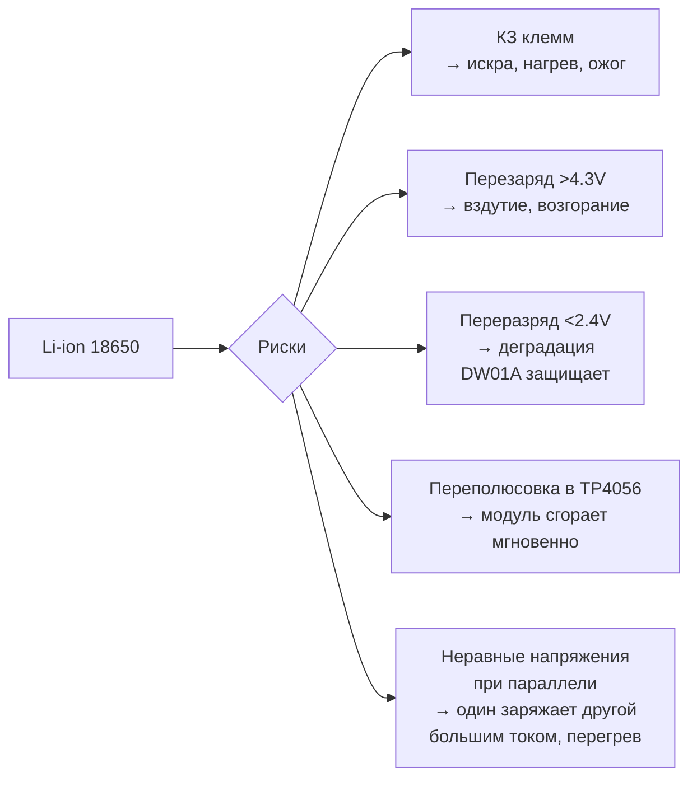
```mermaid
flowchart LR
    A[Li-ion 18650] --> B{Риски}
    B --> C[КЗ клемм<br/>→ искра, нагрев, ожог]
    B --> D[Перезаряд >4.3V<br/>→ вздутие, возгорание]
    B --> E[Переразряд <2.4V<br/>→ деградация<br/>DW01A защищает]
    B --> F[Переполюсовка в TP4056<br/>→ модуль сгорает мгновенно]
    B --> G[Неравные напряжения<br/>при параллели<br/>→ один заряжает другой<br/>большим током, перегрев]
```

**Железные правила:**

1. **Не замыкай клеммы батареи.** Не клади её на металлический стол рядом с монетами и ключами.
2. **Проверяй полярность 5 раз.** Плюс батареи → плюс холдера → B+ TP4056. Минус → минус → B−. Если перепутаешь — TP4056 сгорит за секунду (в худшем случае — с искрами).
3. **Выравнивай напряжения двух батарей перед параллельным соединением.** Разница >0.05V = большой ток переуравнивания = нагрев = вздутие. Подробнее в [Этапе 2](#этап-2).
4. **При вздутии, нагреве или запахе** — щипцами (не руками!) положи батарею в металлическую банку с песком, вынеси на улицу, не бросай в мусор.
5. **Не заряжай** при температуре ниже 0°C или выше +45°C.
6. **Паяльник** — всегда ставь на подставку, не оставляй включённым без присмотра. Рабочая температура жала 350–380°C.

Остальные компоненты (резисторы, конденсаторы, ESP32, диод) безопасны — в худшем случае сожжёшь их, но не себя.

---

<a name="инструменты"></a>
## 2. Инструменты

| Инструмент | Обязательно? | Зачем |
|---|---|---|
| **Мультиметр** (любой за 500–2000 р) | ✅ Да | Мерить напряжения на каждом этапе. Без него ты слепой. |
| **Паяльник Alientek T90B 140W** (жала C245-KU BK + C245-K) + припой + флюс | ✅ Да | Припаять пады A/B на boost, при желании — выпаять PWR LED |
| **Бокорезы** (или ножницы для проводов) | ✅ Да | Обрезать выводы резисторов и LED |
| **Отвёртка** (крестовая малая) | ✅ Да | Затяжка гермовводов, если корпус на винтах |
| **Пинцет** | Желательно | Брать SMD, резисторы и мелкие провода |
| **Третья рука** (держатель плат с лупой) | Желательно | Удобно паять мелкие пады |
| **Антистатический браслет** | Нет | ESP32 довольно устойчив, но если есть — носи |
| **Дрель со свёрлами 12 мм и 18 мм** | ✅ Да | Отверстия под гермовводы PG7 в корпусе |
| **Маркер перманентный** | Желательно | Подписывать провода, холдеры, клеммы |
| **Изолента или термоусадка** | Желательно | Изолировать спайки, особенно на силовой линии |
| **USB Type-C кабель с data-линиями** | ✅ Да | Для прошивки. Дешёвые зарядные кабели часто только питание — не подойдут! |

**Твои инструменты:**

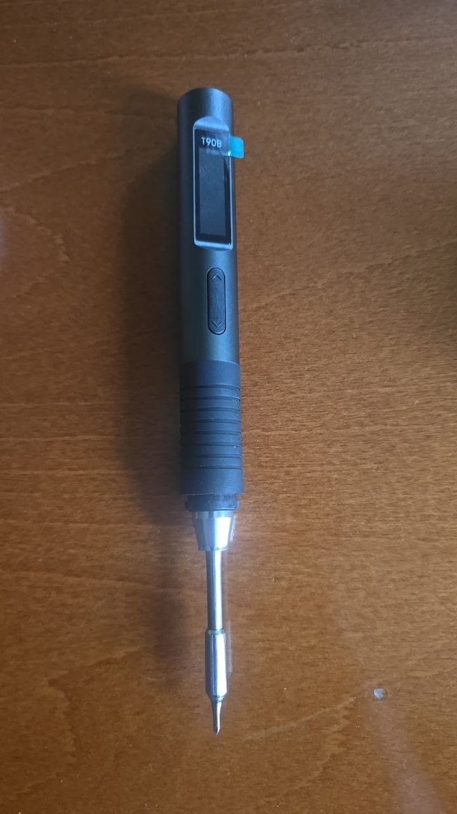
*Паяльник Alientek T90B 140W — жала C245-KU BK (нож-ультра) и C245-K (нож)*

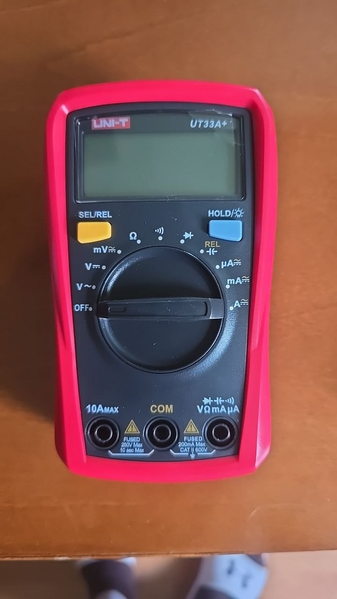
*Мультиметр UNI-T UT33A+ — 40V-диапазон для boost-модулей, 4V для делителей*

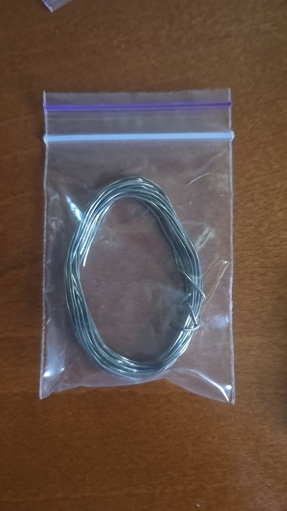
*Припой ПОС-63 и флюс-паста*

**Как узнать, что USB-кабель не только зарядный:** воткни в ESP32 + компьютер, ESP32 должен появиться в диспетчере устройств как порт. Если не появляется — либо нет драйвера (см. раздел в reference-документе про USB-Serial), либо кабель без data. Попробуй другой.

---

<a name="мультиметр"></a>
## 3. Мультиметр за 10 минут

Любой бытовой мультиметр (DT-830, UNI-T UT33A+, Mastech и т.п.) подойдёт. Тебе нужны три режима:

```
          Вид типичного мультиметра:

          ┌──────────────────────────┐
          │    ЦИФРОВОЙ ДИСПЛЕЙ      │
          │      0.000 V             │
          └──────────────────────────┘

               ┌──────────┐
          OFF  │          │ V~ (AC вольты)
        V= 20  │          │ V= 200
        V= 2   │   Ω      │ V= 2
        Ω      │          │ mA
        200    │          │ 10A
               └──────────┘
                    │
           (крутилка режимов)

   ╔═══════╗                ╔═══════╗
   ║  COM  ║                ║ V/Ω/mA║
   ║(чёрный║                ║(красный║
   ║ щуп)  ║                ║  щуп) ║
   ╚═══════╝                ╚═══════╝
```

### Три режима, которые тебе нужны:

| Режим | Значок | Когда использовать | Как подключать |
|---|---|---|---|
| **DC Volts** (постоянное напряжение) | **V=** или **V⎓** | 95% измерений в этом проекте — все напряжения 3.3V, 5V, 12V, заряд батареи | Чёрный щуп → COM, красный → V/Ω. Чёрный на GND, красный на измеряемую точку. |
| **Continuity** (прозвонка) | **🔊** или значок диода | Проверка соединений: «есть ли контакт между этими двумя точками?» | Красный щуп на одну точку, чёрный — на другую. Пиликает → соединены. Молчит → не соединены. |
| **Resistance** (сопротивление) | **Ω** | Проверка резисторов, перед пайкой — что не перепутал номинал | Красный щуп на один вывод резистора, чёрный — на другой. Схема должна быть БЕЗ питания! |

### Правила безопасной работы с мультиметром:

1. **Никогда не мерь сопротивление под напряжением.** Мультиметр в режиме Ω подаёт свой ток — если цепь под напряжением, это может сжечь прибор или искажать измерение.
2. **Не ставь щупы на батарею в режиме Ω.** Это почти КЗ через прибор.
3. **В режиме V=** всегда подключай чёрный щуп первым (к GND), потом красный.
4. **Выбирай правильный предел.** Если меряешь 5V, ставь режим V= 20 (до 20V). V= 200 показывает меньше знаков после запятой. V= 2000m показывает больше — но если там 5V, зашкалит.
5. **Если мультиметр показывает «1.» слева и больше ничего** — это overload (OL), предел мал, переключи на больший диапазон.

### Базовое упражнение — перед тем, как начинать:

1. Возьми батарейку-крону 9V (или любую 1.5V батарейку).
2. Поставь мультиметр на V= 20.
3. Чёрный щуп на минус, красный на плюс → должно показать 1.4–1.5V (или 8–9V для кроны).
4. Поменяй щупы местами → покажет отрицательное значение.
5. Теперь ты умеешь мерить напряжение.

---

<a name="резисторы"></a>
## 4. Цветовой код резисторов

Резистор — это маленький цилиндрик с цветными кольцами. Кольца кодируют значение сопротивления. В проекте 4 номинала:

| Ном. | Цвета (4 кольца) | Цвета (5 колец, точнее) | В проекте |
|---|---|---|---|
| **220 Ω** | красный-красный-коричневый-золотой | красный-красный-чёрный-чёрный-коричневый | LED (×5) |
| **10 kΩ** | коричневый-чёрный-оранжевый-золотой | коричневый-чёрный-чёрный-красный-коричневый | Сигнальный делитель (**низ** + **верх** 1-й в серии) (×4) |
| **5 kΩ** | зелёный-чёрный-красный-золотой | зелёный-чёрный-чёрный-коричневый-коричневый | Сигнальный делитель (**верх**, 2-й в серии) (×2) |
| **100 kΩ** | коричневый-чёрный-жёлтый-золотой | коричневый-чёрный-чёрный-оранжевый-коричневый | Делитель батареи (×2) |

### Как читать 4-кольцевой резистор:

```
 │ │ │ │
═════════
 │ │ │ │
 1 2 3 4
 ↑ ↑ ↑ ↑
 │ │ │ └── толерантность (золотой = ±5%, серебристый = ±10%)
 │ │ └──── множитель (количество нулей)
 │ └────── вторая цифра
 └──────── первая цифра
```

Числа для цветов:
- Чёрный = 0
- Коричневый = 1
- Красный = 2
- Оранжевый = 3
- Жёлтый = 4
- Зелёный = 5
- Синий = 6
- Фиолетовый = 7
- Серый = 8
- Белый = 9

**Пример для 10 kΩ:** коричневый(1)-чёрный(0)-оранжевый(×1000)-золотой(±5%) = 10 × 1000 = 10000 Ω = 10 kΩ.

**Пример для 5 kΩ:** зелёный(5)-чёрный(0)-красный(×100)-золотой(±5%) = 50 × 100 = 5000 Ω = 5 kΩ.

### Не доверяй только глазам

**Всегда прозванивай резисторы мультиметром в режиме Ω перед пайкой.** Цветовые кольца легко перепутать (оранжевый и красный, коричневый и чёрный при плохом свете). Померил — убедился, что 10k это 10k, и только потом ставишь в схему.

Установи мультиметр в Ω × 20k (или аналогичный предел). Красный щуп на один вывод, чёрный на другой. Покажет цифру близкую к ожидаемой:
- 10 kΩ → покажет 9.6–10.4
- 5 kΩ → 4.75–5.25
- 100 kΩ → 95–105 (на пределе 200k или 2M)
- 220 Ω → 210–230 (на пределе 2k)

---

<a name="компоненты"></a>
## 5. Определение компонентов в руках

### ESP32 DevKit V1 (Type-C, 30 pin)


*Источник диаграммы — [TronixLab/DOIT_ESP32_DevKit-v1_30P](https://github.com/TronixLab/DOIT_ESP32_DevKit-v1_30P) на GitHub.*

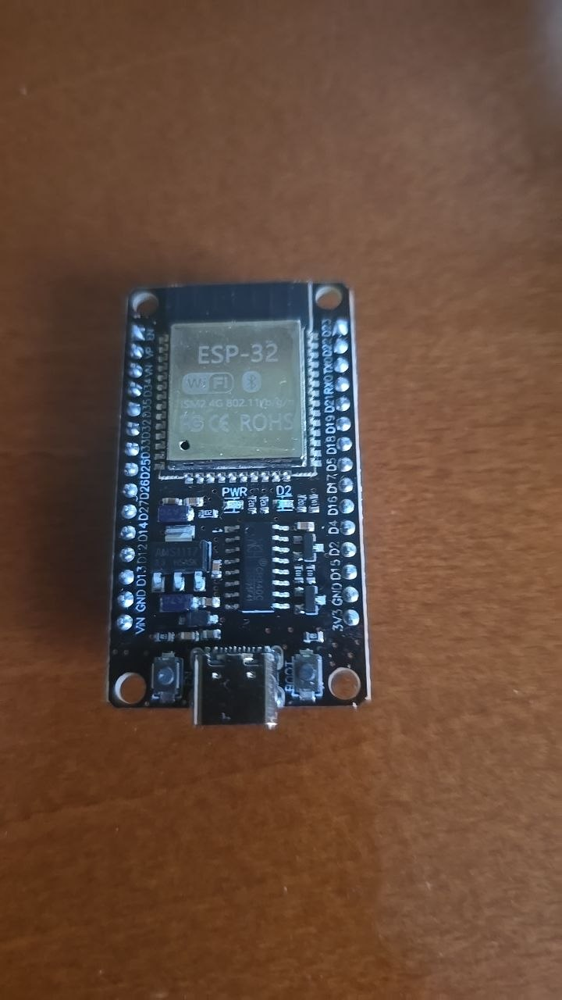
*Твой экземпляр ESP32 DevKit V1 — для сверки с пинаутом выше*

Разметка «где что» на плате (Type-C снизу, антенна сверху):

```
                         ┌─────────────────────────┐
                         │  ╔═══════════════════╗  │
                         │  ║                   ║  │  ← ① ESP-WROOM-32:
                         │  ║     ESP-32        ║  │    синий модуль в металлическом
                         │  ║     WiFi          ║  │    экране с антенной сверху
                         │  ║  ISM2.4G 802.11   ║  │    (надпись «WiFi Bluetooth»)
                         │  ║                   ║  │
                         │  ╚═══════════════════╝  │
                         │                         │
        ← ② PWR  ────►   │   ●PWR       ●D2       │  ◄── ② D2 LED (синий):
          (красный LED,  │  (красный)  (синий)    │      мигает при boot/TX;
          всегда горит   │                         │      встроенный LED на GPIO2
          при питании)   │                         │
                         │  ┌────────┐ ┌─────────┐ │  ← ③ два SMD-чипа:
        ← ③ AMS1117  ──► │  │AMS1117 │ │ CH340/  │ │    AMS1117 — LDO-стабилизатор
          (стабилизатор  │  │ 3.3V   │ │CP2102/  │ │    на 3.3V (VIN → 3V3);
           3.3V)         │  │ H5ASK  │ │CH9102X  │ │    CH340 (или CP2102/CH9102X) —
                         │  └────────┘ │USB↔UART │ │    USB-Serial мост для прошивки
                         │             └─────────┘ │    (какой именно — см. Этап 8)
                         │                         │
                         │     ⦿           ⦿       │  ← ④ две тактильные кнопки:
                         │    BOOT         EN      │    BOOT — зажимай перед Upload,
                         │                         │    если Arduino IDE «Connecting...»;
                         │       ┌─────────┐       │    EN — сброс (перезагрузка)
                         └───────┤  USB-C  ├───────┘
                                 └─────────┘         ← ⑤ USB Type-C:
                                                       сюда кабель данных к ПК
                                                       (ЦЦА бывают «только зарядные»
                                                       без data-линий — не подойдут!)
```

Отличительные признаки:

- 30 контактов по бокам (по 15 на сторону)
- Type-C разъём USB по центру короткой стороны
- Надписи пинов по краям: `VIN`, `GND`, `3V3`, `D0`..`D39`, `VP`, `VN`, `EN`

**Важно:** пины подписаны как `D34`, `D35` и т.д. — это **GPIO34, GPIO35**. В коде прошивки `PIN_WIND_SPEED = 34` — тот же пин с надписью `D34`.

#### Полный пинаут ESP32 DevKit V1

Сверяйся с этой распиновкой при **каждом** подключении провода. Звездой (★) отмечены пины, используемые в этом проекте — ошибка в пине = часы отладки.

```
              Вид сверху (антенна ↑, Type-C ↓)
                    ╔═══════════════════╗
                    ║   ESP-WROOM-32    ║
                    ║     (антенна)     ║
                    ╚═══════════════════╝

       EN  ● ─┐                            ┌─ ●  D23  (VSPI MOSI)
    VP/D36  ● │                            │  ●  D22  (I²C SCL)
    VN/D39  ● │   ┌──────────────────┐     │  ●  TX0  (GPIO1,  UART0 TX — не занимать)
  ★    D34  ● │   │                  │     │  ●  RX0  (GPIO3,  UART0 RX — не занимать)
  ★    D35  ● │   │                  │     │  ●  D21  (I²C SDA)
  ★    D32  ● │   │   ESP-WROOM-32   │     │  ●  D19
  ★    D33  ● ┤   │                  │     ├  ●  D18
  ★    D25  ● │   │     (чип)        │     │  ●  D5
  ★    D26  ● │   │                  │     │  ●  TX2  (GPIO17)
  ★    D27  ● │   └──────────────────┘     │  ●  RX2  (GPIO16)
  ★    D14  ● │      ●PWR    ●D2           │  ●  D4
       D12  ● │                            │  ●  D2   (встроенный LED — не занимать)
       D13  ● │   ┌──────┐  ┌─────────┐    │  ●  D15
       GND  ● │   │AMS1117│ │ CH340/  │    │  ●  GND
  ★    VIN  ● ─┘  │ 3.3V  │ │ CP2102  │    └─ ●  3V3
                  └──────┘  └─────────┘
                      ⦿BOOT        ⦿EN
                          ┌─────────┐
                          │  USB-C  │
                          └─────────┘

★ — пины, используемые в проекте:

    ADC вход   D34  ←  скорость ветра   (через делитель (10k+5k)+10k, 0-2.0V)
    ADC вход   D35  ←  направление      (через делитель (10k+5k)+10k, 0-2.0V)
    ADC вход   D32  ←  напряжение бат.  (через делитель 100k+100k)
    Цифр. вых. D26  →  220Ω → 🟢 зелёный LED  (станция OK)
    Цифр. вых. D27  →  220Ω → 🟡 жёлтый LED   (ветер >5 м/с)
    Цифр. вых. D14  →  220Ω → 🔴 красный LED  (ветер >15 м/с)
    Цифр. вых. D25  →  220Ω → 🟢 зелёный LED  (WiFi OK)
    Цифр. вых. D33  →  220Ω → 🔴 красный LED  (ошибка)
    Питание    VIN  ←  шина ~4.7V breadboard (через Schottky_A от адаптера или Schottky_B от boost#2)
    Питание    GND  ←  GND шина (любой из двух пинов GND)
```

⚠️ **Чего НЕ трогать в этом проекте:**

- **D6–D11** физически подключены к внутренней SPI-флеш ESP32. Любой провод туда → «кирпич».
- **D0 (BOOT), D2, D12, D15** — boot-strapping пины. Внешняя нагрузка может помешать старту. Не занимать без необходимости.
- **ADC2-каналы** (D0, D2, D4, D12–D15, **D25, D26, D27**): когда WiFi радио работает, ADC2 молчит — читать аналог нельзя. Именно поэтому в проекте аналоговые входы только на **D34/D35/D32** (все на ADC1), а D25/D26/D27 используются **только как цифровые выходы** для LED. Если соблазнишься подключить датчик на D26 — получишь 0 или мусор.

### TP4056 с защитой (Type-C)


*Источник диаграммы — [components101.com — TP4056A](https://components101.com/modules/tp4056a-li-ion-battery-chargingdischarging-module). На диаграмме классический microUSB вариант; у тебя **Type-C** — отличается только разъёмом, шесть пятачков IN+/IN−/B+/B−/OUT+/OUT− и обе LED-индикации CHG/FULL полностью совпадают.*

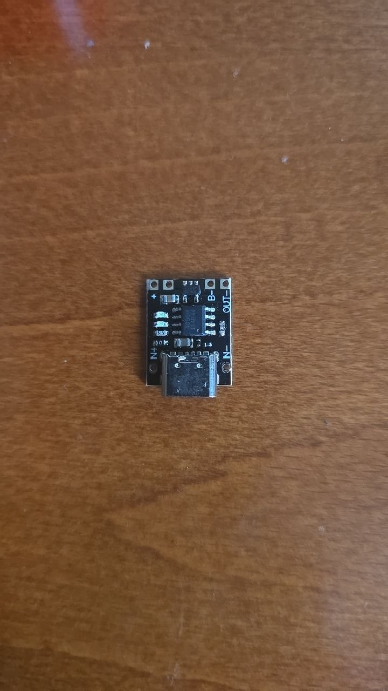
*Твой TP4056 Type-C с защитой (DW01A + 8205A)*

Разметка 6 пятачков (читай надписи на своей плате — шёлкография подписана на каждой):

```
             ┌──────────────────────────┐
        B+ ──┤ ⦿                     ⦿  ├── B−      ← верхний ряд: к БАТАРЕЕ
             │  (метка «+»)     (метка  │             (B+ слева, B− справа)
             │                   «B−»)  │
             │     ┌──────┐             │
             │     │DW01A │ ← защита    │
             │     └──────┘             │
             │     ┌──────┐             │
             │     │TP4056│ ← зарядка   │          ← три микросхемы:
             │     └──────┘             │             TP4056 (CC/CV зарядка 1A),
             │   ┌─────8205A─────┐      │             DW01A (отсечка 2.4V/4.3V),
             │   └───────────────┘      │             8205A (MOSFET отсечка)
             │                          │
             │     🔴red    🔵blue       │          ← два SMD-LED:
             │    (CHG)    (FULL)        │             🔴 CHG = заряжается
             │                          │             🔵 FULL = заряжена до 4.2V
             │                          │
       IN+ ──┤ ⦿                     ⦿  ├── IN−     ← нижний ряд: к АДАПТЕРУ
             │   (метка «IN+»)  (метка  │             (IN+ слева, IN− справа)
             │                   «IN−»)  │
             │     ┌────────────┐       │
             │     │   USB-C    │       │          ← альтернативный вход 5V:
             │     └────────────┘       │             можно подать через USB-C
             └──────────────────────────┘             или припаять к IN+/IN−

              (пятачки OUT+ / OUT− — на обратной стороне или сбоку,
               смотри надписи «OUT» на твоей конкретной плате)
```

⚠️ **Раскладка меняется от партии к партии.** У разных производителей пятачки B+/B−/OUT+/OUT− могут быть сгруппированы иначе. **Перед пайкой обязательно прочти глазами надписи на СВОЕЙ плате** и продублируй мультиметром в режиме прозвонки:
- IN+ должен звониться с центральным контактом USB-C
- B+ и B− должны быть изолированы от IN+/IN− при вынутой батарее

Отличительные признаки:

- Крошечная плата ~20×15 мм
- Type-C разъём для входного 5V (у старых версий — microUSB)
- Три микросхемы: **TP4056** (заряжает Li-ion током до 1A), **DW01A** (отсекает при переразряде <2.4V и перезаряде >4.3V — типовые значения ±100 мВ), **8205A** (двойной MOSFET — рука DW01A на выключатель)
- 6 пайных пятачков: **IN+/IN−** (от адаптера), **B+/B−** (к батарее), **OUT+/OUT−** (к нагрузке)

**Железная мнемоника, чтобы не перепутать:**
- **I**N = **I**nput (вход зарядки, от адаптера 5V)
- **B** = **B**attery (к аккумулятору 18650)
- **OUT** = к нагрузке (к IN+ boost#2; его OUT+ → Schottky_B → шина ~4.7V breadboard)

Путаница IN/B сожжёт модуль за секунду. Пять раз проверь.

### Mini Boost Module (HW-085 или TMF002) — в проекте ДВЕ штуки

> **В BOM их два идентичных модуля:**
> - **Boost #1** — повышает 5V с шины до **12V** для датчика ветра
> - **Boost #2** — повышает 3.7V батареи до **5V**, чтобы через Schottky_B подать на ту же шину, что и адаптер (даёт стабильные 4.7V при отключении адаптера)
>
> Модули совершенно одинаковые — отличается только пресет напряжения (настраивается пайкой падов A/B в Этапе 1). Пометь их маркером «#1 12V» и «#2 5V» сразу после настройки.


*Источник фото — [DFRobot DFR0952 — Mini DC-DC Boost Power Supply Module 3.7V to 5V/8V/9V/12V](https://www.dfrobot.com/product-2584.html). Именно такой модуль у тебя: чёрная плата ~22×11 мм, надписи `A` и `B` у пайных падов (видно на фото слева), квадратный дроссель в центре, пятачки `+ −` с обеих сторон — без потенциометра. Внутри стоит чип MT3608 (о нём пишут в datasheet), но как модуль — это HW-085 / TMF002 / Teyleten TMF002. Выходное напряжение фиксируется пайкой падов A/B (см. [Этап 1](#этап-1)).*

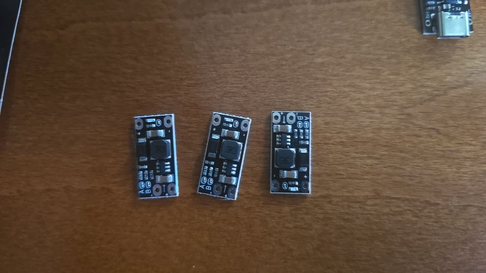
*Твои boost-модули — нужно два рабочих (третий запас)*

Схематичная разметка (твоя плата, вид сверху):

```
             Mini Boost HW-085 / TMF002 (реальный размер ~11×17 мм)

              ┌────────────────────┐
        OUT+──┤ ⦿              ⦿  ├──IN+         ← противоположные стороны:
              │                    │                 IN на одном торце,
              │  ┌──┐              │                 OUT на другом
              │  │dr│ ← дроссель   │
              │  └──┘ (квадратный  │
              │        индуктор)   │
              │                    │             ← на плате обычно напечатаны
              │  ┌─────────┐       │                маркировки напряжений:
              │  │  MT3608 │       │                5V / 8V / 9V / 12V
              │  └─────────┘       │                (не всегда, зависит от партии)
              │                    │
              │   ●A    ●B         │             ← ⚠️ ДВА ПАЯНЫХ ПАДА:
              │  (пресет напряжения)│                замыкай каплей припоя для
              │                    │                выбора выхода (см. Этап 1)
              │                    │
        OUT− ─┤ ⦿              ⦿  ├──IN−
              └────────────────────┘

          С завода обычно: A и B уже замкнуты → выход 12V ✓ (это то, что нам нужно)
          Но всегда проверяй мультиметром на Этапе 1 — клоны бывают с обратной логикой.
```

Отличительные признаки:

- Ещё меньше TP4056, ~11×17 мм — самый маленький компонент в проекте
- 4 пятачка питания: `IN+`, `IN−`, `OUT+`, `OUT−` (на противоположных торцах платы)
- Два пайных пада `A` и `B` — пресет выходного напряжения (см. [Этап 1](#этап-1))
- Маркировка напряжений `5V / 8V / 9V / 12V` — иногда напечатана шёлкографией рядом с падами, иногда отсутствует
- С завода **обычно** приходит с обоими замкнутыми падами → 12V на выходе. Но не верь на слово — проверь

⚠️ **Максимальный выходной ток ~0.5A.** Для датчика (25 мА при 12V) это десятикратный запас. НЕ вешай на этот boost ничего ещё — перегреется.

⚠️ **Нет защиты от переполюсовки.** Перепутал IN+/IN− = модуль превратится в уголёк за 2 секунды.

### Диод Шоттки 1N5819

- Чёрный/серый цилиндрик ~5×2 мм с двумя выводами
- На одной стороне — **серебристая полоса**. Это **катод (K)**. Другая сторона — **анод (A)**.
- Правило: **плюс идёт в сторону, где НЕТ полосы**. Полоса смотрит в сторону «куда ток течёт после диода».

```
   Анод (+)              Катод (−)
      │                      │
      ├──[ ═══▼═══ ]─────────┤
      │        │             │
               │
            Полоска — это катод!
```

В нашем проекте **два диода Шоттки** (diode-OR):
- **Schottky_A**: анод → плюс адаптера 5V, катод (полоска) → шина breadboard (~4.7V)
- **Schottky_B**: анод → OUT+ boost#2 (5V от батареи), катод (полоска) → та же шина breadboard

Оба диода сходятся катодами в одну точку — это и есть главная шина питания. Полоска на корпусе диода (катод) **всегда** должна смотреть в сторону шины.

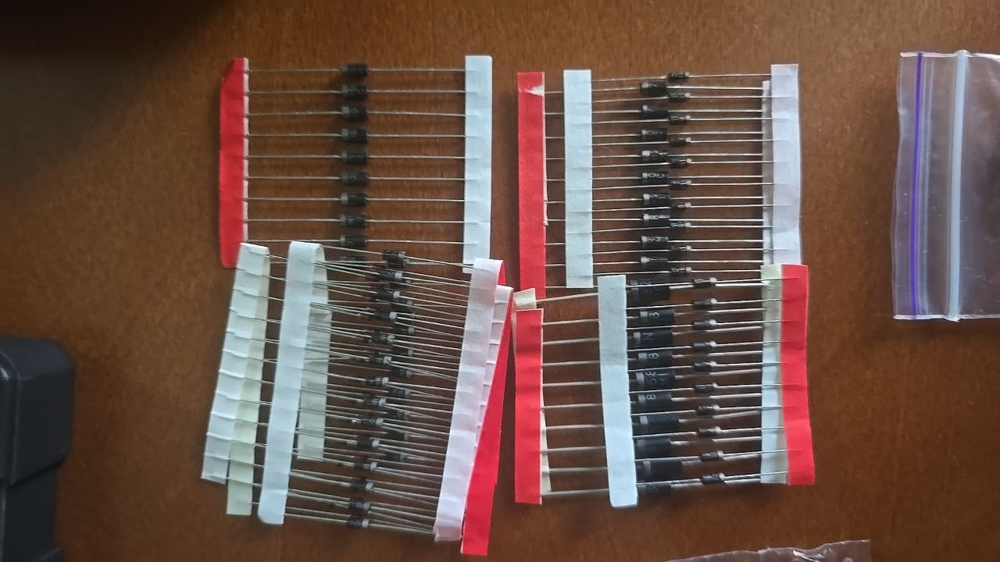
*Твой набор диодов — найди 1N5819 по маркировке на корпусе*

### Керамические конденсаторы 100 нФ

- Маленькие бежевые/синие «леденцы» с двумя выводами
- Маркировка **«104»** (= 10 × 10⁴ пФ = 100 000 пФ = 100 нФ = 0.1 мкФ)
- **Полярности НЕТ** — можно ставить любой стороной

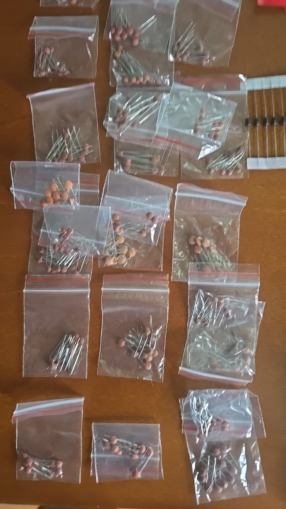
*Твой набор керамики — нужны маркированные «104» (100 нФ)*

### Электролитический конденсатор 1000 мкФ 16V (или 10V)

- Цилиндр размером от ~8×12 мм до ~10×14 мм, обычно чёрный или синий
- Сверху указано `1000 μF 16V 105°C` (рекомендовано) или минимум `1000 μF 10V 105°C`
- Рейтинг температуры **105°C** предпочтителен (лучше, чем обычные 85°C): дольше живёт в горячем корпусе летом
- **Полярность есть!**
  - **Длинная ножка** = **плюс (+)**
  - На корпусе **полоска с минусами «−−−»** напротив **минуса** (короткой ножки)

**Почему 16V, а не 10V:** шина в проекте ~4.7V, так что формально 10V хватает (запас 2.1×). **Но** если случайно перепутаешь пресет на boost #2 (он должен быть 5V, пресет `0 0`) и оставишь заводские 12V (`1 1`) — электролит 10V вздуется за минуту. 16V переживёт это без последствий (запас 3.4× к 4.7V, и даже при 12V ещё есть запас 1.33×). Разница в цене 3-5₽, а страховка от ошибки существенная.

**Внимание:** если воткнёшь электролит наоборот (полярность) — через несколько минут (а иногда и секунд) он вздуется и может взорваться с треском. Всегда перепроверяй полярность, даже если взял 16V.

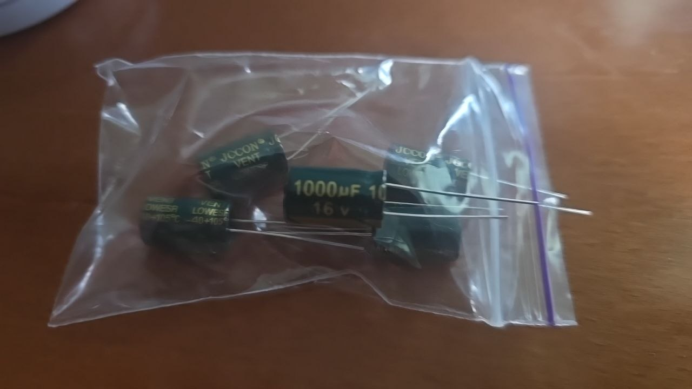
*Электролит JCCON 1000 мкФ 16V — полоска «−−−» указывает на минус*

### Светодиоды (LED) 5 мм

- Прозрачный или полупрозрачный «шарик» диаметром 5 мм, две ножки снизу
- **Длинная ножка = анод (+)**, к GPIO через резистор 220 Ω
- **Короткая ножка = катод (−)**, к GND
- Внутри корпуса: у катода есть **плоский срез** на ободке корпуса (смотри сбоку)
- Красные и зелёные LED имеют падение ~2.0V, жёлтые ~2.1V — в наших расчётах везде примерно 2V

```
        ┌─ плоский срез ─┐
        │                │
        │    ╱───╲       │
        │   │ ◯ │        │
        │    ╲─┬─╱       │
        └──────┼─────────┘
               │  ← короткая ножка = катод (−), к GND
               │
               ─────────── длинная ножка = анод (+), через 220Ω к GPIO
```

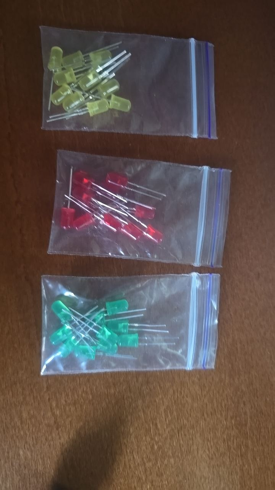
*Твои светодиоды 5 мм — нужно: зелёный ×2, жёлтый ×1, красный ×2*

### PTC-предохранитель 2A

- Маленький круглый жёлтый «конденсатор» без полярности
- На корпусе маркировка типа `200` (= 2 А holding current)
- Срабатывает при КЗ: нагревается → сопротивление растёт в 1000 раз → ток ограничивается
- **Не взрывается** — после устранения КЗ остывает за минуту и работает дальше

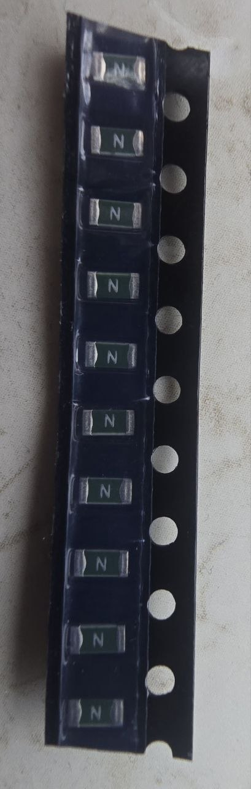
*PTC SMD10 — SMD-компонент, перед установкой нужно припаять выводы*

### 18650 Li-ion и холдеры

- **Батарея 18650**: цилиндр 18×65 мм с номинальным напряжением 3.7V (реально 3.0–4.2V)
- Минус — плоский конец, плюс — с маленьким выступом
- **Холдер**: пластиковая коробка на одну батарею с пружинным контактом, обычно с торчащими проводами красный (+) и чёрный (−)
- Внутри холдера на дне нарисована или выдавлена разметка `+` и `−` — по ней вставляй батарею

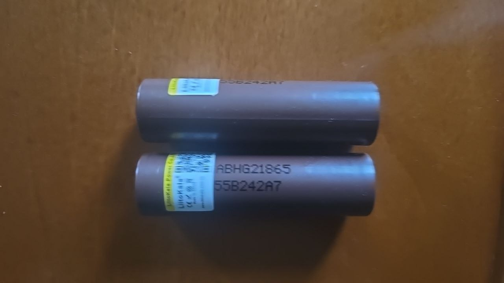
*Батарея 18650 LG — плоский конец минус, с выступом плюс*

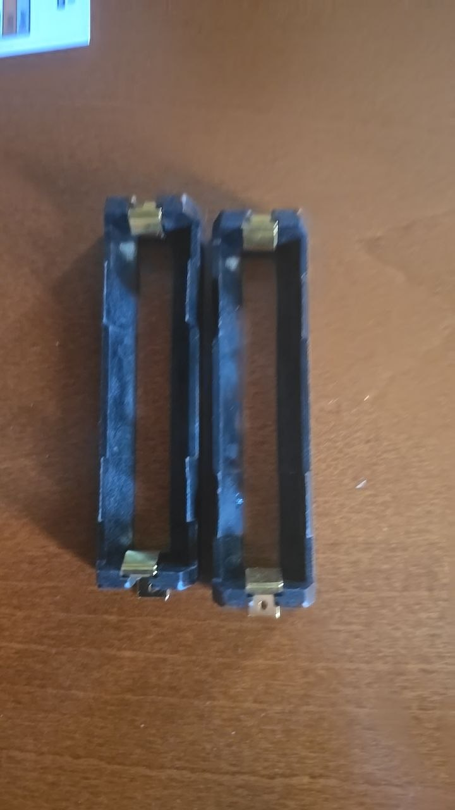
*Холдер 18650 × 2 шт. — соединить параллельно*

---

<a name="breadboard"></a>
## 6. Breadboard 101

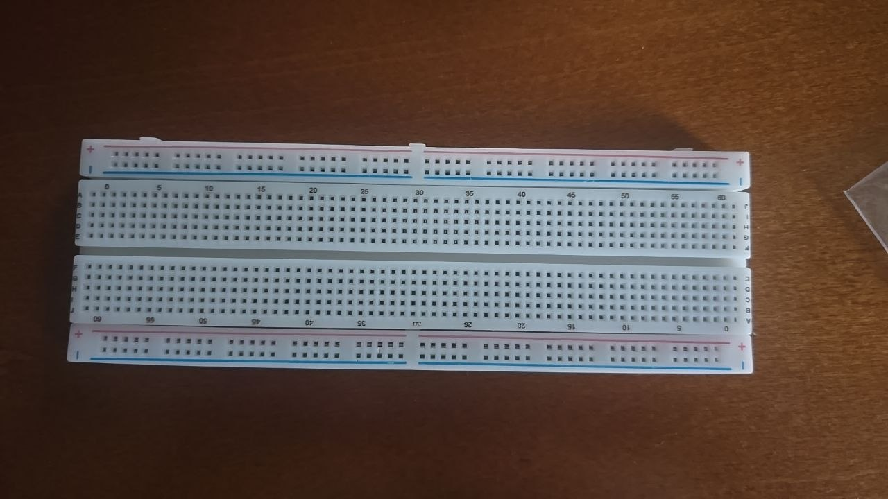
*Твой breadboard 830 точек (165×55 мм)*

Breadboard (макетная плата, беспаечная плата) — это пластиковая плата с отверстиями, где некоторые отверстия внутри соединены металлическими контактами. Втыкаешь проволочку — она соединяется с соседями.

### Анатомия breadboard 830 точек (165×55 мм)

```
                                (разъём BreadBoard 830)

   ┌────────────────────────────────────────────────────────────────┐
   │ + ○○○○○   ○○○○○   ○○○○○   ...                                  │  ← верхняя шина + (красная полоса сбоку)
   │ − ○○○○○   ○○○○○   ○○○○○   ...                                  │  ← верхняя шина − (синяя/чёрная полоса)
   │                                                                │
   │ a ○ ○ ○ ○ ○ ○ ○ ○ ○ ○ ○ ○ ○ ○ ○ ○ ○ ○ ○ ○ ○ ○ ○ ○ ○ ○ ○ ○ ○ ○  │
   │ b ○ ○ ○ ○ ○ ○ ○ ○ ○ ○ ○ ○ ○ ○ ○ ○ ○ ○ ○ ○ ○ ○ ○ ○ ○ ○ ○ ○ ○ ○  │
   │ c ○ ○ ○ ○ ○ ○ ○ ○ ○ ○ ○ ○ ○ ○ ○ ○ ○ ○ ○ ○ ○ ○ ○ ○ ○ ○ ○ ○ ○ ○  │
   │ d ○ ○ ○ ○ ○ ○ ○ ○ ○ ○ ○ ○ ○ ○ ○ ○ ○ ○ ○ ○ ○ ○ ○ ○ ○ ○ ○ ○ ○ ○  │
   │ e ○ ○ ○ ○ ○ ○ ○ ○ ○ ○ ○ ○ ○ ○ ○ ○ ○ ○ ○ ○ ○ ○ ○ ○ ○ ○ ○ ○ ○ ○  │
   │   =============  CANYON (средний разрыв для DIP)  =============│
   │ f ○ ○ ○ ○ ○ ○ ○ ○ ○ ○ ○ ○ ○ ○ ○ ○ ○ ○ ○ ○ ○ ○ ○ ○ ○ ○ ○ ○ ○ ○  │
   │ g ○ ○ ○ ○ ○ ○ ○ ○ ○ ○ ○ ○ ○ ○ ○ ○ ○ ○ ○ ○ ○ ○ ○ ○ ○ ○ ○ ○ ○ ○  │
   │ h ○ ○ ○ ○ ○ ○ ○ ○ ○ ○ ○ ○ ○ ○ ○ ○ ○ ○ ○ ○ ○ ○ ○ ○ ○ ○ ○ ○ ○ ○  │
   │ i ○ ○ ○ ○ ○ ○ ○ ○ ○ ○ ○ ○ ○ ○ ○ ○ ○ ○ ○ ○ ○ ○ ○ ○ ○ ○ ○ ○ ○ ○  │
   │ j ○ ○ ○ ○ ○ ○ ○ ○ ○ ○ ○ ○ ○ ○ ○ ○ ○ ○ ○ ○ ○ ○ ○ ○ ○ ○ ○ ○ ○ ○  │
   │                                                                │
   │ + ○○○○○   ○○○○○   ○○○○○   ...                                  │  ← нижняя шина +
   │ − ○○○○○   ○○○○○   ○○○○○   ...                                  │  ← нижняя шина −
   └────────────────────────────────────────────────────────────────┘
     1 2 3 4 5 6 7 8 9 ...                    ... 30
     (номера колонок, обычно подписаны снизу)
```

### Правила соединений внутри breadboard:

1. **Шины + и −** идут **вдоль** платы (горизонтально). Все точки внутри одной полосы соединены между собой. Сюда подключаем питание.
2. **Средние ряды** (a–e и f–j) соединены **поперёк** (по 5 точек в одном ряду). Ряд `a1-b1-c1-d1-e1` — это **одна точка**, электрически связанная.
3. **Canyon (средний разрыв)** разделяет ряды a–e и f–j. Это для микросхем DIP, чтобы ножки с двух сторон не замыкали друг друга.
4. **⚠️ На длинных breadboard** шины + и − иногда разорваны в середине! Проверь мультиметром (режим прозвонки) шину + от точки в начале до точки в конце. Если не пищит — посередине разрыв, надо соединить проводом.

### Куда ставим ESP32

ESP32 DevKit V1 шириной ~26 мм — он ставится **верхом через canyon**. Рядом пины с одной стороны окажутся в рядах a–b, с другой — в рядах i–j. Средние ряды c–d–e и f–g–h останутся свободными для проводов от ESP32 к остальной схеме.

```
                 ESP32 сидит здесь:
                 ┌──────────────────────────┐
                 │       ESP32 DevKit       │  ← USB-C снизу
 a ──────────────┤ D23 D22 TX RX D21 D19... ├────────
 b ──────────────┤                          ├────────
 c               │                          │   (свободные ряды для проводов)
 d               │                          │
 e               │                          │
 ===== canyon =============================
 f               │                          │   (свободные ряды)
 g               │                          │
 h               │                          │
 i ──────────────┤                          ├────────
 j ──────────────┤ VIN GND D13 D12 D14 D27..├────────
                 └──────────────────────────┘
```

### Практика перед сборкой:

Возьми breadboard и мультиметр. Режим прозвонки (пищалка). Убедись:
- Что полоса `+` сверху действительно непрерывна (воткни два провода в её начало и конец, прозвони)
- Что полоса `+` сверху **не соединена** с полосой `−` снизу (не должно пищать)
- Что ряд `a1-b1-c1-d1-e1` соединён между собой (пищит)
- Что ряд `a1` и ряд `a2` **не соединены** (не пищит — это независимые столбцы)

Если всё так — breadboard исправен. 5 минут на эту проверку могут сэкономить часы отладки.

---

<a name="обзор"></a>
## 7. Обзор общей схемы

Прежде чем собирать — пойми большую картину. Подробности в `wind-station-assembly.md`, здесь упрощённо.

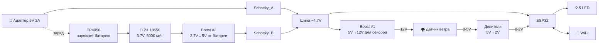
```mermaid
flowchart LR
    ADAPTER[🔌 Адаптер 5V 2A]
    SCHA[Schottky_A]
    TP[TP4056<br/>заряжает батарею]
    BAT[🔋 2× 18650<br/>3.7V, 5000 мАч]
    BOOST2[Boost #2<br/>3.7V→5V от батареи]
    SCHB[Schottky_B]
    RAIL[Шина ~4.7V]
    BOOST1[Boost #1<br/>5V→12V для сенсора]
    SENSOR[🌪️ Датчик ветра]
    DIV[Делители<br/>5V→2V]
    ESP[ESP32]
    LED[💡 5 LED]
    WIFI[📡 WiFi]

    ADAPTER --> SCHA --> RAIL
    ADAPTER -.заряд.-> TP
    TP --> BAT
    BAT --> BOOST2 --> SCHB --> RAIL
    RAIL --> ESP
    RAIL --> BOOST1
    BOOST1 -->|12V| SENSOR
    SENSOR -->|0-5V| DIV
    DIV -->|0-2V| ESP
    ESP --> LED
    ESP <--> WIFI
```

**В двух словах:**
- Адаптер через Schottky_A кормит шину (4.7V) и заряжает батарею параллельно
- Батарея через boost #2 и Schottky_B резервирует шину при отключении адаптера — шина держится те же ~4.7V
- Diode-OR: адаптер и boost #2 смотрят на шину через свои Schottky, выигрывает больший (адаптер в приоритете, когда есть)
- ESP32 живёт от шины через свой AMS1117 (dropout 0.8–1.25V, на 4.7V = стабильные 3.3V)
- Boost #1 поднимает 5V до 12V для датчика
- Датчик выдаёт 0–5V, делители **(10k+5k)+10k** опускают до 0–2V для ADC ESP32 (чистая линейная зона)
- ESP32 гонит данные по WiFi на дашборд

Всё остальное (LED, монитор батареи, ADC-фильтры) — это обвязка.

> **Почему два boost, а не один с диодом:** без boost#2 батарея 3.7V через один диод даёт шину 3.35V — AMS1117 на ESP32 теряет регулировку (ему нужен VIN ≥ 4.3V для стабильных 3.3V), ESP32 уходит в brownout на пиках WiFi. Второй boost поднимает 3.7V до 5V → шина снова 4.7V → всё работает.

---

<a name="этап-0"></a>
## 8. Этап 0: Приёмка комплекта

Перед тем, как паять — **разложи всё на столе и проверь, что всё пришло**. Гораздо обиднее обнаружить, что не хватает резистора 5k в процессе сборки, чем до неё.

### Визуальный чеклист:

- [ ] ESP32 DevKit V1 — 1 шт. (Type-C снизу, PWR LED горит при подключении USB)
- [ ] Датчик ветра Polycarbonate 0-5V — 1 шт. (три чашки на вертикальной оси + флюгер отдельно, с кабелем 4 жилы)
- [ ] Mini Boost Module — **2 шт.** (~11×17 мм, пайные пады, надписи IN/OUT):
  - один под пресет **12V** (#1, для датчика)
  - один под пресет **5V** (#2, поднимает батарею на шину)
- [ ] TP4056 Type-C с защитой — 1 шт. (~20×15 мм, Type-C, 6 пайных пятачков)
- [ ] Диод Шоттки 1N5819 — **минимум 3 шт.** (2 в схему: Schottky_A и Schottky_B; плюс запас 1)
- [ ] 18650 батареи — 2 шт. (убедись, что напряжение ≥3.0V у каждой — совсем разряженные не подойдут)
- [ ] Холдеры 18650 — 2 шт.
- [ ] Резисторы 10kΩ — 4 шт. (коричневый-чёрный-оранжевый) — низ делителя ×2 + верх 1-й в серии ×2
- [ ] Резисторы 5kΩ — 2 шт. (зелёный-чёрный-красный) — верх делителя 2-й в серии (10k+5k=15k)
- [ ] Резисторы 100kΩ — 2 шт. (коричневый-чёрный-жёлтый)
- [ ] Резисторы 220Ω — 5 шт. (красный-красный-коричневый)
- [ ] Керамика 100 нФ (маркировка «104») — 4 шт.
- [ ] Электролит 1000 мкФ **16V** 105°C — **1 шт. в схему** (цилиндр с полоской; остальные запас; 10V тоже работает, но 16V защищает от ошибки пресета boost #2)
- [ ] PTC 2A — 1 шт. (жёлтый диск)
- [ ] LED 5 мм: зелёный ×2, жёлтый ×1, красный ×2 (итого 5)
- [ ] Breadboard 830 точек
- [ ] Провода dupont М-М (40 шт., разных цветов) и М-Ж (40 шт.)
- [ ] Корпус IP65 190×150×75 (купленный — с **глухой** крышкой, см. про светодиоды ниже)
- [ ] Гермовводы PG7 ×2
- [ ] Адаптер 5V 2A Type-C
- [ ] Мультиметр
- [ ] Силикагель (пакетик)

### Фото компонентов для сверки

| Компонент | Фото |
|-----------|------|
| Резисторы (набор) | 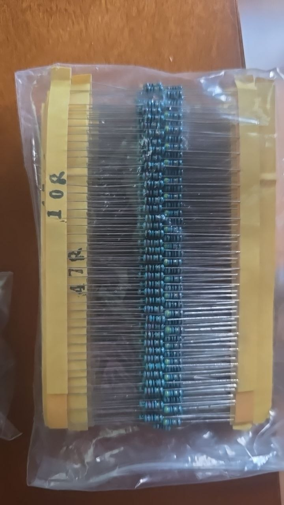 |
| Диоды (набор, ищи 1N5819) |  |
| LED 5мм |  |
| Тумблер | 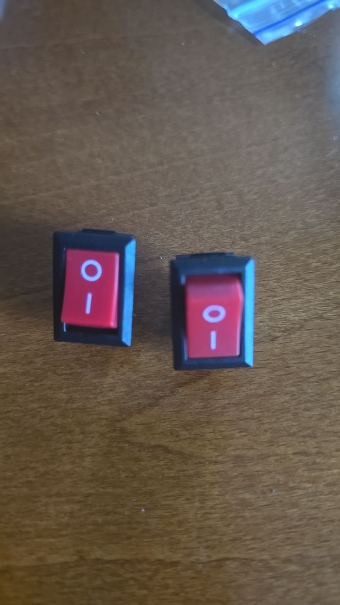 |
| Breadboard |  |
| Dupont M-M | 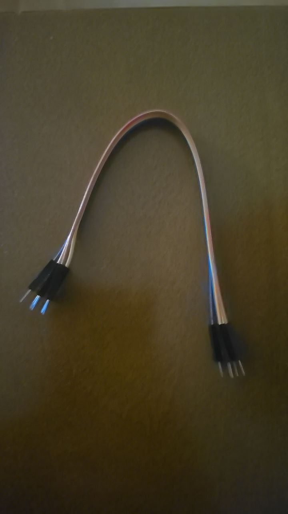 |
| Dupont M-F | 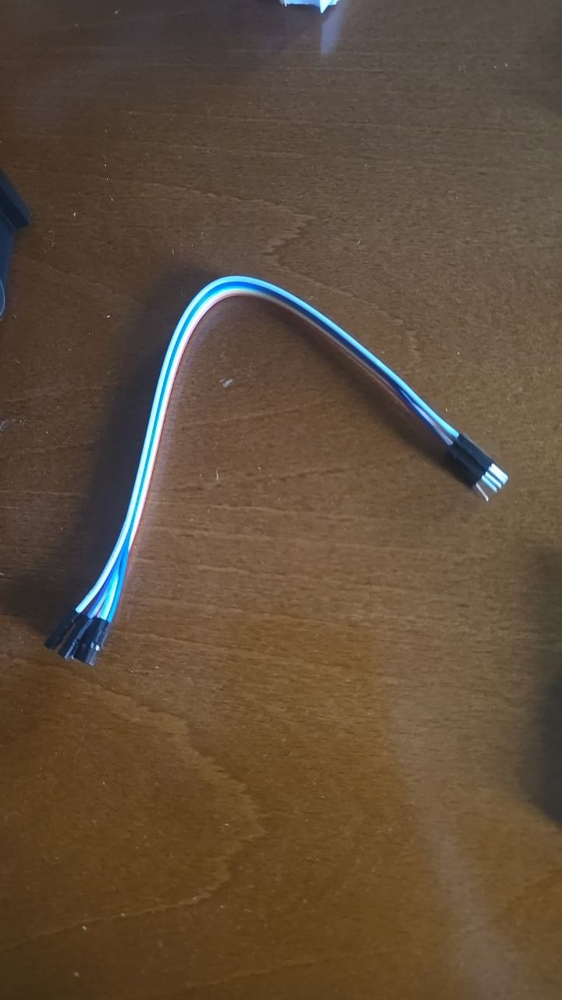 |
| Корпус IP65 | 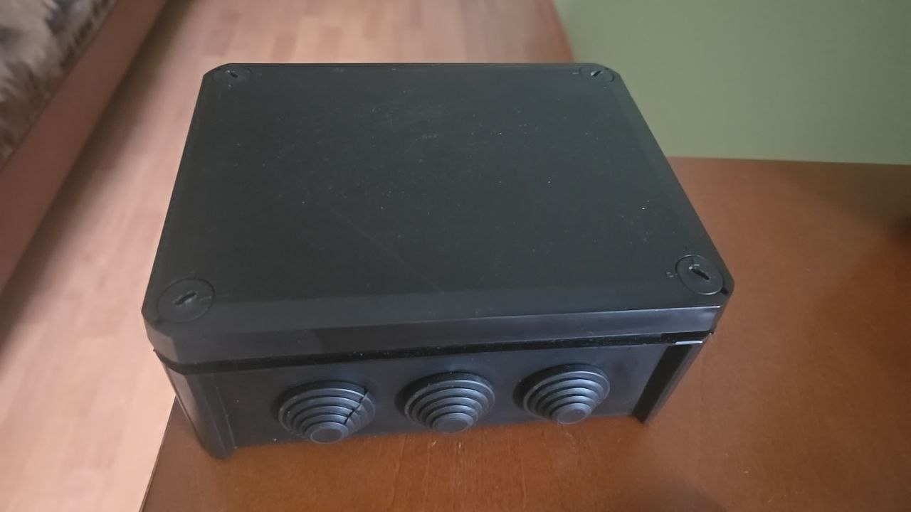 |
| Гермовводы PG7 | 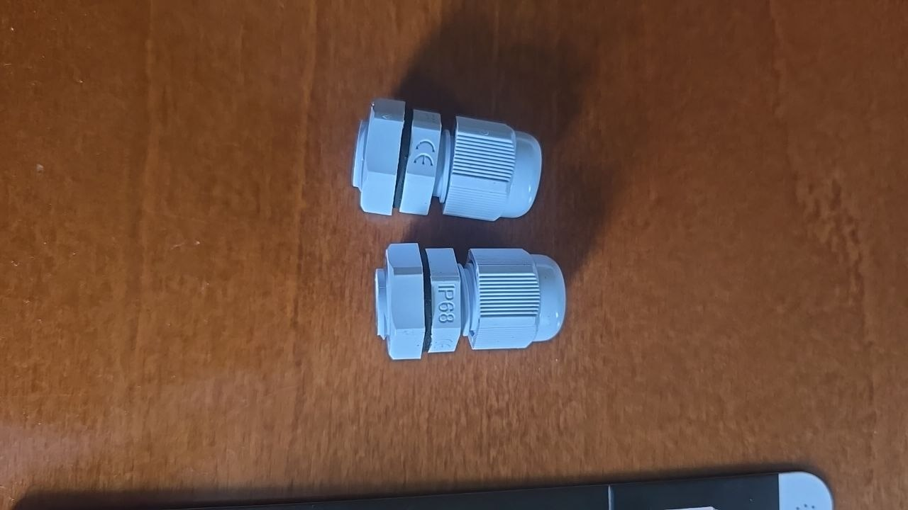 |
| Герметик Lacrysil | 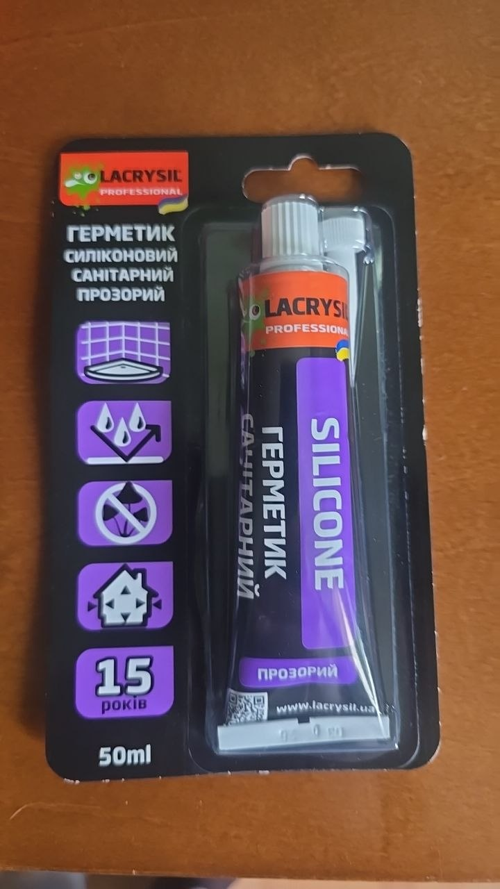 |
| Монтажная лента | 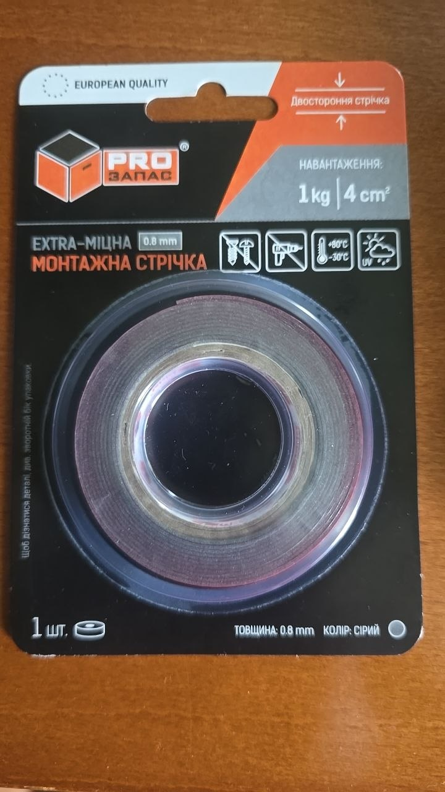 |
| Кабель FTP Cat5e | 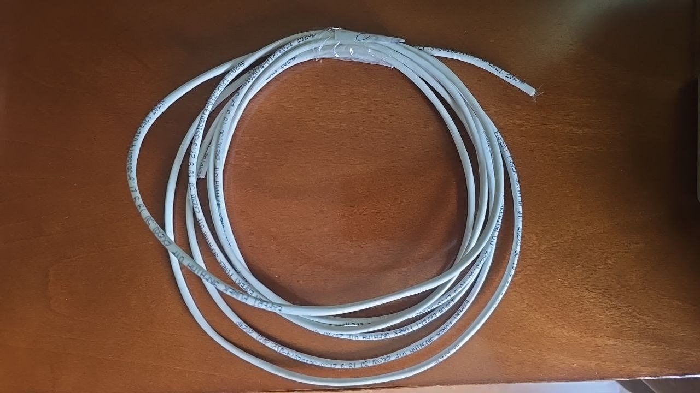 |
| Изолента | 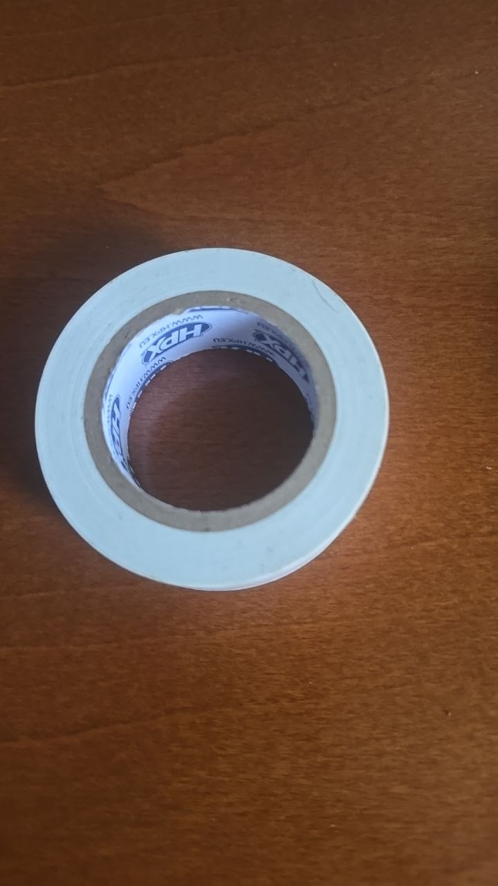 |
| Стяжки | 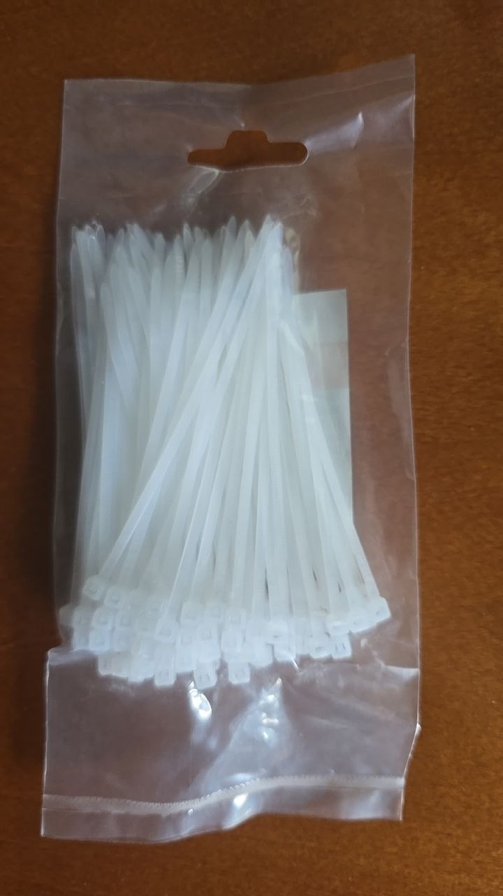 |

### Рабочее место:

- Плоский светлый стол (желательно НЕ металлический — чтобы не было риска КЗ)
- Хорошее освещение (маркировку резисторов в полумраке не прочтёшь)
- Небольшой лоток или тарелка под мелкие детали — чтобы не терялись
- Бумажное полотенце под пайку (если капля припоя упадёт)
- Бокал с водой — НЕ на столе со схемой (разлил — убил проект)

---

<a name="этап-1"></a>
## 9. Этап 1: Настройка двух Mini Boost Module (12V для датчика и 5V для батареи)

Цель: настроить **оба** boost-модуля заранее, **до** подключения датчика и батареи:
- **Boost #1** → **12V** для питания датчика. Если ошибиться и оставить 5V — датчик не заработает (его нижняя граница 10V), но не сгорит. Если выдаст больше 12V — датчик может выйти из строя.
- **Boost #2** → **5V** для подъёма батарейного напряжения на шину. Если ошибиться и дать 12V — электролит на шине может вздуться (10V-версия точно, 16V-версия выдержит с запасом). Если меньше 5V — автономка не будет работать, шина просядет.

Оба модуля настраиваются одинаковым способом (через пайные пады `A`/`B`), разница только в целевых пресетах.

### Проверка пресета A/B

Найди на плате boost-модуля два маленьких пайных пятачка с буквами `A` и `B` рядом (см. фото и ASCII-разметку в [разделе 5 → Mini Boost](#компоненты)). Они могут быть вплотную друг к другу в центре платы, рядом с микросхемой преобразователя.

С завода обычно установлен 12V (оба пада A и B замкнуты каплей припоя). Проверим визуально:

```
    Лицевая сторона Mini Boost Module
   ┌─────────────────────┐
   │ +                   │
   │                     │
   │  ┌──┐               │
   │  │  │ ← дроссель    │
   │  └──┘               │
   │                     │
   │  (микросхема)       │
   │                     │
   │  A ○  B ○           │ ← эти два пада
   │                     │
   │ IN+      OUT+       │
   │ IN-      OUT-       │
   └─────────────────────┘

  A, B пады:
  ○ пустой пад      = "0"
  ● замкнут припоем = "1"
```

| A | B | Выход | Применение в проекте | Действие |
|---|---|---|---|---|
| **0** | **0** | **5V** | **Boost #2** ← для батареи на шину | Оба пада **разомкнуты** (если залиты — сними припой паяльником или косичкой) |
| 0 | 1 | 8V | — | — |
| 1 | 0 | 9V | — | — |
| **1** | **1** | **12V** | **Boost #1** ← для датчика | Оба пада **замкнуты** (с завода обычно так) |

⚠️ **Таблица справедлива для модулей HW-085 (и большинства клонов).** У TMF002 и безымянных плат логика пресета может быть инвертирована (0/0 = 12V, 1/1 = 5V) или пары расположены иначе. **Доверяй мультиметру, а не таблице.** Измерь выход каждого модуля под пустой нагрузкой — если не сходится с твоим желаемым напряжением, пробуй перепаять по результату. Никогда не подключай датчик к boost #1 или электролит к boost #2, пока не увидел на выходе нужное напряжение своими глазами.

**Типовая ошибка**: модули с завода приходят с пресетом `1 1` = 12V. Для boost #2 нужно **разомкнуть** оба пада. Для этого: нагреть паяльником каплю припоя на паде и стряхнуть её (или снять медной косичкой для выпайки). Мультиметром в режиме прозвонки убедиться, что две половинки пада больше не соединены.

### Проверка выхода мультиметром (повтори для обоих модулей)

1. **Ничего не подключай к выходу.** OUT+ и OUT- пусть висят в воздухе (это важно — Boost не должен работать под нагрузкой без настройки).
2. Подай на IN+ / IN- напряжение 5V от USB-адаптера:
   - Вариант А: припаять два провода к IN+ и IN-, подать 5V от лабораторного блока или от Type-C кабеля (разрезанного, если нужно)
   - Вариант Б: если на boost есть Type-C разъём — воткни туда USB-C кабель с 5V адаптером
3. Мультиметр → режим V= 20.
4. Чёрный щуп на OUT−, красный на OUT+.
5. Должно показать:
   - **Boost #1 (12V) → 11.5–12.5V** ✓
   - **Boost #2 (5V) → 4.8–5.2V** ✓
   Если не сходится — пресет неверный, перепаяй и проверь ещё раз. Если сильно больше — редкая заводская ошибка, возврат.
6. Отключи питание. Пометь каждый модуль маркером «#1 12V» или «#2 5V».

⚠️ **Важные особенности:**
- **Входное напряжение должно быть МЕНЬШЕ выходного.** Для boost #1 (12V) подавай на IN максимум 10V; для boost #2 (5V) входное 3.7V от батареи — отлично. Если подашь 12V на boost #1 или 5V на boost #2 — модуль уйдёт в неопределённое состояние (скорее всего, пропустит вход напрямую без регулировки).
- **Максимальный выходной ток ~0.5A.** Для датчика (25 мА) это огромный запас.
- **Нет защиты от переполюсовки.** Перепутал плюс/минус на входе — модуль превратится в уголёк. Проверяй мультиметром перед подачей.

### Отметь результат

- ✅ `OUT = 12.0 ± 0.5V при IN = 5V` — Этап 1 завершён.

---

<a name="этап-2"></a>
## 10. Этап 2: Подготовка батарей

Цель: **выровнять напряжения** двух 18650 перед тем, как соединить их параллельно.

### Почему это критично

Представь, что батарея A имеет 4.0V, а батарея B — 3.5V. Разница 0.5V. Когда ты соединяешь их плюс-к-плюсу, минус-к-минусу, они становятся одной «общей» батареей. Напряжение выравнивается — но через что? Через **внутреннее сопротивление ячеек** (очень низкое, 30–50 мОм).

Ток переуравнивания: `I = ΔV / R = 0.5V / 0.06Ω ≈ 8 A`.

8 ампер через каждую ячейку (одна отдаёт, другая принимает). Проект использует 2500-мАч ячейки, это режим 3.2C — выше паспортного тока заряда/разряда. **Результат: нагрев, вздутие, возможное возгорание.**

При разнице 0.05V: ток ≈ 0.8A — безопасно.

### Пошагово

**Шаг 1: Измеряем напряжение каждой батареи отдельно.**

1. Мультиметр → V= 20.
2. Батарея №1: чёрный щуп на минус (плоский конец), красный на плюс (с выступом). Записываем: `V₁ = ___V`
3. Батарея №2: то же самое. `V₂ = ___V`
4. Вычисляем разницу `|V₁ − V₂|`.

**Шаг 2: Анализ разницы**

| Разница | Действие |
|---|---|
| < 0.05V | ✅ Можно соединять параллельно, переходи к Шагу 3 |
| 0.05V – 0.2V | ⚠️ Заряди обе по отдельности до одинакового уровня. TP4056 на этом этапе **ещё не в схеме** — используй его автономно: припаяй (или прижми крокодилами) временные провода к B+/B−, прислони их к клеммам одной батареи, подай 5V на IN+/IN− через USB-C. Красный LED горит → заряжается. Синий → заряжена до 4.2V. Заряжай **по одной**, не параллельно. |
| > 0.2V | 🛑 Сильный дисбаланс. Заряди каждую отдельно до 4.2V (или разряди обе до 3.7V известным потребителем — фонарик, вентилятор). |

**Шаг 3: Пауза после зарядки — 30 минут.**

После зарядки напряжение батареи «плывёт» (surface charge). Через полчаса оно устаканивается. Только после этого — финальный замер и сравнение.

**Шаг 4: Финальный замер.**

`|V₁ − V₂|` должно быть **< 0.05V**. Если да — можно параллелить.

### Параллельное соединение в холдерах

1. Установи обе батареи в свои холдеры. Проверь полярность: знак `+` на батарее должен совпасть с знаком `+` на дне холдера.
2. Соедини провода холдеров параллельно:
   - **Красный (+) холдера 1 + Красный (+) холдера 2** → скрутка → общий провод **ВХОД+**
   - **Чёрный (−) холдера 1 + Чёрный (−) холдера 2** → скрутка → общий провод **ВХОД−**
3. Изолируй скрутки изолентой или термоусадкой.
4. Проверь мультиметром: между общими ВХОД+ и ВХОД− должно быть то же напряжение, что было у каждой батареи по отдельности (например, 3.95V). Если показывает 0V или отрицательное — где-то переполюсовка, переделывай.

```
 Холдер 1 (+)──┐
               ├──── ВХОД+ (к PTC, затем B+ TP4056)
 Холдер 2 (+)──┘
 
 Холдер 1 (−)──┐
               ├──── ВХОД− (к B− TP4056)
 Холдер 2 (−)──┘
```

✅ Этап 2 завершён: две батареи соединены в «виртуальную» батарею 3.7V / 5000 мАч.

---

<a name="этап-3"></a>
## 11. Этап 3: Силовая цепь (diode-OR load sharing)

Цель: собрать систему «адаптер → Schottky_A → шина ← Schottky_B ← boost #2 ← TP4056 ← батарея», и **перед подключением ESP32** проверить все напряжения мультиметром.

### Что соединяем

Два источника — адаптер и батарея-через-boost#2 — подают на шину через **свои** диоды Шоттки. Кто в моменте выдаёт больше напряжения, тот и кормит шину; второй закрыт (реверсивно смещён). Когда оба активны — адаптер в приоритете, boost#2 в резерве.

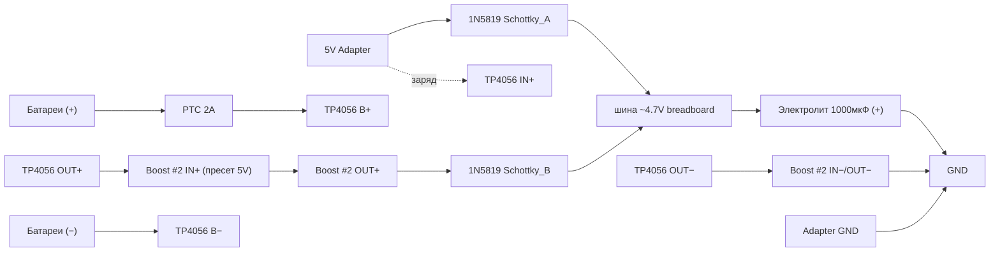
```mermaid
flowchart LR
    ADP["5V Adapter"] --> SCHA["1N5819 Schottky_A"]
    SCHA --> RAIL["шина ~4.7V breadboard"]
    ADP -.заряд.-> TP["TP4056 IN+"]
    BAT["Батареи (+)"] --> PTC["PTC 2A"] --> TPB["TP4056 B+"]
    TP_OUT["TP4056 OUT+"] --> BOOST2["Boost #2 IN+ (пресет 5V)"]
    BOOST2 --> BOOST2OUT["Boost #2 OUT+"]
    BOOST2OUT --> SCHB["1N5819 Schottky_B"]
    SCHB --> RAIL
    RAIL --> CAP["Электролит 1000мкФ (+)"]
    CAP --> GND["GND"]

    BAT_M["Батареи (−)"] --> TP_BM["TP4056 B−"]
    TP_OUT_M["TP4056 OUT−"] --> BOOST2_GND["Boost #2 IN−/OUT−"] --> GND
    ADP_M["Adapter GND"] --> GND
```

**Важный момент:** в старой схеме стоял один диод между TP4056 OUT+ и шиной, шина при автономке падала до 3.4V. Это не работало — AMS1117 ESP32 нуждается в ≥4.3V на входе для стабильных 3.3V, на 3.4V он уходит из регулировки и ESP32 падает в brownout на рывках WiFi. **Boost #2 существует именно для этого** — он поднимает 3.7V батареи до 5V, далее Schottky_B, и шина остаётся на 4.7V независимо от источника.

### Пошаговая сборка на breadboard

**Шаг 1: Шины GND и +5V.**

- Выбери одну из двух шин `−` на breadboard как главный GND. Пометь маркером если есть.
- Выбери одну из `+` шин как главную +5V.
- Если шина разорвана посередине (проверял на [этапе 6](#breadboard)) — соедини половинки перемычкой.

**Шаг 2: Установи TP4056 рядом с breadboard.**

⚠️ **Безопасность пайки:** перед любой пайкой цепи **вытащи 18650 из холдеров**. Паяльник легко коснётся контактов холдера или пятачка под напряжением → искра, сгоревшее жало, в худшем случае — нагрев батареи. Паяй по обесточенной схеме, батареи вставляй **в самом конце**.

TP4056 — отдельный модуль, на breadboard он сам по себе не встанет (его пайные пады не в шаг 2.54 мм). Есть три варианта подключения, от простого к сложному:

- **Easiest:** TP4056 с **предпаянными винтовыми клеммами** (ищи «TP4056 with screw terminals» — на 50–80₽ дороже, зато ноль пайки). Вкручиваешь провода dupont отвёрткой.
- **Medium:** TP4056 с **запаянным pin header** (штырями) — втыкаешь dupont-ы руками.
- **Hardest (и рекомендованный в референсе):** припаять провода dupont **М-Ж** прямо к пятачкам 1.5 мм. Не первая пайка в жизни — тонкое жало (1–1.5 мм), припой 0.5–0.8 мм с флюсом, «третья рука» обязательна, не более 2 сек на пад.

Провода идут **от модуля TP4056 в точки на breadboard**:

- `IN+` → резерв (сюда подключим адаптер потом)
- `IN−` → резерв
- `B+` → свободный ряд breadboard (назовём «точка B+»)
- `B−` → свободный ряд breadboard («точка B−»)
- `OUT+` → свободный ряд («точка OUT+»)
- `OUT−` → шина GND

**Что НЕ делать:** не крепи TP4056 скрутками «на весу» без изоленты/термоусадки — они разболтаются в корпусе от вибрации, и B+/B− замкнётся где-то через неделю работы.

**Шаг 3: Подключи батареи к TP4056 через PTC.**

1. Общий провод **ВХОД+** от батарей (с [этапа 2](#этап-2)) → один вывод PTC.
2. Второй вывод PTC → точка B+ на breadboard (которая идёт на B+ TP4056).
3. Общий провод **ВХОД−** от батарей → точка B− на breadboard (которая идёт на B− TP4056).

**Не подключай питание адаптера пока!**

**Шаг 4: Проверка 1 — батарея питает TP4056.**

1. Мультиметр → V= 20.
2. Чёрный щуп на GND breadboard, красный на точку B+.
3. **Ожидание:** напряжение, равное напряжению батареи (3.5–4.2V).
4. Если показывает 0V — проверь холдеры (батареи вставлены?), скрутки (не слетели?), PTC (не перегорел? — мультиметром в Ω должен показать <1Ω).

**Шаг 5: Установи Boost #2 (подъём батареи до 5V).**

1. Возьми второй Mini Boost Module (boost #2), уже настроенный на **5V** ([Этап 1](#этап-1), пресет `0 0`).
2. Провода от его пайных пятачков **IN+/IN−** тяни на breadboard:
   - `IN+` boost#2 → точка `OUT+ TP4056` на breadboard (общий ряд, куда приходит OUT+ TP4056)
   - `IN−` boost#2 → шина GND
3. Провода от `OUT+/OUT−` boost#2 — в отдельные свободные ряды breadboard:
   - `OUT+` boost#2 → новая точка «точка OUT+ boost#2»
   - `OUT−` boost#2 → шина GND

**Промежуточная проверка boost#2 автономно:**
- Вставь батареи в холдеры. На «точке OUT+ boost#2» мультиметр должен показать **~5V** (4.8–5.2V), чёрный щуп на GND.
- Если 0V — проверь пресет (A=0, B=0), прозвонку IN+→OUT+, полярность подключения.
- Если напряжение = напряжению батареи (3.7V) без подъёма — пресет ошибочный или boost не работает.

**Шаг 6: Два диода Шоттки (Schottky_A и Schottky_B).**

Оба диода — 1N5819. **Полоска = катод.**

1. **Schottky_A** (от адаптера к шине):
   - Вывод БЕЗ полоски (анод) → точка на breadboard, куда приходит `+` адаптера (её зарезервируем в Шаге 8)
   - Вывод С полоской (катод) → шина breadboard (главная шина питания)
2. **Schottky_B** (от boost#2 к той же шине):
   - Вывод БЕЗ полоски (анод) → точка «OUT+ boost#2» с Шага 5
   - Вывод С полоской (катод) → **та же** шина breadboard (катоды обоих диодов должны сходиться в одну точку)
3. Обрезай лишние ножки бокорезами.

**Шаг 7: Электролит 1000 мкФ.**

1. **Длинная ножка (+)** → шина breadboard.
2. **Короткая ножка (−, с полоской на корпусе)** → шина GND.

**⚠️ Перепутаешь — через минуту вздуется!** (И если boost #2 случайно настроен на 12V вместо 5V — тоже вздуется: предел 10V.)

**Шаг 8: Проверка 2 — батарея через boost#2 питает шину.**

Адаптер пока **не** подключай.

1. Мультиметр → V= 20.
2. Чёрный на GND, красный на шину breadboard.
3. **Ожидание:** **~4.7V** (OUT+ boost#2 5V минус 0.3–0.4V на Schottky_B). Допуск 4.5–4.9V.
4. Если 0V или ~3.3V — проверь: boost#2 выдаёт 5V? Schottky_B в правильной полярности (полоска к шине)? Анод Schottky_B на OUT+ boost#2?
5. Если напряжение = 3.3–3.5V — ты случайно подключил Schottky_A или Schottky_B анодом к батарее напрямую, минуя boost#2. Проверь, что вход Schottky_B именно на OUT+ boost#2, а не на OUT+ TP4056.

**Шаг 9: Подключение адаптера.**

1. Адаптер 5V 2A — тебе нужен доступ к жилам +5V и GND. Варианты от удобного к крайнему:
   - **USB-C breakout board с винтовыми клеммами** (~100–150₽ на Ozon/Aliexpress, ищи «USB Type-C breakout screw terminal»). Втыкаешь адаптер в плату, выводишь +5V и GND на винтовые клеммы. **Рекомендую для новичка** — невозможно перепутать.
   - **Готовый USB-C→клеммы разрыв-кабель** — то же, но одним куском.
   - **Крайний вариант:** отрезать USB-C коннектор адаптера и зачистить жилы. Типичная маркировка: красный = +5V, чёрный = GND. Но на дешёвых адаптерах цвета бывают любые — **обязательно прозвони мультиметром, прежде чем подавать на схему**. Перепутал = сгорел TP4056.
2. **Красный (+)** провод адаптера → разветвляется на **две** точки:
   - Точка **анод Schottky_A** (с Шага 6) — откуда он идёт на шину
   - Точка `IN+` TP4056 — для зарядки батареи
3. **Чёрный (−)** → шина GND (которая включает `IN−` TP4056).

Фактически адаптер делает две вещи одновременно:
- Кормит шину через Schottky_A (5V − 0.35V ≈ 4.7V)
- Заряжает батарею через TP4056 (`IN+` / `IN−`)

Когда адаптер активен: шина 4.7V ≈ выходу boost#2 через Schottky_B, оба диода на грани закрытия. В реальности адаптер чуть выше (менее потерь) и чаще ведёт, а boost#2 работает в холостую. Когда адаптер отключается — Schottky_A закрывается, boost#2 через Schottky_B берёт на себя питание шины без перерыва.

**Шаг 10: Проверка 3 — полная силовая цепь.**

Включи адаптер в розетку. Мультиметр → V= 20.

| Контрольная точка | Ожидаемое напряжение | Что делать, если не так |
|---|---|---|
| Шина → GND | **4.6–4.8V** | Меньше 4.5V — проверь Schottky_A (полярность, контакт). Если 5.0V — у тебя нет Schottky_A, адаптер напрямую сидит на шине |
| OUT+ boost#2 → GND | **~5V** | Если 3.7V — boost#2 не работает, проверь пресет |
| TP4056 B+ → GND | 3.7–4.2V (батарея заряжается) | Не 0V, не 4.7V. Если 4.7V — один из Schottky смотрит «в батарею» наоборот |
| Schottky_A анод → катод | +0.3…0.4V (прямое смещение) | Это нормально — адаптер кормит через этот диод |
| Schottky_B анод → катод | около 0V или чуть-чуть + (почти закрыт) | Адаптер и boost#2 в балансе. Если большое прямое падение — вообще странно, проверь заново |
| TP4056 CHG LED | Красный горит (заряжает) | Если горит синий/зелёный — батарея уже полная, нормально |

**Шаг 11: Проверка 4 — выдёргиваем адаптер.**

Вытащи адаптер из розетки. Проверь шину → GND:
- **Ожидание:** шина держится на **~4.7V** (5V boost#2 − 0.35V Schottky_B). **Не должна упасть до 3.4V** — если упала, значит boost#2 не работает или Schottky_B не подключён.
- TP4056 CHG LED должен погаснуть.
- Электролит 1000 мкФ продлит «затухание» на долю секунды (хотя при нормальной работе boost#2 подхватывает питание мгновенно, и никакой просадки ты не увидишь).

Воткни адаптер обратно. Шина должна вернуться на ~4.7V (теперь уже через Schottky_A).

✅ Этап 3 завершён: силовая цепь собрана, батарея резервирует шину, диод изолирует батарею от перезаряда.

---

<a name="этап-4"></a>
## 12. Этап 4: ESP32 на breadboard

Цель: установить ESP32 и убедиться, что он получает 5V и производит 3.3V.

### Установка

Перед установкой — ещё раз сверься с **фото и полным пинаутом в [разделе 5 → ESP32 DevKit V1](#компоненты)**. Ориентация: USB-C смотрит **за край breadboard** (торчит наружу), чтобы кабель для прошивки не упирался в провода.

1. Воткни ESP32 в breadboard верхом через canyon. Пины с обеих сторон должны войти в отверстия плотно — дави равномерно, двумя большими пальцами, над обоими торцами платы.
2. Сторона с `VIN / GND / D13..D34` идёт в ряды i/j (или a/b, не принципиально, главное — запомни и не перепутай потом).
3. Найди пин `VIN` (нижний левый угол платы, если USB-C смотрит на тебя) и подключи dupont-проводом к шине ~4.7V breadboard.
4. Найди пин `GND` (их несколько, любой подойдёт) и подключи к шине GND.
5. Поставь керамику 100 нФ (маркировка «104») **между пинами VIN и GND прямо у самой ESP32** — на пайную колонку, куда VIN втыкает. Это фильтр питания, критичный для стабильности.

### Проверка

1. Мультиметр → V= 20. Чёрный на GND, красный на VIN ESP32.
   - **Ожидание:** **4.6–4.8V** (та же шина после Schottky_A/B).
2. Красный щуп на пин `3V3` ESP32 (обычно противоположная сторона от VIN).
   - **Ожидание:** 3.2–3.3V.
3. Смотри глазами: **PWR LED на плате ESP32 должен гореть красным.** Если не горит — либо нет питания, либо LED выпаян (у тебя такого нет), либо ESP32 мёртв (редко).

Ничего не прошиваем пока — мы просто проверяем, что железо живое. USB в ESP32 ВООБЩЕ НЕ ВТЫКАЙ ПОКА.

✅ Этап 4 завершён: ESP32 живёт от шины.

---

<a name="этап-5"></a>
## 13. Этап 5: Сигнальные делители

Цель: собрать два делителя **(10k+5k) + 10k** (для скорости и направления) и проверить, что они делят 5V в **2.0V**.

> **Почему большее плечо (10k+5k) сверху, а не снизу:** ADC ESP32 при 11dB чисто линеен в 150 мВ … 2.45V. Если поставить большее плечо (10k+5k) снизу, а 10k сверху — на максимуме будет 3.0V, это уже нелинейная зона, скорости >49 м/с занижались бы. Текущий (10k+5k)+10k даёт 0–2.0V, весь диапазон 0–60 м/с в чистой линейной зоне. Верхнее плечо 15k собрано из **10k + 5k последовательно** — отдельного 15k в наборе нет.

### Схема одного делителя

```
      V_вход (0-5V от датчика)
            │
        ┌───┴───┐
        │ 10kΩ  │ ← ВЕРХНЕЕ плечо, 1-й в серии
        └───┬───┘
        ┌───┴───┐
        │  5kΩ  │ ← ВЕРХНЕЕ плечо, 2-й в серии (10k+5k=15k)
        └───┬───┘
            │────► к ADC пину (GPIO34 или GPIO35)
            │
            ├──── 100нФ ──── GND (фильтр)
            │
        ┌───┴───┐
        │ 10kΩ  │ ← НИЖНИЙ резистор
        └───┬───┘
            │
           GND
```

### Сборка делителя для скорости (GPIO34)

Выбери свободный участок breadboard вдали от ESP32:

1. **Верхнее плечо = 10kΩ + 5kΩ последовательно (= 15kΩ):** резистор **10kΩ** — один вывод в ряд `a10` (например), другой в ряд `a11`. Затем резистор **5kΩ** — один вывод в тот же ряд `a11`, другой в ряд `a12`.
2. **Резистор 10kΩ (нижнее плечо)** — один вывод в ряд `a12` (тот же, где нижний вывод 5kΩ верхнего плеча!), другой в ряд шины GND.
3. **Провод от `a12`** → пин **GPIO34** ESP32 (используй dupont M-M, если ESP32 пины доступны, или M-F).
4. **Керамика 100нФ** — один вывод в `a12`, другой в GND. Полярности нет — как удобно. **Этот кондёр критичен**, не пропускай: он образует RC-фильтр с резисторами делителя и подавляет наводки на длинном (2–5 м) кабеле от датчика на мачте. Без него значения скорости будут скакать на ±3 м/с даже в штиль — особенно рядом с WiFi-роутером или коллекторным мотором.
5. **Временно**: провод от `a10` → шина **~4.7V** (для проверки; значение на выходе делителя будет чуть меньше 2.0V из-за того, что вход — шина 4.7V, а не чистые 5V датчика — это ОК). Потом заменим на сигнал датчика.

### Проверка

1. Мультиметр → V= 20. Чёрный на GND, красный на точку `a12` (выход делителя).
2. **Ожидание:** при входе 4.7V с шины → **~1.88V** на выходе (4.7 × 0.4). Допуск 1.8–2.0V. При входе прямо 5V от внешнего источника → 2.0V.
3. Если 5V (или 4.7V) — в делителе обрыв (10k не подключён к GND). Прозвони.
4. Если 0V — обрыв верхнего плеча (10k или 5k) или замыкание на GND после точки `a12`. Проверь.
5. Если сильно меньше (~1.5V) или больше (~2.8V) — ошибка в номиналах. Прозвони резисторы мультиметром (10k → ~10 кΩ, 5k → ~5 кΩ, верхнее плечо 10k+5k последовательно → ~15 кΩ) перед повторной сборкой.

### Проверка с другой стороны: что читает ESP32?

Пока прошивки нет — этот шаг отложим до [Этапа 9](#этап-9). Но суть такая: прошивка с делителем видит 2.0V на ADC → считает sensor = 2.0 × 2.5 = 5V → скорость = 60 м/с. Константа в коде: `SIGNAL_DIVIDER_RATIO = 2.5f`.

### Сборка второго делителя для направления (GPIO35)

Повторить пошагово, но:
- Выход делителя идёт на **GPIO35**
- Вход делителя — отдельный (для сигнала направления от датчика)

В обоих делителях убери временный провод от `a10` к ~4.7V **после проверки** — туда пойдёт сигнал с датчика.

✅ Этап 5 завершён: два делителя собраны и выдают 2.0V при 5V на входе (чистая линейная зона ADC).

---

<a name="этап-6"></a>
## 14. Этап 6: Делитель батареи

Цель: собрать делитель 100k+100k для мониторинга напряжения батареи на GPIO32.

### Схема

```
      Шина батареи (после PTC, ≈ V_батареи)
           │
       ┌───┴────┐
       │ 100kΩ  │
       └───┬────┘
           ├──────► GPIO32
           ├────── 100нФ ──── GND
       ┌───┴────┐
       │ 100kΩ  │
       └───┬────┘
           │
          GND
```

### Сборка

1. Вход делителя — это **точка B+ TP4056** (= напряжение батареи до PTC, либо после — нюанс незначителен; в `wind-station-assembly.md` на схеме указано «после PTC»).
2. Первый 100kΩ: один вывод на B+ (или сразу после PTC), другой — в новый ряд, назовём `d20`.
3. Второй 100kΩ: один вывод в `d20`, другой — на GND.
4. Керамика 100 нФ: один вывод в `d20`, другой на GND.
5. Провод от `d20` → GPIO32 ESP32.

### Проверка

1. Мультиметр → V= 20. Чёрный на GND, красный на `d20`.
2. **Ожидание:** `V_батареи / 2`. При 3.95V батарее → **1.97V** на GPIO32.
3. Если 0V — обрыв нижнего 100k.
4. Если 4V — обрыв верхнего 100k.
5. Замерь также напряжение батареи напрямую (B+ → GND) — оно должно быть **ровно в 2 раза больше** напряжения на GPIO32.

✅ Этап 6 завершён: мониторинг батареи готов.

---

<a name="этап-7"></a>
## 15. Этап 7: Светодиоды

Цель: подключить 5 LED через резисторы 220Ω к своим GPIO.

### Схема одного LED

```
   GPIO (26/27/14/25/33)
         │
     ┌───┴────┐
     │ 220 Ω  │
     └───┬────┘
         │
       Анод ( LED )
         │
     (длинная ножка вниз, плоский срез наверху)
         │
       Катод
         │
        GND
```

### Соответствие LED → GPIO → цвет

| GPIO | Цвет LED | Что означает |
|---|---|---|
| 26 | 🟢 Зелёный | Станция работает (нет ошибки ADC) |
| 27 | 🟡 Жёлтый | Ветер > 5 м/с |
| 14 | 🔴 Красный | Ветер > 15 м/с |
| 25 | 🟢 Зелёный (2-й) | WiFi подключён |
| 33 | 🔴 Красный (2-й) | Ошибка (ADC или WiFi) |

### Сборка одного LED (повторить 5 раз)

1. Выбери свободный столбец breadboard.
2. **Резистор 220Ω**: один вывод в точку `X` (от GPIO), другой в точку `Y`.
3. **LED**: длинная ножка (анод) в точку `Y` (где низ резистора), короткая ножка в шину GND.
4. **Dupont провод**: от точки `X` к соответствующему GPIO пину ESP32.

### Практический совет

**Делай LED на длинных проводах dupont M-F.** 5 светодиодов в одном углу breadboard — это колхоз. Лучше:
- Резисторы 220Ω сиди в breadboard
- Длинные провода M-F (30+ см) от резистора к LED
- LED потом крепишь на крышке корпуса IP65

Так при закрытии корпуса LED не будут мешать, а светодиодный статус будет виден снаружи.

> ⚠️ **Крышка у купленного корпуса непрозрачная.** Сквозь неё ничего не видно, поэтому либо сверлить под 5-мм светодиоды и герметизировать отверстия (иначе теряется IP65), либо не выводить их вовсе и смотреть статус на дашборде — там те же индикаторы.

### Проверка

Пока прошивки нет — сделаем ручную проверку **одного** LED:

1. Dupont M-M: один конец в шину +3V3 (на ESP32 есть пин 3V3), другой конец временно втыкаем в точку `X` (вход резистора LED).
2. LED должен загореться.
3. Если не горит — проверь полярность LED (короткая к GND, длинная через резистор). Переверни.
4. Если горит тускло — нормально, ток ~5–6 мА, LED видно, но не ярко. Хватит, чтоб быть индикатором.
5. Повтори для всех 5 LED.

**После проверки** отсоединяй 3V3-провод и подключай обратно к нужному GPIO.

### Дополнительная проверка: ничего не коротит?

1. Адаптер выключи.
2. Мультиметр в режим прозвонки.
3. Чёрный щуп — GND, красный — на каждый GPIO по очереди. Не должно пищать (LED не проводит в обратную сторону).
4. Чёрный — шина ~4.7V, красный — GND. Не должно пищать (иначе КЗ в питании — ищи).

✅ Этап 7 завершён: 5 LED готовы к управлению от ESP32.

---

<a name="этап-8"></a>
## 16. Этап 8: Первая прошивка

Цель: залить прошивку `esp32_wind_station.ino` в ESP32 по USB.

### Подготовка

1. **Определи чип USB-Serial** твоего ESP32. У тебя на фото я вижу маленькую микросхему рядом с Type-C — это одно из:
   - CP2102 (Silicon Labs)
   - CH9102X (WCH, новый)
   - CH340 (WCH, старый)
2. Воткни USB-C кабель в ESP32 и компьютер. **Адаптер 5V должен быть отключён** (одновременно два источника питания — конфликт).
3. Открой **Диспетчер устройств Windows**: Win+X → «Диспетчер устройств».
4. Найди новое устройство:
   - Если в разделе «Порты (COM и LPT)» → драйвер уже есть, запомни номер COM
   - Если в «Другие устройства» с жёлтым треугольником → нужен драйвер
5. ПКМ по устройству → Свойства → Сведения → ИД оборудования. VID/PID скажет тебе, какой чип:

| VID & PID | Чип | Драйвер скачать |
|---|---|---|
| `VID_10C4 & PID_EA60` | CP2102 | [Silicon Labs CP210x](https://www.silabs.com/) — обычно Win11 ставит сам |
| `VID_1A86 & PID_55D4` | CH9102X | [WCH CH343SER](https://www.wch-ic.com/downloads/CH343SER_EXE.html) |
| `VID_1A86 & PID_7523` | CH340C | [WCH CH341SER](https://www.wch-ic.com/downloads/CH341SER_EXE.html) |

Установи драйвер, перезагрузи если попросит. После этого ESP32 должен появиться как `COM3` (или другой номер) в «Портах».

### Arduino IDE

1. Скачай [Arduino IDE](https://www.arduino.cc/en/software) (версия 2.x — актуальная).
2. `File → Preferences → Additional Board Manager URLs` → добавь:
   ```
   https://raw.githubusercontent.com/espressif/arduino-esp32/gh-pages/package_esp32_index.json
   ```
3. `Tools → Board → Boards Manager` → ищи `esp32` → установи «esp32 by Espressif Systems».
4. `Tools → Board → ESP32 Arduino → ESP32 Dev Module`.
5. `Tools → Port` → выбери COM-порт, который определился.
6. `Tools → Upload Speed → 115200`.

### Настройка прошивки

1. Открой файл `esp32_wind_station.ino` в этой папке.
2. Найди в начале скетча:
   ```cpp
   const char* ssid        = "ТВОЯ_СЕТЬ";
   const char* password    = "ТВОЙ_ПАРОЛЬ";
   ```
3. Впиши своё имя WiFi и пароль (обычно домашний роутер, 2.4 ГГц; ESP32 не видит 5 ГГц сети).
4. (По желанию) замени `hostname` и `otaPassword` на свои.
5. Сохрани: `Ctrl+S`.

### Прошивка

1. `Verify` (✓ значок) — проверка синтаксиса. Должно пройти без ошибок.
2. `Upload` (→ значок) — загрузка в ESP32.
3. В консоли снизу увидишь: `Connecting....` затем `Writing at 0x00001000... (10%)` и так до 100%.
4. **Если зависает на «Connecting....»** — нажми и держи кнопку `BOOT` на ESP32, потом кликни Upload снова. Как только началась загрузка (`Writing at...`) — можно отпустить. **Где BOOT:** одна из двух тактильных кнопок по бокам Type-C разъёма (см. фото ESP32 в [разделе 5](#компоненты), элемент ④). Вторая кнопка (`EN`) — это сброс. Если не уверен, какая из двух — BOOT: зажми любую, попробуй Upload; если не сработало, отпусти, зажми другую, попробуй снова. EN при этом не мешает (просто перезагружает).
5. В конце: `Leaving... Hard resetting via RTS pin...`. Прошивка залита.

### Serial Monitor

1. `Tools → Serial Monitor` (или значок лупы справа вверху).
2. Скорость: **115200 baud**.
3. Нажми кнопку `EN` (Reset) на ESP32.
4. Должно появиться:
   ```
   === Метеостанция ветра ===
   WiFi.......... OK
   IP: 192.168.x.x
   mDNS: http://windstation.local
   OTA готов
   HTTP: 80
   V=0.0 m/s  D=0°  G=0.0  Bat=3.85V (50%)  RSSI=-58
   ...
   ```
5. Запиши IP-адрес (понадобится, если mDNS не сработает).

### Что если WiFi не подключился?

- `WiFi............... ОШИБКА — работаю без сети` — проверь SSID/пароль в скетче, перезалей.
- Обрати внимание: ESP32 **не видит 5 ГГц** WiFi. Если у тебя роутер dual-band, нужен отдельный SSID на 2.4 ГГц.

✅ Этап 8 завершён: прошивка живёт, ESP32 в сети.

---

<a name="этап-9"></a>
## 17. Этап 9: Проверка без датчика

Цель: открыть дашборд в браузере и убедиться, что JSON API работает.

### Доступ по mDNS

1. В браузере на любом устройстве в той же сети: `http://windstation.local`
2. Должна открыться простая страница: «Wind Station», IP, ссылка на `/api/data`.
3. Кликни на `/api/data` — увидишь JSON:
   ```json
   {"speed":0.0,"direction":0,"gust":0.0,"ledGreen":false,"ledYellow":false,"ledRed":false,"ledAuto":true,"battery":3.85,"batteryPercent":50,"wifiRssi":-58,"adcError":true,"hostname":"windstation.local","uptime":45}
   ```

### Что должно быть при отсутствии датчика

> **Это штатное состояние Этапа 9.** Датчик ещё не подключён, и прошивка корректно это детектирует через `adcError: true`. Не пытайся «починить» этот флаг здесь — он погаснет сам, как только подключишь датчик в Этапе 10. Если же на Этапе 10 `adcError` останется `true` — вот тогда реальная проблема (обрыв сигнала).

- `speed: 0`, `direction: 0`, `gust: 0` — вход ADC болтается в нуле
- `adcError: true` — через ~30 секунд после включения прошивка детектирует «висящие» ADC
- `ledGreen: false` — потушен, потому что adcError = true
- `ledRed` (GPIO33) глазами: горит (индикатор ошибки)
- `battery: 3.7–4.2` — реальное напряжение батареи
- `batteryPercent: 0–100` — в зависимости от заряда
- `wifiRssi: -30..-90` — отрицательное число, сила сигнала WiFi

### Если mDNS не работает

- Windows: установи [Bonjour Print Services](https://support.apple.com/kb/DL999) (дополнительные драйверы для `.local` адресов)
- Или открой по IP напрямую: `http://192.168.x.x` (тот IP, что печатается в Serial Monitor)

### Тест управления LED через API

Выключи `auto` режим и включи/выключи LED вручную:

- `http://windstation.local/api/led?auto=false` — перевели в ручной режим
- `http://windstation.local/api/led?green=true&yellow=true&red=true` — зажгли все три
- `http://windstation.local/api/led?green=false&yellow=false&red=false` — погасили
- `http://windstation.local/api/led?auto=true` — вернули автомат

Глазами проверь что LED на GPIO26/27/14 реагируют. LED на GPIO25 (WiFi) и GPIO33 (ошибка) управляются автоматически, их через API не меняем.

✅ Этап 9 завершён: прошивка, WiFi, API, LED — всё работает без датчика.

---

> ⚠️ **СТОП перед Этапом 10 — критическая проверка!**
> Boost-модули **могут** выдавать до 28V при неправильном пресете. Датчик рассчитан на 10–30V, но
> подавать больше 12V нельзя. **Перед подключением датчика:**
> 1. Убедись что boost#1 выдаёт **12.0 ± 0.3V** (мультиметр на OUT+ boost#1 относительно GND)
> 2. Только после этого подключай VCC датчика к OUT+ boost#1
>
> Если пропустить этот шаг и пресет окажется неверным — датчик сгорит мгновенно.

<a name="этап-10"></a>
## 18. Этап 10: Подключение датчика

Цель: подключить датчик ветра, убедиться, что скорость и направление меняются.

### Провода датчика

Типичный Polycarbonate 0-5V Wind Sensor имеет 4 провода:
- **Красный** — VCC (10–30V, у нас 12V от boost)
- **Чёрный** — GND
- **Жёлтый** (или зелёный) — сигнал скорости 0–5V
- **Синий** (или белый) — сигнал направления 0–5V

**⚠️ Цвета могут отличаться!** Смотри инструкцию к твоему конкретному датчику. Если нет — меряй мультиметром:
- Подай 12V на два провода (пробуя пары) — если датчик не реагирует, переверни полярность
- Крути чашки — на сигнальных проводах относительно GND должно меняться напряжение

### Подключение

**Предварительно выключи всё питание!**

1. **VCC датчика (красный)** → выход Mini Boost Module `OUT+` (12V).
2. **GND датчика (чёрный)** → шина GND breadboard.
3. **Сигнал скорости** → вход делителя скорости (точка `a10` из [Этапа 5](#этап-5), где 10k резистор).
4. **Сигнал направления** → вход делителя направления (аналогично).

### Проверки мультиметром перед включением

1. Прозвонка: датчик VCC не замкнут на GND? Если да — брак или неправильные цвета.
2. Прозвонка: сигнальные провода не замкнуты на VCC или GND (в статике должны быть «висячими»).

### Включение

1. Подай адаптер 5V.
2. Через 10 секунд открой `http://windstation.local/api/data`.
3. Подуй на чашки или просто шевельни их рукой:
   - `speed` должна подняться с 0 до 5–30 м/с в зависимости от силы дуновения
   - `gust` (порыв) должен зафиксировать пик
4. Поверни флюгер:
   - `direction` должно меняться от 0 до 359°

### Диагностика

| Симптом | Причина | Фикс |
|---|---|---|
| `speed = 60` постоянно | Сигнал скорости замкнут на VCC или обрыв верхнего плеча (10k+5k) | Проверь делитель, проверь провод |
| `speed = 0` при ветре | Датчик не получает 12V, или сигнал оборван | Мультиметр на VCC датчика (должно быть 12V), сигнальные жилы |
| `direction` не меняется | Датчик направления заклинило, или сигнал оборван | Крути рукой, мерь мультиметром на выходе датчика |
| `adcError: true` | Детектор обрыва сработал (оба канала <10мВ 30с) | Если датчик подключён — значит реально обрыв, проверь |
| Значения скачут | Наводки на кабель | Уменьши длину, проверь конденсаторы 100 нФ на делителях |

✅ Этап 10 завершён: датчик отвечает на ветер.

---

<a name="этап-11"></a>
## 19. Этап 11: Калибровка и поверка

В этом проекте датчик линейный 0–5V / 0–60 м/с, и прошивка использует `analogReadMilliVolts()` с eFuse-калибровкой. **Специальная калибровка обычно не требуется.**

### Поверка (sanity check)

- **При штиле в комнате:** speed ≈ 0 ± 0.3 м/с. Если 2+ м/с всегда — наводки, нужен экранированный кабель.
- **Слабое дуновение рта:** speed поднимается на 3–8 м/с, через пару секунд падает.
- **Поверни флюгер на 360°:** direction делает полный круг, не зависая.
- **Порог жёлтого LED (5 м/с):** дуй сильнее, через пару секунд жёлтый LED загорится.
- **Красный LED (15 м/с):** в комнате вряд ли достигнешь — это штормовой ветер. Тест в реальных условиях.

### Известные неидеальности:

- На малых скоростях (<1 м/с) сигнал может болтаться в шумах; прошивка не фильтрует, показывает как есть.
- На максимумах (>55 м/с) ADC ESP32 на 11dB в нелинейной зоне, показания могут быть занижены. Для большинства применений это не критично — ураганы редко.
- Направление усредняется circular mean через 5 отсчётов (10 секунд). Быстрые перемены флюгера показываются с лагом.

✅ Этап 11 завершён: показания адекватны.

---

<a name="этап-12"></a>
## 20. Этап 12: Монтаж в корпус

Цель: перенести собранную на breadboard схему в IP65 корпус.


*Корпус IP65 190×150×75 — сверлить под PG7: сверло 12 мм*


*Гермоввод PG7 IP68 × 2 шт.*


*Герметик Lacrysil — для финальной герметизации по периметру крышки*

### Сверление отверстий

Корпус 190×150×75 мм — в боковой стенке нужны 2 отверстия:

1. **Под гермоввод PG7 кабеля датчика** — сверло **12 мм** (резьба PG7 ≈ 12.5 мм, но 12 мм даёт плотную посадку).
2. **Под гермоввод PG7 кабеля адаптера** — сверло **12 мм**.

**Безопасность сверления:**
- Зажми корпус в тиски или крепко держи
- Начни с маленького сверла (3–4 мм), потом расширь до 12 мм
- Подложи доску под корпус — иначе сверло пройдёт дальше и поцарапает стол

Отверстия сверли **в боковой стенке**, не в крышке и не в дне — чтобы вода не стекала внутрь.

### Размещение внутри

Смотри диаграмму «Компоновка в корпусе» в `wind-station-assembly.md`. Примерно так:

- **Дно корпуса:** холдеры 18650 (приклей термоклеем или двусторонним скотчем), пакетик силикагеля в углу
- **Средний уровень:** модули TP4056, Mini Boost, диод Шоттки, PTC, электролит — всё на уголок термоклеем
- **Верхний уровень:** breadboard с ESP32 и делителями — на двусторонний скотч 3M к боковой стенке или дну
- **Крышка/верх:** 5 LED выведены длинными проводами dupont к крышке (крышка глухая — под них нужны герметизированные отверстия)

### Гермовводы

1. Внутрь каждого гермоввода PG7:
   - Ослабь накидную гайку
   - Проведи кабель через гайку + уплотнительное кольцо + корпус гермоввода
   - Затяни гайку рукой, потом ключом — но не переусердствуй (пластик лопнет).
2. **Внутри корпуса** — кабель датчика подключается к boost (12V) и к делителям. Адаптер 5V — к силовой линии.

### Итоговая проверка герметичности

1. Закрой крышку. Проверь, что уплотнитель (резиновая прокладка) плотно прилегает — нет «щелей».
2. Перед выносом на улицу **протестируй дома с подключением**, проверь что по `windstation.local` дашборд живой.
3. Не клади корпус на солнце — ESP32 + батарея внутри без вентиляции перегреются.

✅ Этап 12 завершён: станция в корпусе, готова к установке.

---

<a name="диагностика"></a>
## 21. Диагностика — если что-то не работает

### Дерево решений

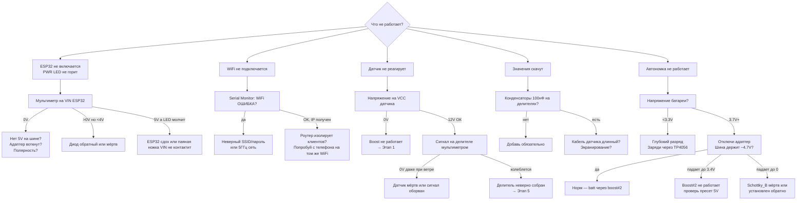
```mermaid
flowchart TD
    START{Что не работает?}
    START --> NOPOWER[ESP32 не включается<br/>PWR LED не горит]
    START --> NOWIFI[WiFi не подключается]
    START --> NOSENSOR[Датчик не реагирует]
    START --> FLAKY[Значения скачут]
    START --> NOBATTERY[Автономка не работает]
    
    NOPOWER --> P1[Мультиметр на VIN ESP32]
    P1 -->|0V| P2[Нет 5V на шине?<br/>Адаптер воткнут?<br/>Полярность?]
    P1 -->|>0V но <4V| P3[Диод обратный или мёртв]
    P1 -->|5V а LED молчит| P4[ESP32 сдох или паяная ножка VIN не контактит]
    
    NOWIFI --> W1[Serial Monitor: WiFi ОШИБКА?]
    W1 -->|да| W2[Неверный SSID/пароль<br/>или 5ГГц сеть]
    W1 -->|ОК, IP получен| W3[Роутер изолирует клиентов?<br/>Попробуй с телефона на том же WiFi]
    
    NOSENSOR --> S1[Напряжение на VCC датчика]
    S1 -->|0V| S2[Boost не работает<br/>→ Этап 1]
    S1 -->|12V ОК| S3[Сигнал на делителе мультиметром]
    S3 -->|0V даже при ветре| S4[Датчик мёртв или сигнал оборван]
    S3 -->|колеблется| S5[Делитель неверно собран<br/>→ Этап 5]
    
    FLAKY --> F1[Конденсаторы 100нФ на делителях?]
    F1 -->|нет| F2[Добавь обязательно]
    F1 -->|есть| F3[Кабель датчика длинный?<br/>Экранирование?]
    
    NOBATTERY --> B1[Напряжение батареи?]
    B1 -->|<3.3V| B2[Глубокий разряд<br/>Заряди через TP4056]
    B1 -->|3.7V+| B3[Отключи адаптер<br/>Шина держит ~4.7V?]
    B3 -->|да| B4[Норм — batt через boost#2]
    B3 -->|падает до 3.4V| B5[Boost#2 не работает<br/>проверь пресет 5V]
    B3 -->|падает до 0| B6[Schottky_B мёртв или<br/>установлен обратно]
```

### Таблица симптомов и решений

| Симптом | Возможная причина | Решение |
|---|---|---|
| Дашборд показывает `battery: 0%` всегда | Делитель 100k не подключен к батарее | Проверь, что первый 100k идёт на точку B+ или после PTC, а не на шину 5V |
| `battery: 100%` всегда | Напряжение на GPIO32 выше 2.1V — либо делитель сломан, либо подключён к 5V | Мультиметр на GPIO32 → должно быть ~2V |
| `adcError: true` с подключённым датчиком | Реальный обрыв сигнала | Мультиметр на сигнальных жилах датчика |
| `windstation.local` не открывается | mDNS не работает на устройстве | Открой по IP (из Serial Monitor) |
| OTA не видит плату в Arduino IDE | Другая подсеть или файрвол | Одна WiFi-сеть, отключи VPN на компьютере |
| ESP32 перезагружается каждые несколько секунд | Brownout — просадка питания | Проверь электролит 1000 мкФ, сократи провод от адаптера |
| TP4056 сильно греется | Ток заряда 1A, нормально | Если >50°C — поставь радиатор или обдув |
| PTC постоянно «срабатывает» (шина падает) | КЗ на шине | Отключи батарею, проверь мультиметром в Ω между шиной и GND (должно быть >1kΩ) |
| Все LED мигают случайно | ESP32 в загрузочном цикле из-за плохого питания | Электролит 1000мкФ, керамика у VIN |
| Шина падает до 3.4V при отключении адаптера | Boost #2 не работает или Schottky_B установлен обратно | Проверь пресет boost #2 (5V, пады A/B = `0 0`), мультиметр на OUT+ boost#2 → 5V; полярность Schottky_B: полоска к шине |
| Автономка намного меньше 15 часов | Boost #2 с плохим КПД или PWR LED выпаян неправильно | Измерь ток на IN+ boost#2 (должен быть ~0.2A в работе) — если сильно больше, у boost#2 проблема с КПД |

---

<a name="финал"></a>
## 22. Финальный чеклист перед «постоянной» работой

Когда станция собрана в корпусе и живёт пару дней стабильно, пройди этот список:

- [ ] Все пайки проверены (нет «холодных» с матовой поверхностью)
- [ ] Все dupont соединения плотные (пошевели рукой — не выскакивают)
- [ ] Электролит 1000 мкФ установлен правильно (полярность, не вздут)
- [ ] Шина не коротит на GND (мультиметром в Ω, >1kΩ при отключённом питании)
- [ ] Boost #2 настроен на 5V (OUT+ мультиметром = ~5V) и его Schottky_B смотрит катодом на шину
- [ ] Батареи заряжены до 4.1–4.2V
- [ ] Автономка ~15 часов подтверждена (отключи адаптер утром, проверь вечером; если отключился раньше — см. диагностику)
- [ ] Дашборд доступен из соседней комнаты стабильно 24+ часа
- [ ] Датчик показывает правдоподобные значения в реальных условиях
- [ ] Корпус герметично закрыт, силикагель внутри свежий
- [ ] Корпус не на прямом солнце
- [ ] LED видно снаружи — либо через отверстия в глухой крышке, либо статус смотрится на дашборде
- [ ] Кабели датчика и адаптера защищены от натяжения (петля запаса внутри корпуса)

---

<a name="словарь"></a>
## 23. Словарь терминов

- **ADC** (Analog-to-Digital Converter) — аналого-цифровой преобразователь внутри ESP32. Меряет напряжение 0–3.3V и возвращает число 0–4095.
- **Анод / Катод** — плюсовой и минусовой вывод диода/LED. Ток течёт от анода к катоду.
- **Brownout** — защитное отключение микроконтроллера при просадке питания ниже порога (~2.7V для ESP32).
- **Dropout voltage** — минимальная разница между Vin и Vout LDO-регулятора для стабильной работы. AMS1117: ~1.1V при большом токе.
- **DIP** — Dual Inline Package, корпус микросхемы с двумя рядами ножек (как у ESP32).
- **GPIO** — General Purpose Input/Output, универсальный вывод микроконтроллера.
- **Li-ion** — Lithium-ion, тип аккумулятора. 18650 — стандартный цилиндрический формат 18×65 мм.
- **LDO** — Low-DropOut regulator, линейный стабилизатор с малым падением. AMS1117 — такой.
- **mDNS** — Multicast DNS, локальная замена глобального DNS. `windstation.local` резолвится без настроек роутера.
- **OTA** — Over-The-Air, прошивка по воздуху (по WiFi).
- **PWM** — Pulse Width Modulation, широтно-импульсная модуляция. Мы не используем в этом проекте.
- **PTC** — Positive Temperature Coefficient resistor, самовосстанавливающийся предохранитель.
- **SMD** — Surface-Mount Device, компонент для поверхностного монтажа (маленький, без ножек, припаивается сверху).
- **VIN** — Voltage Input, вход питания ESP32 (обычно 5V).
- **3V3** — линия 3.3V, выход AMS1117 на ESP32 (питание ядра и периферии).

---

**Удачной сборки! 🌬️**

Если застрял — открой `wind-station-assembly.md` (reference) и ищи свой вопрос там. Если и там нет — мультиметр в руки и пошагово назад по этой инструкции до точки, где всё работало.
